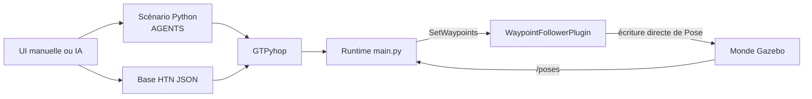
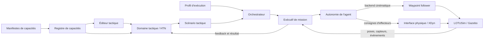

# Architecture end-to-end des scénarios tactiques LOTUSim

**Statut :** document d'architecture de travail  
**Date :** 10 juillet 2026  
**Périmètre :** `tactical_scenario_maker` et les composants nécessaires à son fonctionnement end-to-end dans l'écosystème LOTUSim

## 1. Résumé exécutif

L'objectif métier est de permettre la création et l'exécution de scénarios tactiques militaires crédibles, avec plusieurs agents hétérogènes, des missions réactives et des compromis de fidélité adaptés à l'usage.

Le pré-PoC actuel démontre une première boucle complète : décrire une mission, la décomposer avec un planificateur HTN, envoyer des waypoints à LOTUSim et replanifier à partir des positions observées. Cette boucle repose toutefois sur le `WaypointFollowerPlugin`, qui déplace les entités selon un modèle cinématique 2D simplifié. Elle ne pilote pas les effecteurs des plateformes et ne mobilise pas leur dynamique physique.

La cible retenue sépare donc quatre responsabilités :

1. le **scénario tactique** exprime des intentions, des rôles et des événements ;
2. l'**autonomie attachée à chaque agent** publie les objectifs qu'elle sait accepter et tente de les réaliser ;
3. le **profil d'exécution** choisit, agent par agent, une implémentation et un niveau de fidélité ;
4. LOTUSim, ses interfaces de physique et ses moteurs externes exécutent et observent le monde simulé.

Le Scenario Maker ne doit ni calculer une route générique, ni commander directement des effecteurs, ni garantir qu'un objectif est atteignable. Il compose un scénario à partir des capacités annoncées par les autonomies disponibles et traite leurs résultats explicites : succès, échec, annulation ou timeout.

## 2. Portée et non-objectifs

Ce document dépasse volontairement le seul dépôt `tactical_scenario_maker`. Le produit ne peut fonctionner end-to-end que si les frontières avec l'IHM LOTUSim, l'orchestration des simulations, les autonomies de plateforme et la physique sont définies.

En revanche, l'architecture proposée ne cherche pas à :

- construire un pilote universel capable de naviguer tout type de plateforme ;
- résoudre les problèmes de navigation propres à un voilier, un drone aérien ou un véhicule sous-marin ;
- imposer une fidélité physique uniforme à tous les acteurs d'un scénario ;
- faire remonter les commandes d'effecteurs dans le vocabulaire tactique ;
- choisir dès maintenant le protocole ROS exact ou le format définitif des manifestes.

## 3. Carte de l'écosystème LOTUSim

Les dépôts publics utiles se répartissent ainsi :

| Projet | Responsabilité principale | Rapport au Scenario Maker |
|---|---|---|
| [`LOTUSim`](https://github.com/naval-group/LOTUSim) | Cœur Gazebo, gestion des entités, interfaces ROS, waypoint follower, interfaces de physique et de rendu | Fournit le monde simulé et les contrats d'intégration |
| [`LOTUSim-generic-scenario`](https://github.com/naval-group/LOTUSim-generic-scenario) | Lancement du monde, gestion du cycle de vie des agents, XDyn, Unity et processus ROS | Candidat naturel pour posséder l'orchestration d'un run |
| [`LOTUSim-Xdyn`](https://github.com/naval-group/LOTUSim-Xdyn) | Dynamique navale haute fidélité | Une implémentation possible du plant physique des plateformes navales |
| [`LOTUSim-UI-frontend`](https://github.com/naval-group/LOTUSim-UI-frontend) | IHM React/Vite et carte Leaflet | Candidat naturel pour héberger l'éditeur tactique |
| [`LOTUSim-UI-backend`](https://github.com/naval-group/LOTUSim-UI-backend) | Passerelle REST/WebSocket vers ROS 2 | Gateway existante entre navigateur et instances LOTUSim |
| [`LOTUSim-Unity-modules`](https://github.com/naval-group/LOTUSim-Unity-modules) | Rendu 3D et interactions Unity | Visualisation haute fidélité, indépendante de l'édition tactique |
| [`LOTUSim-Unity-custom-hdrp`](https://github.com/naval-group/LOTUSim-Unity-custom-hdrp) | Adaptations du pipeline de rendu Unity HDRP | Dépendance de rendu spécialisée |
| [`LOTUSim-Unity-ros-tcp-endpoint`](https://github.com/naval-group/LOTUSim-Unity-ros-tcp-endpoint) | Passerelle ROS 2 vers Unity | Transport du rendu et de certaines commandes vers Unity |
| [`LOTUSim-multi-agents-benchmark`](https://github.com/naval-group/LOTUSim-multi-agents-benchmark) | Benchmarks multi-agents | Source potentielle de scénarios de charge et de critères de performance |

L'IHM web officielle existe donc déjà, mais reste en développement : la carte et la création d'entités sont fonctionnelles, tandis que les routes de scénarios et la gestion multi-instance sont encore largement des placeholders. Le pré-PoC ne doit pas supposer que cette IHM est un produit achevé, mais il doit éviter de reconstruire durablement une seconde pile web concurrente sans décision explicite.

## 4. Architecture actuelle du pré-PoC

### 4.1 Composants

- [`tsm/web`](../tsm/web/) sert la SPA locale et l'API (scénarios, doctrine, préview de plan, lancement d'un run en sous-processus).
- [`templates/index.html`](../templates/index.html) reste l'UI locale monolithique, adaptée au schéma canonique (onglet IA masqué).
- [`doctrine/knowledge_base.json`](../doctrine/knowledge_base.json) contient la doctrine HTN, possédée par `tsm/domain/doctrine.py`.
- [`tsm/domain`](../tsm/domain/) porte le schéma canonique v1 des scénarios (`scenarios/*.json`) et la géométrie.
- [`tsm/planning`](../tsm/planning/) confine GTPyhop derrière un `Planner` (domaine privé, verrou) et porte les méthodes HTN.
- [`tsm/execution`](../tsm/execution/) exécute : actions/commands, boucle de replanification événementielle par agent, assemblage du runtime (`main.py` n'est plus qu'un shim).
- [`tsm/lotusim`](../tsm/lotusim/) est l'unique frontière ROS (spawn, waypoints, poses) — la couture des futures autonomies (§7.6).
- [`attic/`](../attic/) : générateur IA parqué en attente de réadaptation (voir §12, impact 2).

### 4.2 Flux actuel



Le runtime ne lance pas le monde LOTUSim, XDyn ou Unity. Il suppose qu'une instance nommée `lotusim` est déjà disponible et se connecte directement à ses interfaces ROS.

## 5. Contraintes et lacunes observées

### 5.1 Le waypoint follower est cinématique

Le pré-PoC injecte uniquement une configuration `<waypoint_follower>` au spawn. Aucun bloc `physics_engine_interface`, aucun effecteur et aucune commande `VesselCmdArray` ne sont utilisés.

Le `WaypointFollowerPlugin` convertit le waypoint en coordonnées locales, calcule des vitesses virtuelles, intègre lui-même la position et le cap, puis écrit directement la pose Gazebo. Il constitue un bon backend de validation rapide, mais pas une navigation physiquement fidèle.

### 5.2 Il n'existe pas de navigation universelle

Atteindre un waypoint est un problème propre au couple plateforme/autonomie. Pour un Focus V2, remonter au vent peut nécessiter de tirer des bords, de réagir à une rotation du vent et d'accepter que le checkpoint ne soit jamais atteint. Les effecteurs, contraintes et stratégies sont radicalement différents pour un quadricoptère ou un sous-marin.

Le trou à combler n'est donc pas un automate générique absent du Scenario Maker. Il faut une **implémentation d'autonomie propre à la plateforme**, remplaçable et explicitement associée à chaque agent.

### 5.3 Une capacité ne garantit pas la faisabilité

Une autonomie qui annonce `navigation.reach_position` affirme qu'elle sait accepter cet objectif et produire un résultat. Elle ne garantit pas de réussir dans toute situation. Le vent, la mer, une panne, une contrainte cinématique ou un comportement adverse peuvent rendre l'objectif impossible.

Cette distinction doit être visible dans le modèle :

- **capacité annoncée** : l'objectif est compris et peut être tenté ;
- **faisabilité courante** : elle dépend de l'état du monde et n'est connue qu'à l'exécution ;
- **résultat** : succès, échec, annulation ou timeout.

### 5.4 Le modèle d'action actuel est synchrone en apparence

Dans le pré-PoC, `aller_a` est considéré comme exécuté dès que le waypoint a été envoyé. Il n'existe pas de cycle de vie persistant reliant l'ordre tactique à l'arrivée effective, à un échec ou à un timeout.

De plus, un plan HTN contenant plusieurs déplacements serait envoyé immédiatement, alors que chaque appel `SetWaypoints` remplace la liste précédente dans le plugin. L'exécutif doit donc gérer des objectifs longs plutôt que dérouler instantanément une liste de commandes.

### 5.5 Les modèles de données sont fragmentés

Le système manipule aujourd'hui au moins trois représentations d'un scénario :

- la sortie structurée du générateur IA ;
- les données JSON échangées avec l'UI ;
- les modules Python `scenarios/*.py` contenant `AGENTS`.

Il n'existe pas encore de schéma canonique versionné. Par ailleurs, une génération IA peut modifier immédiatement la base HTN globale avant que le scénario soit importé, ce qui confond brouillon de scénario et évolution de la doctrine.

**Mise à jour 2026-07 :** le schéma canonique v1 (JSON versionné, `scenarios/*.json`) a remplacé les modules Python générés ; il reste deux représentations (schéma canonique, sortie du générateur IA parqué) au lieu de trois.

### 5.6 Plusieurs composants dupliquent des responsabilités

`main.py` réimplémente une partie de la création et du suivi des agents déjà présente dans `LOTUSim-generic-scenario`. L'UI locale réimplémente également des fonctions proches de l'IHM web officielle. Les propriétaires définitifs du cycle de vie d'un run et de l'expérience utilisateur doivent être tranchés avant une réécriture importante.

## 6. Décisions d'architecture validées

### D1 — Le Scenario Maker reste au niveau tactique

Il décrit des acteurs, rôles, intentions, règles, événements et réactions. Il ne calcule pas la conduite détaillée de la plateforme et ne commande pas directement ses effecteurs.

### D2 — Un agent exécutable est un couple plateforme/autonomie

La plateforme physique contraint ce qui est possible, mais les capacités appartiennent à l'implémentation d'autonomie effectivement embarquée. Deux plateformes physiques identiques peuvent exposer des catalogues différents si elles utilisent des autonomies différentes.

### D3 — Les autonomies publient leurs capacités

Chaque package d'autonomie expose un catalogue versionné des objectifs qu'il sait accepter, avec leurs paramètres et résultats possibles. Le Scenario Maker compose uniquement avec les capacités compatibles avec les agents choisis.

### D4 — Catalogue hybride : manifeste hors ligne et vérification runtime

L'option retenue combine :

- un manifeste consultable hors ligne pour construire et valider un scénario ;
- une implémentation runtime qui reçoit réellement les objectifs ;
- une vérification au lancement que les capacités attendues sont présentes.

Cette approche évite à la fois la duplication d'un catalogue codé en dur dans le Scenario Maker et la dépendance à une simulation déjà démarrée pour éditer un scénario.

### D5 — Les objectifs ont un cycle de vie explicite

Un objectif long suit au minimum les états conceptuels suivants :

```text
soumis → accepté → en cours → réussi | échoué | annulé | timeout
```

Le protocole technique exact reste à choisir. Le modèle sémantique, lui, ne doit pas assimiler « ordre transmis » à « objectif accompli ».

Ce cycle de vie correspond exactement au protocole des actions ROS 2 — goal accepté ou refusé, feedback continu, résultat terminal, préemption incluse (voir [§16](#16-standards-et-systèmes-de-référence)). `NavigateToPose` de Nav2 en est la preuve d'existence à l'échelle.

### D6 — La simulation est multi-fidélité et la fidélité est choisie par agent

Une même capacité peut être implémentée par plusieurs backends :

- **dynamique** : autonomie de plateforme, effecteurs et moteur physique ;
- **cinématique** : waypoint follower ou modèle de mouvement simplifié ;
- **scénarisé** : trajectoire ou timing imposé pour produire un effet tactique déterminé.

Un même run peut mélanger ces niveaux. Par exemple, le bâtiment étudié peut utiliser XDyn et un pilote réaliste tandis que des adversaires secondaires utilisent une dynamique simplifiée.

### D7 — Le scénario tactique et le profil d'exécution sont séparés

Le scénario exprime ce qui doit être tenté. Un profil d'exécution distinct associe chaque agent à une autonomie et à un niveau de fidélité. Le même scénario peut ainsi être rejoué rapidement en cinématique ou avec une sélection d'acteurs en haute fidélité.

### D8 — Pas de dégradation automatique silencieuse

Un agent dynamique qui échoue ne doit pas basculer automatiquement vers un mouvement cinématique sans décision explicite. Un changement de fidélité modifie le sens du résultat. Toute sélection ou évolution de fidélité doit être visible et enregistrée avec le run.

## 7. Architecture cible logique

Les composants ci-dessous sont des responsabilités logiques. Ils ne préjugent pas encore du nombre final de processus ou de dépôts.

### 7.1 Éditeur tactique

Responsabilités :

- créer les acteurs, missions et événements ;
- présenter uniquement les objectifs compatibles avec les capacités annoncées ;
- afficher les incompatibilités avant le lancement ;
- permettre de choisir ou charger un profil d'exécution.

L'intégration dans `LOTUSim-UI-frontend` est une orientation forte, mais reste à confirmer après étude de son niveau de maturité et de son modèle d'extension.

### 7.2 Domaine tactique

Responsabilités :

- porter le modèle canonique du scénario ;
- gérer la doctrine et les décompositions HTN ;
- valider les dépendances de capacités ;
- transformer une mission en objectifs adressés aux agents ;
- traiter les résultats et déclencher une replanification.

La génération IA produit des brouillons conformes à ce modèle. Elle ne modifie pas implicitement la doctrine de référence.

### 7.3 Registre de capacités

Responsabilités :

- charger les manifestes des autonomies installées ;
- exposer leurs compatibilités de plateformes ;
- fournir les schémas de paramètres nécessaires à l'éditeur ;
- vérifier les versions et la disponibilité au démarrage d'un run.

Ce registre peut être une bibliothèque ou une fonction du backend ; rien ne justifie encore d'en faire un service indépendant.

### 7.4 Orchestrateur de simulation

Responsabilités :

- lancer et arrêter le monde et les dépendances nécessaires ;
- instancier les agents avec leurs modèles et profils d'autonomie ;
- vérifier les capacités réellement exposées ;
- conserver l'identité, la configuration et la provenance du run ;
- superviser les processus et remonter leurs états.

`LOTUSim-generic-scenario` est le candidat naturel, mais cette propriété reste à confirmer.

### 7.5 Exécutif de mission

Responsabilités :

- soumettre un objectif à l'autonomie d'un agent ;
- suivre son cycle de vie ;
- propager feedback, succès et erreurs vers le domaine tactique ;
- appliquer les timeouts et annulations ;
- empêcher l'exécution simultanée d'objectifs incompatibles pour un même agent.

La pratique robotique établie (Nav2, PlanSys2, `scenario_runner` — voir [§16](#16-standards-et-systèmes-de-référence)) éclaire la frontière avec le domaine tactique : le planificateur s'engage sur un plan, l'exécutif surveille les objectifs longs, et la replanification n'est déclenchée que par un échec ou une invalidation explicite — pas en continu à chaque observation.

### 7.6 Fournisseur d'autonomie

Responsabilités :

- publier un manifeste de capacités ;
- accepter ou refuser un objectif ;
- tenter de le réaliser selon ses algorithmes propres ;
- publier son état et un résultat explicite ;
- traduire si nécessaire l'objectif en consignes d'effecteurs.

Exemples d'implémentations de la même capacité `navigation.reach_position` :

- un adaptateur cinématique utilisant `SetWaypoints` ;
- le helmsman Focus V2 utilisant vent, voile et gouvernail ;
- une pile PX4 pour un drone ;
- une autonomie industrielle externe.

### 7.7 LOTUSim et plant physique

LOTUSim conserve la gestion du monde, du temps, des entités, de l'observation et des interfaces de simulation. Selon le profil choisi, le mouvement provient :

- du waypoint follower cinématique ;
- de `VesselCmdArray` transmis à XDyn ou à un autre moteur ;
- d'une pile externe raccordée par une interface adaptée.



## 8. Modèle conceptuel

Les extraits YAML de cette section sont illustratifs. Ils montrent la séparation des responsabilités, pas un format déjà choisi.

### 8.1 Profil de plateforme

Décrit le modèle physique et les contraintes de compatibilité, sans embarquer de logique tactique :

```yaml
platform_id: focus_v2
domain: surface
```

### 8.2 Manifeste d'autonomie

Décrit ce que l'implémentation sait accepter. L'exemple est illustratif ; le format définitif reste à choisir.

```yaml
autonomy_id: focus_v2_helmsman_v1
compatible_platforms: [focus_v2]
fidelity: dynamic
capabilities:
  - id: navigation.reach_position
    version: 1
    input: ReachPositionGoal
    outcomes: [succeeded, failed, cancelled, timed_out]
```

### 8.3 Scénario tactique

Le scénario référence des acteurs et des objectifs, mais pas leurs commandes d'effecteurs :

```yaml
agents:
  patrouilleur:
    platform: focus_v2
    initial_position: [1.260, 103.750]
    mission: surveiller_zone
  intrus:
    platform: focus_v2
    initial_position: [1.266, 103.756]
    mission: rejoindre_zone_b

events:
  - at: PT10M
    effect: rotate_wind
    value: 30deg
```

Les événements d'environnement sont exprimés par le scénario, mais appliqués par le sous-système d'environnement compétent. Les autonomies les observent et y réagissent ; le Scenario Maker ne recalcule pas leur navigation.

Le modèle d'événements d'OpenSCENARIO (voir [§16](#16-standards-et-systèmes-de-référence)) suggère d'aller au-delà du seul déclencheur temporel : des conditions sur l'état simulé (distance entre entités, entrée dans une zone, temps **simulé** — pas temps mur) qui arment des réactions. L'horloge de référence des événements devra être tranchée explicitement.

Dans le pré-PoC refactoré, la mission du schéma v1 (« mission.task ») référence une tâche de la doctrine HTN — c'est assumé tant que la couche capacités (D3, §7.6) n'existe pas ; le vocabulaire scénario/doctrine/capacités sera séparé avec les manifestes.

### 8.4 Profil d'exécution

Le profil choisit les implémentations sans modifier l'intention tactique. Le niveau de fidélité est porté par le manifeste de l'implémentation sélectionnée, puis résolu et enregistré avec le run ; il n'est pas déclaré une seconde fois dans le profil.

```yaml
agents:
  patrouilleur:
    autonomy: focus_v2_helmsman_v1
  intrus:
    autonomy: focus_v2_kinematic_v1
```

## 9. Flux end-to-end

### 9.1 Conception

1. L'éditeur charge les plateformes et les manifestes d'autonomie disponibles.
2. L'utilisateur choisit des acteurs et leur attribue des objectifs compatibles.
3. Le domaine tactique valide la structure, les références entre agents et les capacités requises.
4. Le scénario est sauvegardé indépendamment de son profil d'exécution.

### 9.2 Préparation du run

1. L'utilisateur choisit un profil d'exécution ou en dérive un à partir de valeurs par défaut explicites.
2. L'orchestrateur vérifie la compatibilité plateforme/autonomie.
3. Il vérifie que chaque capacité exigée est réellement exposée par l'implémentation installée.
4. Il démarre le monde, les moteurs, les autonomies et les passerelles nécessaires.
5. Toute incompatibilité bloque le run avant que la simulation commence.

### 9.3 Exécution

1. Le HTN sélectionne un objectif abstrait pour un agent.
2. L'exécutif le soumet à l'autonomie correspondante.
3. L'autonomie accepte ou refuse l'objectif.
4. Si elle l'accepte, elle pilote la plateforme avec son propre niveau de fidélité.
5. L'exécutif transmet le feedback au domaine tactique sans considérer l'objectif terminé.
6. Le succès, l'échec, l'annulation ou le timeout met à jour l'état tactique.
7. Le HTN poursuit ou replanifie selon ce nouvel état.

### 9.4 Fin et traçabilité

Le résultat d'un run conserve au minimum :

- la version du scénario tactique ;
- le profil d'exécution complet ;
- les versions des autonomies et manifestes ;
- les niveaux de fidélité par agent ;
- les événements et résultats d'objectifs ;
- les versions pertinentes de LOTUSim et des moteurs physiques.

Cette provenance est indispensable pour comparer deux exécutions et ne pas présenter un résultat cinématique comme une validation physique.

## 10. Gestion des erreurs

| Situation | Comportement attendu |
|---|---|
| Capacité absente du manifeste | L'éditeur refuse l'affectation ou signale immédiatement l'incompatibilité |
| Manifeste présent mais implémentation absente au runtime | Le lancement est bloqué |
| Objectif refusé par l'autonomie | L'exécutif publie un échec explicite au domaine tactique |
| Objectif accepté mais jamais terminé | Le timeout configuré produit un résultat explicite |
| Autonomie ou moteur déconnecté | L'objectif courant échoue avec une cause `unavailable` |
| Objectif rendu impossible par l'environnement | L'autonomie échoue ou reste en cours jusqu'au timeout selon son contrat |
| Objectif impossible avec un profil haute fidélité | L'échec est propagé au scénario ; aucune dégradation silencieuse n'est appliquée |

Le scénario peut prévoir des branches de réaction à certains échecs, mais il n'est pas obligé de masquer tout échec pour produire une narration déterministe.

## 11. Multi-fidélité et crédibilité tactique

La fidélité utile dépend de la question posée par l'expérience. Une simulation tactiquement crédible n'exige pas nécessairement une physique uniforme et maximale pour tous les acteurs.

Exemples :

- étudier le comportement réel du Focus V2 : Focus dynamique, adversaires cinématiques ;
- entraîner un opérateur à la coordination : acteurs principaux fidèles, figurants scénarisés ;
- valider rapidement une doctrine HTN : tous les agents cinématiques ;
- rejouer un scénario démonstratif : trajectoires adverses scénarisées pour préserver le tempo tactique.

Le compromis est explicite, choisi avant le run et attaché aux résultats. La fidélité n'est pas un simple nombre global : elle concerne au moins la mobilité, l'autonomie, les capteurs, les communications et l'environnement. Le premier périmètre d'implémentation peut néanmoins se limiter à la fidélité de mobilité/autonomie, qui est le besoin directement observé dans le pré-PoC.

## 12. Impacts pressentis sur le pré-PoC

Ces impacts sont des orientations, pas encore un plan d'implémentation validé :

1. introduire un schéma canonique de scénario indépendant des modules Python — **fait** (schéma v1, 2026-07) ;
2. séparer la doctrine de référence des tâches proposées par l'IA — la mutation implicite de la KB est neutralisée (générateur parqué), la séparation doctrine/brouillon reste à faire ;
3. remplacer l'action immédiate `aller_a` par la soumission et le suivi d'un objectif long ;
4. encapsuler le waypoint follower actuel comme une autonomie cinématique déclarant ses capacités ;
5. encapsuler le pilote Focus V2 comme une autonomie dynamique spécifique ;
6. déplacer ou intégrer l'expérience d'édition dans l'IHM officielle après audit de ses extensions ;
7. confier le cycle de vie des runs à un orchestrateur unique, probablement basé sur `LOTUSim-generic-scenario` ;
8. conserver GTPyhop derrière une frontière de domaine sans effets de bord d'import ni état global partagé entre threads — **fait** (tsm/planning/planner.py, 2026-07).

## 13. Stratégie de vérification

L'architecture devra être prouvée par plusieurs niveaux de tests :

### Tests de schéma

- manifestes valides et invalides ;
- compatibilité plateforme/autonomie ;
- validation des paramètres d'objectif ;
- séparation scénario/profil d'exécution.

### Tests de contrat des autonomies

Chaque fournisseur d'autonomie doit démontrer qu'il :

- publie les capacités annoncées ;
- accepte ou refuse correctement un objectif ;
- produit un résultat terminal ou respecte le timeout ;
- supporte l'annulation ;
- ne prétend pas réussir avant l'effet observable attendu.

### Tests tactiques hors simulation

- décomposition HTN déterministe ;
- réaction aux succès et échecs ;
- absence de capacité détectée avant lancement ;
- génération IA validée contre le schéma canonique sans mutation implicite de doctrine.

### Tests end-to-end

- run cinématique déterministe avec le waypoint follower ;
- run Focus V2 dynamique où l'objectif peut réussir ou échouer selon le vent ;
- run mixte avec niveaux de fidélité différents ;
- vérification que la provenance du run reflète exactement les implémentations utilisées.

## 14. Questions ouvertes

Les décisions suivantes n'ont pas encore été prises :

1. Quel est le format canonique et versionné des scénarios, manifestes et profils d'exécution ? *(tranché pour les scénarios : JSON v1 — manifestes et profils d'exécution restent ouverts)*
2. Les objectifs utilisent-ils une action ROS générique avec payload validé, une action typée par famille de capacité, ou une combinaison des deux ? *(orientation : l'action typée par famille est le pattern ROS-natif éprouvé — voir §16)*
3. Où vivent les manifestes et qui garantit leur compatibilité avec l'implémentation runtime ?
4. Quelle granularité retenir pour l'ontologie initiale des capacités ? *(les taxonomies de tâches NETN-ETR et C2SIM servent de checklist gratuite — voir §16)*
5. `LOTUSim-generic-scenario` devient-il l'unique orchestrateur des runs ?
6. Le Scenario Maker devient-il un module de `LOTUSim-UI-frontend` ou reste-t-il une application séparée intégrée par API ?
7. Quelle API LOTUSim doit appliquer les événements d'environnement comme les rotations de vent ?
8. Quelles exigences minimales de fidélité un scénario peut-il déclarer sans se coupler à un profil d'exécution précis ?
9. Comment gérer les objectifs concurrents, priorités et préemptions sur un même agent ?
10. Quel sous-ensemble de cette architecture constitue le prochain incrément démontrable ? *(tranché et livré : réorganisation en couches + schéma canonique, voir docs/superpowers/specs/2026-07-10-tsm-refactor-design.md)*

## 15. Synthèse des décisions de la session

| Sujet | Décision |
|---|---|
| Responsabilité du Scenario Maker | Niveau tactique uniquement |
| Navigation | Fournie par une autonomie spécifique, pas par un pilote universel |
| Identité d'un agent exécutable | Plateforme physique + implémentation d'autonomie |
| Découverte des objectifs | Manifeste hors ligne + vérification runtime |
| Sémantique d'une capacité | Savoir tenter et produire un résultat, sans garantie de succès |
| Exécution des objectifs | Cycle de vie asynchrone et résultat explicite |
| Fidélité | Choisie agent par agent |
| Réutilisation d'un scénario | Scénario tactique séparé du profil d'exécution |
| Dégradation de fidélité | Jamais automatique ni silencieuse |
| Traçabilité | Profil et versions enregistrés avec chaque run |

## 16. Standards et systèmes de référence

L'architecture cible n'est pas une invention isolée : les écosystèmes M&S défense, robotique ROS et simulation de conduite autonome ont convergé indépendamment vers les mêmes frontières (scénario déclaratif / exécutif / autonomies à capacités déclarées / plant physique). Cette convergence valide la décomposition — et fournit des sémantiques, protocoles et codes éprouvés à réutiliser plutôt qu'à réinventer.

**Principe d'usage : emprunter la sémantique et les patterns, pas les formats.** Les standards défense (XML lourds, outillage rare) seraient écrasants pour l'équipe actuelle ; leur valeur immédiate est de servir de vocabulaire de référence et de checklist. Leur valeur future est l'argument d'interopérabilité : une architecture dont les concepts se *mappent* sur C2SIM/HLA sera intégrable dans une fédération le jour où un client l'exigera.

| Concept du document | Référence | Ce qu'on en retient |
|---|---|---|
| Cycle de vie des objectifs (D5, §7.5) | [Actions ROS 2](https://design.ros2.org/articles/actions.html) ; [Nav2](https://docs.nav2.org/) `NavigateToPose` | Le protocole goal/feedback/result existe déjà, préemption et refus inclus ; ne pas inventer le nôtre |
| Exécutif de mission (§7.5) | [`scenario_runner`](https://github.com/carla-simulator/scenario_runner) (CARLA), [esmini](https://github.com/esmini/esmini) ; [BehaviorTree.CPP](https://github.com/BehaviorTree/BehaviorTree.CPP) ; [PlanSys2](https://github.com/PlanSys2/ros2_planning_system) | Moteur de conditions/déclencheurs évaluées contre l'état simulé ; le planificateur s'engage, l'exécutif surveille, replanification sur échec seulement |
| Fournisseur d'autonomie et manifeste (D2–D4, §7.6) | [Open-RMF](https://github.com/open-rmf/rmf) *fleet adapters* ; STANAG 4586 (OTAN) | Un adaptateur par plateforme qui déclare ses capacités et accepte/refuse des tâches ; leçon 4586 : l'interface « générique » finit toujours percée de messages spécifiques — assumer la spécificité (§5.2) |
| Scénario déclaratif, séparation logique/concret (D7, §8.3) | [ASAM OpenSCENARIO](https://www.asam.net/standards/detail/openscenario/) (XML et DSL 2.x) | Scénario *logique* paramétré vs scénario *concret* résolu = notre séparation scénario/profil d'exécution ; déclencheurs conditionnels riches plutôt que timeline pure |
| État initial et ordres militaires (§8.3) | SISO MSDL (SISO-STD-007), C-BML (SISO-STD-011), C2SIM (SISO-STD-019) — [sisostds.org](https://www.sisostds.org/) ; [NETN-FOM](https://github.com/AMSP-04/NETN-FOM), module ETR (OTAN) | NETN-ETR définit précisément notre modèle : tâches (`MoveToLocation`, `FollowEntity`…) soumises à des entités simulées, avec rapports d'état et résultats ; taxonomies = checklist pour l'ontologie de capacités (Q4) |
| Scénarios maritimes Gazebo (§7.7) | [VRX — Virtual RobotX](https://github.com/osrf/vrx) | Même stack, même modèle `wamv` ; plugins de scoring : le monde juge le succès d'une tâche, pas le pilote qui l'exécute |
| Autonomie drone (§7.6) | [MAVLink mission protocol](https://mavlink.io/en/services/mission.html) / PX4 | Le protocole que parlera une autonomie drone réelle ; modèle waypoint accepted/current/reached éprouvé |

Lectures de code recommandées avant le prochain incrément d'architecture : `scenario_runner` (l'exécutif de scénario le plus proche de notre besoin), Nav2 (le pattern serveur d'action + behavior tree), l'API de tâches d'Open-RMF (la découverte de capacités en pratique).

Ce qui n'a **pas** de standard établi — notre part réellement singulière : la multi-fidélité par agent avec provenance (D6, D8, §9.4), les autonomies de plateforme elles-mêmes (le helmsman Focus V2 est du travail de contrôle, pas d'architecture), et l'orchestration multi-processus propre à la stack LOTUSim (Q5).

---

Ce document constitue la base de la prochaine étape de conception. Les questions ouvertes doivent être arbitrées avant de produire un plan de réarchitecture détaillé.
