# Tactical Scenario Maker (LOTUSim) — Document de passation

*Document assemblé le 2026-07-09, branche `htn_implementation`
(HEAD `469c9fe`). Sources : [`docs/passation/01_comprendre_les_outils.md`](docs/passation/01_comprendre_les_outils.md),
[`02_manuel_utilisateur.md`](docs/passation/02_manuel_utilisateur.md),
[`03_manuel_developpeur.md`](docs/passation/03_manuel_developpeur.md),
[`04_limites_et_ameliorations.md`](docs/passation/04_limites_et_ameliorations.md).
Ce fichier (`docs/PASSATION.md`) est la version assemblée, en lecture continue ;
les quatre fichiers sources restent la référence à éditer partie par partie.*

## À qui s'adresse ce document, et comment le lire

Ce document transmet le projet **Tactical Scenario Maker**, l'outil de
génération de scénarios tactiques pour le simulateur **LOTUSim**, à quiconque
doit le reprendre — développeur, utilisateur métier, ou les deux. Il est
construit en quatre parties, pensées pour être lues dans l'ordre la première
fois, puis consultées indépendamment ensuite :

- **[Partie 1 — Comprendre les outils](#p1)** est un cours magistral : pourquoi
  HTN, ROS, une interface web et un générateur IA ont été choisis, et comment
  chacun fonctionne dans ses grandes lignes. À lire en entier avant tout le
  reste — les parties suivantes en réutilisent le vocabulaire sans le
  redéfinir.
- **[Partie 2 — Manuel utilisateur](#p2)** devrait couvrir l'installation et
  l'usage écran par écran. **Elle n'a pas encore été rédigée** — voir
  l'avertissement en tête de cette partie.
- **[Partie 3 — Manuel développeur](#p3)** est la partie la plus dense :
  comment le système se comporte réellement à l'exécution (threads, boucle
  événementielle, sous-processus), pourquoi chaque choix d'architecture et de
  format a été fait, l'arborescence complète fichier par fichier, et un guide
  « où aller pour modifier quoi ».
- **[Partie 4 — Limites et améliorations](#p4)** est une relecture critique
  honnête : ce qui n'est pas fiable dans le générateur IA, ce qui manque de
  modularité, ce qui reste fragile côté performance/robustesse — chaque point
  chiffré en effort — plus la liste des bugs déjà rencontrés et corrigés, à ne
  pas réintroduire.

**Méthode et niveau de preuve.** Les trois parties rédigées (1, 3, 4) ont été
écrites et vérifiées directement contre le code du dépôt — citations de
fichiers, fonctions et lignes précises, complétées par des tests exécutés en
direct quand la seule lecture du code ne suffisait pas à trancher (notamment
la fraîcheur de la base de connaissances en mémoire, [Partie 3, § 3.1.9](#p3-319),
et la validation des diagrammes Mermaid de ce document lui-même, vérifiés par
le vrai analyseur syntaxique Mermaid plutôt que relus à l'œil). Une poignée de
points restent explicitement non confirmés — voir
[l'Annexe B](#annexe-verif) — et sont marqués **⚠️ À VÉRIFIER** à l'endroit
où ils apparaissent.

---

<a id="sommaire-general"></a>

## Sommaire général

1. **[Partie 1 — Comprendre les outils](#p1)**
   - [1.1 Le contexte et la problématique](#p1-11)
   - [1.2 La description du besoin (le fil rouge)](#p1-12)
   - [1.3 HTN — Hierarchical Task Network](#p1-13)
   - [1.4 ROS — Robot Operating System](#p1-14)
   - [1.5 L'interface utilisateur](#p1-15)
   - [1.6 Ollama — la génération par IA](#p1-16)
   - [1.7 Le besoin, entièrement couvert](#p1-17)
   - [1.8 Vue d'ensemble de l'architecture](#p1-18)
2. **[Partie 2 — Manuel utilisateur](#p2)** *(à rédiger)*
3. **[Partie 3 — Manuel développeur](#p3)**
   - [3.1 Architecture détaillée : les trois blocs, et comment ça tourne vraiment](#p3-31)
     - [3.1.1 Les trois blocs](#p3-311)
     - [3.1.2 Le `Domain` doit exister avant l'import des méthodes](#p3-312)
     - [3.1.3 Démarrage d'une exécution réelle : la séquence complète de `main.py`](#p3-313)
     - [3.1.4 La boucle événementielle, agent par agent](#p3-314)
     - [3.1.5 Animation : le réveil sur changement de position](#p3-315)
     - [3.1.6 Animation : cycle de vie complet d'un agent](#p3-316)
     - [3.1.7 L'état partagé entre threads](#p3-317)
     - [3.1.8 Les sous-processus lancés](#p3-318)
     - [3.1.9 Vérifié en direct : la fraîcheur de la base de connaissances](#p3-319)
   - [3.2 Pourquoi ces choix : formats et architecture](#p3-32)
   - [3.3 L'arborescence, fichier par fichier](#p3-33)
   - [3.4 Où aller pour modifier quoi](#p3-34)
4. **[Partie 4 — Limites et améliorations](#p4)**
   - [4.1 Axe IA : fiabilité du générateur de scénarios](#p4-41)
   - [4.2 Axe Modularité](#p4-42)
   - [4.3 Axe Optimisation / robustesse](#p4-43)
   - [4.4 Tableau récapitulatif, par taille d'effort](#p4-44)
   - [4.5 Pièges déjà rencontrés et résolus](#p4-45)
5. **[Annexe A — Images référencées et leur statut](#annexe-images)**
6. **[Annexe B — Points marqués ⚠️ À VÉRIFIER](#annexe-verif)**

---

<a id="p1"></a>

# Partie 1 — Comprendre les outils

> **Nature de ce document.** Cette partie est un *cours magistral*. Son but n'est
> pas de lister les technologies employées, mais de faire **comprendre** chacune :
> quel problème elle résout, comment elle fonctionne, et pourquoi elle a été
> retenue ici plutôt qu'une autre. Un lecteur qui n'a jamais vu le projet doit
> pouvoir la lire d'un bout à l'autre sans rien connaître au préalable.
>
> Elle reprend et développe en rédaction l'intégralité de la présentation
> *« Générateur de scénario pour LOTUSim »* (slides 1 à 22), à l'exception des
> slides de conclusion.
>
> ---
> **⚠️ Note pour Claude Code.** Ce fichier est un brouillon avancé, écrit sans
> accès au code source. Ta tâche :
> 1. Vérifier **chaque affirmation technique** contre le code réel et corriger
>    ce qui est inexact.
> 2. Compléter tous les blocs marqués `[À COMPLÉTER DEPUIS LE CODE : …]`.
> 3. Conserver la structure, le ton pédagogique et la rédaction en paragraphes
>    (surtout **ne pas** reconvertir en listes à puces).
> 4. Vérifier que les images référencées existent bien dans `docs/img/`.
>
> **⚠️ Réponse de Claude Code (relecture du 2026-07-09).** Le dossier `docs/img/`
> **n'existe pas du tout** dans le dépôt à cette date — aucune des 10 images
> référencées plus bas (`intro_env.png`, `htn_exemple.png`, `ui_mockup.png`,
> `archi_initiation.jpg`, `archi_running_1.jpg`, `archi_running_2.jpg`,
> `archi_ui.jpg`, `resume.jpg`) n'est présente. Les balises `` sont
> laissées telles quelles ci-dessous (structure conservée, comme demandé), mais
> elles s'afficheront cassées tant que ces fichiers n'auront pas été déposés
> dans `docs/img/`. Par ailleurs, plusieurs affirmations techniques du brouillon
> initial se sont révélées inexactes une fois confrontées au code — chacune est
> signalée et corrigée à l'endroit où elle apparaît, avec la preuve trouvée dans
> le code (fichier/ligne, ou commande exécutée).

---

<a id="p1-sommaire"></a>

## Sommaire de la partie

1. [Le contexte et la problématique](#p1-11)
2. [La description du besoin (le fil rouge)](#p1-12)
3. [HTN — Hierarchical Task Network](#p1-13)
4. [ROS — Robot Operating System](#p1-14)
5. [L'interface utilisateur](#p1-15)
6. [Ollama — la génération par IA](#p1-16)
7. [Le besoin, entièrement couvert](#p1-17)
8. [Vue d'ensemble de l'architecture](#p1-18)

---

<a id="p1-11"></a>

## 1.1 — Le contexte et la problématique

*(reprise rédigée de la slide 2, « Introduction »)*

### Le contexte

LOTUSim est un **simulateur multi-agent**. Il fait évoluer, dans un même monde,
des entités marines, sous-marines et aériennes — des bateaux de surface, des
sous-marins, des drones — qui se déplacent selon des règles physiques définies.
L'objectif de ce simulateur est de **reproduire des situations opérationnelles** :
on veut rejouer, en environnement contrôlé, ce qui se passerait réellement en mer.

*Note de vérification — cette description du parc d'entités se confirme
indirectement côté code : la liste blanche des modèles spawnables dans
`bdd/ai_scenario_generator.py` (`VALID_MODELS`) contient bien les trois familles
citées — surface (`wamv`, `fremm`, `pha`), sous-marin (`bluerov2_heavy`, `lrauv`)
et aérien (`x500`, `x500_base`) — plus `commando`, `dtmb_hull`, `mine` (non
qualifiés plus précisément dans le code) et `cube`, qui n'est pas un agent mais
un simple repère visuel statique (utilisé pour matérialiser une `__zone__`).*

Pour décrire ce qu'il doit se passer dans une simulation, LOTUSim consomme un
**fichier de scénario**. Ce fichier a une structure simple, qu'on peut résumer ainsi :

```
Environnement
  Agent_1
     Position initiale
     Positions à suivre
  Agent_2
     Position initiale
```

Autrement dit : chaque agent reçoit un point de départ, et éventuellement une
liste de points par lesquels passer. Le simulateur les fait naviguer, et on
observe le résultat dans la visualisation 3D ou sur une carte 2D.

<a id="warn-1"></a>

*Note de vérification — **⚠️ À VÉRIFIER —** ce format est celui, natif, consommé
directement par LOTUSim. Il est distinct du format `AGENTS = {...}` (fichiers
`scenarios/*.py`) manipulé par ce dépôt, qui est un format intermédiaire propre
à la couche HTN décrite dans cette partie : LOTUSim lui-même ne connaît pas ce
second format, il ne voit jamais que les positions/commandes que le runtime lui
envoie au fil de l'exécution (voir § 1.4 et § 1.8). Le fichier LOTUSim natif tel
que décrit ici n'est pas présent dans ce dépôt (le simulateur est un projet
externe) — NON TROUVÉ DANS LE CODE, cette section reste donc basée sur la
présentation d'origine, non recroisée avec le code de LOTUSim lui-même.*


*Figure 1 — Le fonctionnement d'origine : un fichier de scénario déterministe alimente LOTUSim, qui restitue la simulation.*

### La problématique

Ce fonctionnement, aussi simple soit-il, pose **trois problèmes** qui, ensemble,
rendent l'outil difficile à exploiter pour construire de vrais exercices tactiques.

Le premier est une **complexité d'utilisation**. Écrire un scénario suppose de
manipuler directement un fichier de configuration, avec sa syntaxe propre et ses
coordonnées géographiques saisies à la main. C'est une barrière immédiate pour
quiconque n'est pas familier du format — et notamment pour l'expert métier, qui
est pourtant celui qui sait ce qu'un scénario réaliste devrait contenir.

Le deuxième problème est plus fondamental : le **fichier est déterministe**. Les
positions à suivre sont fixées avant le lancement, une fois pour toutes. En
conséquence, **les agents ne réagissent pas à leur environnement**. Si un intrus
dévie de sa route, le patrouilleur censé le surveiller continue imperturbablement
sa trajectoire préprogrammée. Or c'est précisément la réaction qui fait
l'intérêt d'un scénario tactique.

Le troisième problème découle des deux premiers : il est **impossible de
construire un scénario réaliste avec plusieurs agents ayant chacun une mission**.
On pourrait, à la rigueur, calculer à la main la trajectoire d'un agent isolé.
Mais dès que plusieurs agents doivent interagir — l'un poursuit, l'autre fuit,
un troisième couvre une zone — les trajectoires deviennent interdépendantes et
ne peuvent plus être écrites d'avance : elles dépendent de ce que font les autres,
en temps réel.

> **La question à laquelle tout le projet répond :** comment passer d'un fichier
> de positions figées à des **agents qui embarquent une mission** et décident
> eux-mêmes, en continu, de ce qu'ils doivent faire ?

---

<a id="p1-12"></a>

## 1.2 — La description du besoin (le fil rouge)

*(reprise rédigée des slides 3 et 4, puis 7, 8, 10, 11, 13, 14, 16)*

Avant de choisir la moindre technologie, le besoin a été formulé sous la forme
d'un objectif unique, tenant en une phrase :

> ### **Créer des scénarios tactiques complexes, accessibles à tous.**

Cette phrase contient déjà une tension. « **Complexes** » et « **accessibles à
tous** » tirent dans des directions opposées : plus un outil permet d'exprimer
des comportements riches, plus il est en général difficile à prendre en main.
Tout l'enjeu du projet est de tenir les deux bouts.

De cet objectif ont été dérivés **cinq besoins concrets**, qui forment le fil
conducteur de toute la présentation :

1. **Définir une base de connaissance opérationnelle.** Il faut un endroit où
   décrire, une fois pour toutes, ce que signifient les missions du métier
   (« veiller », « encercler », « suivre ») et comment on les accomplit.
2. **Implémenter des agents qui embarquent chacun une mission.** Chaque agent
   ne reçoit plus une liste de points, mais un objectif, qu'il traduit lui-même
   en actions.
3. **Implémenter des agents qui interagissent avec l'environnement.** Un agent
   doit percevoir la situation réelle (où sont les autres) et y réagir.
4. **Proposer une interface simple et intuitive**, pour que la création d'un
   scénario ne suppose pas d'écrire du code.
5. **Proposer une option IA pour produire des scénarios à partir du langage
   naturel**, afin d'abaisser encore la barrière d'entrée.

La suite de cette partie présente les quatre technologies retenues. Chacune vient
**répondre à un ou plusieurs de ces besoins**, et la présentation d'origine les
introduit précisément dans cet ordre, en cochant les besoins un à un :

| Besoin | Technologie qui y répond |
|---|---|
| Définir une base de connaissance opérationnelle | **HTN** (définit une base de données) |
| Implémenter des agents qui embarquent une mission | **HTN** (calcule un plan) |
| Implémenter des agents qui interagissent avec l'environnement | **ROS** |
| Proposer une interface simple et intuitive | **UI** |
| Proposer une option IA à partir du langage naturel | **Ollama** |

Ce tableau est la carte du reste du document. On le reconstruit maintenant
ligne par ligne.

---

<a id="p1-13"></a>

## 1.3 — HTN — Hierarchical Task Network

*(reprise rédigée des slides 5 et 6 ; répond aux besoins 1 et 2)*

### Le problème que ça résout

Reprenons l'objectif : un agent doit *encercler* un bateau. S'il en est loin, il
doit s'en approcher ; s'il est proche, il doit se mettre à tourner autour ; et si
la cible s'éloigne à nouveau, il doit **rebasculer tout seul** vers l'approche.

L'approche naïve consisterait à écrire cette logique à la main, sous forme d'une
machine à états : *si distance > seuil alors approcher, sinon orbiter*. Cela
fonctionne pour un comportement. Mais il faut le réécrire intégralement pour
chaque nouveau comportement, gérer soi-même les transitions, et le tout devient
un enchevêtrement de conditions impossible à maintenir dès qu'on dépasse quelques
missions. Surtout, ce code ne serait ni lisible ni modifiable par un expert
métier, qui est pourtant la personne légitime pour dire ce qu'« encercler » veut
dire.

### L'idée : la planification

La réponse est de ne plus programmer *le comportement*, mais de faire calculer ce
comportement par un **planificateur**. Un planificateur est un algorithme dont le
rôle tient en une phrase :

> **Calculer une séquence d'actions qui permet de passer d'un état initial à un
> état but.**

HTN — pour *Hierarchical Task Network*, réseau de tâches hiérarchique — est une
famille de planificateurs dont le principe propre est de **décomposer
hiérarchiquement les tâches, des plus abstraites jusqu'aux actions élémentaires**.
On part d'un objectif de haut niveau et on le raffine, étage par étage, jusqu'à
obtenir des ordres que le simulateur sait exécuter directement.

### Le mécanisme : quatre notions

Tout HTN se manipule avec quatre notions, et quatre seulement :

| Notion | Description |
|---|---|
| **Tâche abstraite** | Un objectif à atteindre |
| **Méthode** | Une façon d'accomplir une tâche, suivant des conditions |
| **Sous-tâche** | Ce que produit une méthode (une autre tâche, ou une action) |
| **Action primitive** | Une opération élémentaire, exécutable par le simulateur |

Le moteur fonctionne ainsi. Il reçoit une **tâche abstraite** (« encercler ») et
va chercher les **méthodes** enregistrées pour cette tâche. Chaque méthode porte
des **conditions** d'applicabilité. Le moteur les essaie **dans l'ordre** et
retient la première dont les conditions sont vraies **dans l'état courant du
monde** — c'est-à-dire compte tenu des positions réelles des agents à cet instant.
*(Précision : si la sous-tâche produite par la méthode retenue échoue plus tard
en aval — plus profond dans la décomposition —, le moteur revient en arrière et
essaie la méthode suivante, même si la précondition de la première était
satisfaite. C'est un vrai mécanisme de retour-arrière (`seek_plan`/
`_refine_task_and_continue` dans `gtpyhop.py`), pas seulement un choix figé au
premier essai — dans la pratique de ce projet, les méthodes sont presque
toujours à une seule sous-tâche, donc ce retour-arrière se manifeste rarement,
mais il existe.)*

La méthode retenue produit une ou plusieurs **sous-tâches**. Si une sous-tâche est
elle-même abstraite, on recommence : on cherche ses méthodes, on en choisit une,
elle produit d'autres sous-tâches. La descente s'arrête lorsqu'on atteint des
**actions primitives** : des opérations élémentaires que le simulateur exécute
telles quelles, comme « envoyer ce waypoint à ce bateau ».

Le résultat de cette descente est un **plan** : la liste ordonnée des actions
primitives à exécuter.

**Une nuance de mise en œuvre, propre à ce projet.** GTPyhop distingue en réalité
deux notions au niveau le plus bas, et ce projet utilise les deux : l'**action**
(une fonction Python qui met seulement à jour l'état interne, utilisée pendant
le calcul du plan — et par le mode « calcul du plan à blanc » de l'interface, qui
n'exécute jamais rien de réel) et la **commande** (préfixée `c_`, qui déclenche le
véritable effet de bord ROS, envoyé à LOTUSim). Dans `bdd/primitives_actions.py`,
`aller_a` est l'action (état seul) et `c_aller_a` en est la commande (envoie
réellement le waypoint via ROS) ; à l'exécution réelle (`main.py::_execute_plan`),
le moteur cherche d'abord une commande `c_<nom>`, et ne retombe sur l'action que
si aucune commande n'est déclarée pour ce nom. `creation_agent` (qui « active »
un drone compagnon déjà présent dans le scénario) n'a volontairement **aucune**
commande associée : c'est un simple marqueur d'état, jamais un ordre envoyé à
LOTUSim (voir § 1.8 et la [Partie 3](#p3) pour le détail de cette limitation). Il ne
s'agit donc pas d'une quatrième/cinquième notion HTN à proprement parler — la
théorie continue de ne compter que quatre notions — mais d'un détail
d'implémentation qu'un repreneur croisera dès l'ouverture de
`bdd/primitives_actions.py`.

Voici, schématiquement, ce que donne la décomposition — ici sur un domaine
« voyage », plus lisible qu'un exemple naval :


*Figure 2 — Décomposition d'une tâche abstraite en méthodes, puis en actions élémentaires. Source : « Task Decomposition Example for Simple Travel Domain », towardsdatascience.com.*

On peut représenter la même idée sous forme d'arbre :

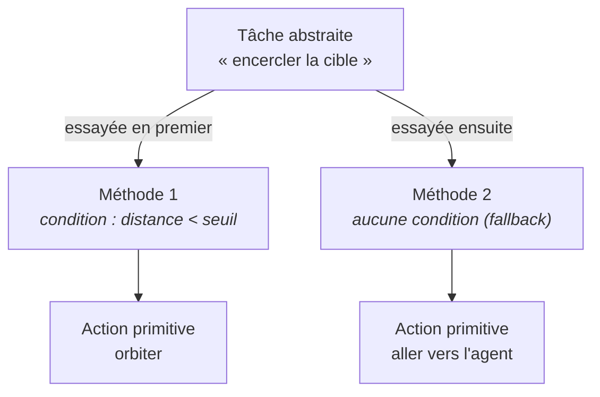

> **Le déclic à avoir.** On ne décrit jamais le comportement final. On décrit
> **les façons possibles d'agir et leurs conditions**. Le comportement *émerge*
> de la planification, et il est **recalculé** dès que la situation change. C'est
> ce qui rend les agents réactifs sans qu'aucune machine à états n'ait été écrite.

Deux conséquences pratiques, qui structureront tout le code :

- **Ajouter un comportement composite = ajouter des méthodes.** On ne touche pas
  au moteur (`gtpyhop.py`, jamais modifié) — il suffit de décrire la nouvelle
  tâche dans `bdd/knowledge_base.json`. Cela vaut tant que ce comportement peut
  s'exprimer en enchaînant des actions primitives **déjà existantes** (aller vers
  un agent, orbiter, s'interposer, etc.). Un comportement qui a besoin d'une
  action primitive *réellement nouvelle* — une trajectoire en carré ou en spirale,
  par exemple, qui n'a pas de fonction Python pour la calculer — demande, lui, une
  vraie modification de `bdd/tasks_methods.py`. C'est exactement pour cette
  raison que le générateur IA (§ 1.6) refuse catégoriquement certaines formes de
  trajectoire plutôt que de les approximer : il n'existe aucune méthode purement
  déclarative pour les produire.
- Comme les méthodes sont essayées dans l'ordre, **l'ordre de déclaration est
  porteur de sens**. Une méthode sans condition (donc toujours applicable) placée
  en premier masquerait définitivement toutes les suivantes ; c'est pourquoi les
  méthodes « par défaut » se placent toujours en dernier.

### Pourquoi ce choix

Trois raisons ont motivé HTN, et elles sont d'ordres différents.

**Une raison technique :** les notions de tâches, de méthodes et de récursivité
sont **natives** au formalisme, et l'**algorithme existe déjà**. Il n'y avait
donc rien à réinventer — seulement à décrire le domaine métier.

**Une raison d'efficacité :** la décomposition **guide la recherche**. Contrairement
à un planificateur classique qui explorerait à l'aveugle l'espace de toutes les
séquences d'actions possibles, le HTN ne considère que les décompositions
autorisées par les méthodes qu'on lui a fournies. La recherche est donc
considérablement plus efficace.

**Une raison métier, et c'est sans doute la plus déterminante :** la **doctrine
militaire raisonne elle-même par décomposition d'ordres**, de la mission globale
jusqu'aux tâches assignées à chaque unité. Le formalisme HTN ne fait donc pas que
« marcher » : il **épouse la façon de penser du domaine**. Une méthode HTN peut
se relire comme un ordre, et une base de connaissances comme un manuel de doctrine.

### D'où vient l'outil

Le moteur n'a pas été écrit pour ce projet. Il s'agit de **GTPyhop**, une
bibliothèque de planification HTN développée à l'**Université du Maryland**
(équipe de Dana Nau, l'un des noms historiques du domaine), publiée sous licence
libre **BSD-3-Clause-Clear** (la variante « Clear », qui écarte explicitement
toute concession de brevet — distincte de la BSD-3-Clause standard ; l'en-tête
exact du fichier porte `SPDX-License-Identifier: BSD-3-Clause-Clear`).

Point important pour le repreneur : elle est **incluse telle quelle dans le
dépôt**, sous la forme d'un unique fichier `gtpyhop.py` à la racine. Elle n'est
donc **pas installée via pip**, et il ne faut **pas la modifier** sans une raison
très précise — sans quoi toute mise à jour ultérieure deviendrait impossible.
*(Curiosité sans conséquence pratique : l'en-tête du fichier annonce la
« version 1.1 », mais le message imprimé automatiquement à chaque import du
module affiche « Imported GTPyhop version 1.0. » — une incohérence interne au
fichier tiers lui-même, antérieure à ce projet et non introduite par lui. Ce
message s'affiche à chaque lancement de `app.py`, `main.py`, et même pendant
`pytest`.)*

### À retenir

> HTN, c'est : *« je décris des missions et les façons de les remplir sous
> conditions ; le moteur choisit, et re-choisit tout seul, en fonction de la
> situation réelle. »*
>
> Il répond directement à deux besoins : il **définit la base de connaissance
> opérationnelle** (les tâches et méthodes du métier) et il **calcule le plan**
> que chaque agent embarque comme mission.

---

<a id="p1-14"></a>

## 1.4 — ROS — Robot Operating System

*(reprise rédigée de la slide 9 ; répond au besoin 3)*

### Le problème que ça résout

HTN sait décider *quoi faire*. Mais l'application et le simulateur sont **deux
programmes distincts**, qui tournent séparément. Il faut donc un moyen pour que
l'application transmette ses ordres à LOTUSim (« crée ce bateau », « va à ce
point »), et surtout pour que LOTUSim renvoie en permanence **les positions
réelles** des agents — sans lesquelles aucune réaction à l'environnement n'est
possible.

C'est exactement le besoin n° 3 : *implémenter des agents qui interagissent avec
l'environnement*. Sans canal de communication temps réel, le HTN replanifierait
dans le vide, sur un état du monde périmé.

### L'idée

Malgré son nom, ROS (*Robot Operating System*) n'est pas un système
d'exploitation. C'est une **couche de communication entre programmes**, très
répandue en robotique. Elle propose plusieurs mécanismes ; le projet en utilise
**trois**, chacun adapté à une nature d'échange différente.

| Mécanisme | Principe | Utilisation dans LOTUSim |
|---|---|---|
| **Topic** | Un programme publie en continu ; n'importe quel programme peut s'abonner | **Tracker les positions des agents en temps réel** |
| **Service** | Un programme envoie une requête et attend une réponse | **Envoyer une position à un agent** |
| **Action** | Un service, avec en plus un suivi de progression et un résultat | **Faire apparaître un agent** |

Le réflexe à acquérir tient en trois lignes. Un **flux continu** qu'on subit se
lit sur un **Topic** (on s'abonne, on est prévenu). Une **question ponctuelle**
dont on attend la réponse passe par un **Service**. Une **opération longue** dont
on veut suivre l'avancement passe par une **Action**.

Le sens de circulation est asymétrique, et c'est essentiel : les **positions
arrivent** en *push*, l'application ne les demande jamais, elle est prévenue ;
tandis que les **ordres partent** à l'initiative de l'application.

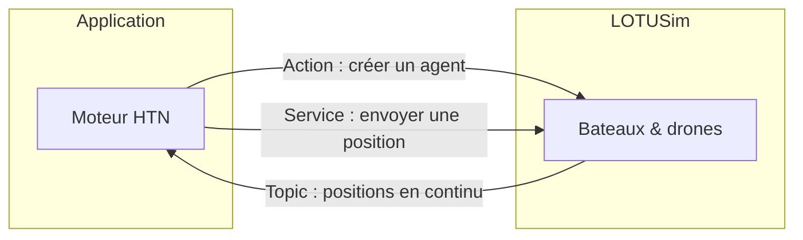

*Figure 3 — Les trois canaux ROS et leur sens de circulation.*

### Le mécanisme, côté LOTUSim

Concrètement, la communication avec LOTUSim se réduit à **trois opérations** :

- **Créer un agent** — via une *Action*, car la création d'une entité dans le
  simulateur prend un certain temps et l'on veut en connaître l'issue.
- **Déplacer un agent** — via un *Service* : on envoie une position, on attend
  l'acquittement.
- **Tracker un agent, en temps réel** — via un *Topic* : LOTUSim publie sans
  interruption les positions de toutes les entités, et l'application s'y abonne.

C'est cette troisième opération qui referme la boucle : les positions reçues
mettent à jour l'état du monde, ce qui **déclenche une replanification HTN**.
La réactivité des agents naît de là.

<a id="warn-2"></a>

**Ce que dit le code, précisément** (`main.py`) : le nœud ROS créé au démarrage
s'appelle `goto_point`, dans le namespace `/lotusim`
(`Node("goto_point", namespace="/lotusim")`) — **⚠️ À VÉRIFIER —** un nom qui ne
correspond à aucune convention documentée par ailleurs dans le dépôt,
vraisemblablement un héritage d'une version antérieure du projet (NON TROUVÉ
DANS LE CODE d'explication plus précise). Les trois canaux annoncés ci-dessus
correspondent exactement à ceci :

| Canal | Nom ROS | Type de message | Utilisé par |
|---|---|---|---|
| Topic | `/lotusim/poses` | `VesselPositionArray` (`lotusim_msgs.msg`) | `PoseTracker._cb` (`main.py`) — met à jour les positions et réveille les agents concernés |
| Action | `/lotusim/mas_cmd` | `MASCmd` (`lotusim_msgs.action`) | `spawn_vessel` (`bdd/primitives_actions.py`) — fait apparaître un agent au démarrage |
| Service | `/lotusim/{agent}/waypoints` (un service par agent) | `SetWaypoints` (`lotusim_msgs.srv`) | `c_aller_a` (`bdd/primitives_actions.py`) — envoie un unique waypoint à un agent nommé |

Les définitions `lotusim_msgs` (messages, service, action) ne sont **pas dans ce
dépôt** : elles viennent du workspace ROS 2 externe qui contient LOTUSim
lui-même, compilé séparément (confirmé présent, dans l'environnement où cet audit
a été mené, sous `~/lotusim_ws`). Le dépôt applicatif ne fait qu'importer ce
paquet comme n'importe quel paquet ROS déjà sourcé dans l'environnement — aucun
script de ce dépôt ne le télécharge ni ne le compile.

<a id="warn-3"></a>

Le `MultiThreadedExecutor` (plutôt qu'un `SingleThreadedExecutor`, l'exécuteur
ROS 2 par défaut) est instancié dans `main()` et tourne dans un thread daemon
séparé (`threading.Thread(target=executor.spin, daemon=True)`), en parallèle des
threads de planification (un par agent, voir § 1.8). **⚠️ À VÉRIFIER —** le code
ne commente pas ce choix explicitement, mais la raison la plus probable est la
suivante : plusieurs agents peuvent avoir, au même instant, un appel de service
ou d'action ROS en attente (par exemple plusieurs `spawn_vessel` ou plusieurs
envois de waypoint qui se chevauchent) ; un exécuteur mono-thread traiterait ces
callbacks un par un, retardant potentiellement la libération d'un agent bloqué
sur `main._wait(fut, ...)` (fonction d'attente définie dans `main.py`, utilisée
à la fois par `spawn_vessel` et par `c_aller_a`) pendant qu'un autre callback
est en cours. *(Cette explication est une déduction du fonctionnement du code,
pas une justification trouvée en commentaire — à confirmer avec l'auteur
d'origine si besoin.)*

### Pourquoi ce choix

Il faut être honnête : **ce n'est pas un choix, c'est une contrainte**. LOTUSim
est bâti sur ROS 2 et n'expose son interface que par ce biais. La version employée
est **ROS 2 Humble**, l'environnement imposé par le simulateur ; l'API Python
correspondante s'appelle `rclpy`, et les définitions de messages proviennent du
paquet `lotusim_msgs`, fourni par le workspace LOTUSim.

Cette contrainte a toutefois une **conséquence architecturale majeure**, qui a
été exploitée délibérément : **seule l'exécution dépend de ROS**. Concevoir un
scénario — l'écrire, l'éditer dans l'interface, le générer par IA — n'a besoin
d'aucun composant ROS. Cette frontière est le principe organisateur de toute
l'architecture, détaillée en [Partie 3](#p3).

### À retenir

> ROS, c'est *« le téléphone entre l'application et le simulateur »*. Trois
> lignes différentes : on **écoute** en continu (Topic), on **demande** (Service),
> on **lance une opération suivie** (Action). C'est lui qui permet aux agents
> d'interagir avec l'environnement.

---

<a id="p1-15"></a>

## 1.5 — L'interface utilisateur

*(reprise rédigée de la slide 12 ; répond au besoin 4)*

### Le problème que ça résout

À ce stade, le système sait faire des choses remarquables : décrire des missions,
les planifier, les exécuter, réagir en temps réel. Mais tout cela reste piloté par
des fichiers Python et un fichier JSON. On a résolu « scénarios tactiques
complexes » ; il reste **« accessibles à tous »**.

Le besoin n° 4 est donc de proposer une **interface simple et intuitive**,
permettant à un opérateur non-développeur de composer un scénario sans écrire une
seule ligne de code.

### L'idée

Une interface **web**, servie localement et ouverte dans un navigateur, organisée
en **trois onglets** correspondant aux trois activités possibles :

- **Scénarios** — composer un scénario : placer les agents, leur attribuer un
  modèle, une position initiale et une mission.
- **Connaissances HTN** — éditer la base de connaissance opérationnelle
  elle-même : les tâches, les méthodes, leurs conditions.
- **IA** — décrire un scénario en langage naturel et le faire générer.


*Figure 4 — Maquette de l'interface (slide « UI - Mockup »), montrant l'écran de composition d'un scénario, l'éditeur de tâches et méthodes, et l'écran de génération par IA.*

Le point remarquable est que l'onglet « Connaissances HTN » **expose directement
le formalisme** au lecteur : une tâche, ses méthodes, leurs préconditions et
leurs sous-tâches. L'expert métier édite donc la doctrine dans les mêmes termes
que ceux du planificateur, ce qui n'aurait pas été possible avec un formalisme
moins proche du domaine (voir § 1.3).

### Le mécanisme : un choix radical de sobriété

La façon dont cette interface est construite mérite d'être expliquée, car elle
relève d'un parti pris net.

Le **backend** (`app.py`) n'utilise **que la bibliothèque standard de Python**,
via le module `http.server`. Il n'y a **ni Flask, ni Django, ni aucune dépendance
web**. Le **frontend** (`templates/index.html`) est écrit en **JavaScript
« vanilla »** : aucun framework, aucune ressource chargée depuis Internet, aucune
étape de compilation. *(Ce choix n'est pas accidentel : les traces de
configuration locale du projet montrent qu'un backend Flask a été essayé puis
abandonné au profit de `http.server`, précisément pour ne dépendre de rien
d'installé séparément.)* Cette sobriété concerne l'interface d'édition
elle-même ; l'outil annexe `visualize.py` (qui produit une carte de trajectoires
après une exécution réelle, voir [Partie 3](#p3)) est le seul endroit du dépôt qui
charge une ressource externe (la bibliothèque cartographique Leaflet, via un
CDN) — il ne fait pas partie de l'interface des trois onglets et n'est pas
requis pour composer ou lancer un scénario.

Le serveur HTTP de `app.py` expose une petite API REST en JSON, entièrement
consommée par le JavaScript de `templates/index.html` via `fetch()`. Voici les
routes réellement définies dans le routeur (`app.py::_route`) :

| Méthode | Route | Rôle |
|---|---|---|
| GET | `/` | Sert la page `templates/index.html` |
| GET | `/api/scenarios` | Liste les noms des scénarios disponibles (fichiers `scenarios/*.py`) |
| GET | `/api/kb` | Renvoie le contenu complet de `knowledge_base.json` |
| GET | `/api/scenario/<name>` | Renvoie la définition d'un scénario (agents, positions, modèle, conditions, mission sous forme de texte) |
| GET | `/api/scenario/<name>/plan` | Calcule le plan HTN « à blanc » pour chaque agent du scénario, **sans aucune exécution ROS** (dry-run pur, voir § 1.8) |
| POST | `/api/kb` | Écrit `knowledge_base.json` avec le corps envoyé, puis recharge la base dans le domaine HTN actif |
| POST | `/api/scenario/<name>` | Écrit (ou crée) le fichier `scenarios/<name>.py` à partir du formulaire envoyé |
| POST | `/api/scenario/<name>/launch` | Lance `python3 main.py <name>` dans un sous-processus séparé — c'est le **seul** point d'entrée qui déclenche une exécution ROS réelle |
| POST | `/api/generate-scenario` | Appelle le générateur IA (§ 1.6) à partir d'une description en langage naturel |
| DELETE | `/api/scenario/<name>` | Supprime le fichier de scénario correspondant |

Le point notable pour la suite ([Partie 3](#p3-33)) est la route de lancement : elle ne
fait **pas** exécuter la simulation dans le processus de `app.py` lui-même, elle
démarre `main.py` comme **sous-processus indépendant**
(`subprocess.Popen([sys.executable, 'main.py', name], ...)`). C'est ce qui
matérialise concrètement, au niveau du système d'exploitation et pas seulement
« sur le papier », la séparation annoncée au § 1.4 : le processus qui sert
l'interface n'importe jamais `rclpy`, seul le processus `main.py` qu'il lance le
fait.

### Pourquoi ce choix

L'argument est le **déploiement**. Le document se lance sur n'importe quelle
machine disposant de Python, sans installer quoi que ce soit, sans étape de
build, sans version de framework susceptible de casser six mois plus tard. Pour
un outil destiné à être repris et exécuté dans des environnements contraints
(une machine de simulation, potentiellement hors-ligne), c'est décisif.

Le **prix à payer est assumé et doit être connu du repreneur** : toute
l'interface tient dans **un seul fichier HTML d'environ 2 673 lignes**, mêlant
structure, style et logique. C'est peu modulaire, et c'est aujourd'hui la
principale dette technique du projet (voir [Partie 4, § 4.2.1](#p4-421)).

### À retenir

> L'UI, c'est *« le minimum qui marche partout »*. On échange délibérément la
> modularité contre une simplicité de déploiement totale. Elle répond au besoin
> d'une interface simple et intuitive, et rend le formalisme HTN directement
> éditable par l'expert métier.

---

<a id="p1-16"></a>

## 1.6 — Ollama — la génération par IA

*(reprise rédigée de la slide 15 ; répond au besoin 5)*

### Le problème que ça résout

Même dotée d'une interface graphique, la création d'un scénario suppose de savoir
quelles missions existent, ce qu'elles signifient, et quels agents leur associer.
Le besoin n° 5 vise à abaisser encore cette barrière : **décrire le scénario en
français**, et le laisser se construire tout seul.

### L'idée et le mécanisme

**Ollama** est un outil qui permet de **faire tourner des LLM (modèles de langage)
en local**. Son fonctionnement se résume en quatre étapes :

1. **Installer Ollama** sur la machine.
2. **Télécharger un modèle**, qui est alors **stocké localement**.
3. Ollama **démarre un petit serveur local** qui fait tourner le LLM.
4. L'application **se connecte via une API** à ce serveur.

Le modèle retenu est **Mistral** (version 7B, environ 4 Go sur le disque —
confirmé : le modèle réellement chargé dans l'environnement de vérification
pèse 4,37 Go sur disque, en quantification `Q4_K_M`). Le nom du modèle est
codé en dur dans `_query_ollama(prompt, model="mistral")`
(`bdd/ai_scenario_generator.py`) : rien dans l'interface ne permet de le changer,
il faut éditer le code source (voir [Partie 3, § 3.4](#p3-34)).

Ce choix apporte **trois propriétés déterminantes** : la solution est **gratuite**,
elle est **locale** (aucune donnée du scénario ne quitte la machine, ce qui compte
dans un contexte de défense), et elle fonctionne **hors-ligne**.

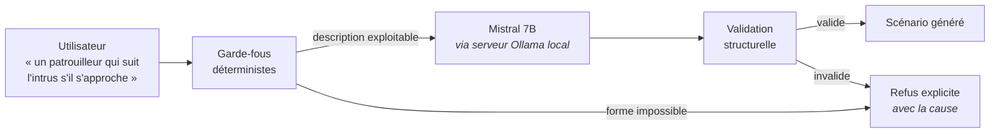

*Figure 5 — Le pipeline de génération : le LLM est encadré, en amont et en aval, par du code déterministe.*

### Le garde-fou, qui est le vrai sujet

Il faut énoncer clairement la limite : **en local, la capacité du modèle est
réduite**. Un modèle 7B se trompe, hallucine, et échoue en particulier sur ce qui
demande de la rigueur — compter correctement les agents, lire des distances,
structurer des branches conditionnelles.

La réponse apportée n'est donc pas de « faire confiance à l'IA », mais d'**ajouter
une couche de fiabilisation** autour d'elle, à la fois **avant** l'appel au
modèle et **après**. Concrètement, dans `bdd/ai_scenario_generator.py`, cette
couche se déroule en six temps.

D'abord, un **filtre de pertinence, avant même d'envoyer quoi que ce soit au
modèle** (`_has_actionable_signal`) : si la description ne contient ni mention
d'un intrus/d'une menace ni aucun mot-clé de mission reconnu, aucun appel LLM
n'est fait — l'application pose directement deux questions de clarification à
l'utilisateur. À ce même stade, certaines demandes sont refusées d'emblée sans
appeler le modèle : une forme de trajectoire que rien dans le code ne sait tracer
(carré, spirale, zigzag, étoile — `_mentions_unsupported_shape`, voir § 1.3), ou
une interposition demandée sans condition de déclenchement associée.

Ensuite, une **extraction déterministe des faits que le texte donne
explicitement**, effectuée par des expressions régulières sur la description
brute plutôt que confiée au modèle : le nombre d'agents attendus, le nombre
d'intrus/cibles, un seuil de distance chiffré (« moins de 100 m »), et surtout
la détection de **toute** ligne du type « si `<condition>` : `<comportement>` »
(`_detect_multi_condition_branches`). Quand ce dernier cas est détecté, la tâche
conditionnelle correspondante (`reagir_conditions` dans la base de connaissance)
est construite **entièrement par du code, sans passer par le LLM** pour cette
partie précise — le LLM ne sert alors qu'à décrire les agents eux-mêmes.

Le modèle est ensuite appelé (température basse, sortie JSON forcée, 90 secondes
de délai maximum) avec un prompt qui énumère explicitement les huit missions
disponibles et les règles de comptage. Sa réponse est comparée aux faits extraits
à l'étape précédente : si le nombre d'agents ou d'intrus ne correspond pas, si
une mission n'est pas reconnue, ou si une tâche que le modèle propose lui-même
est structurellement incohérente (par exemple une précondition de distance qui
compare un agent à lui-même — toujours vraie, donc inutile), **une seconde et
dernière tentative est faite**, avec un message de correction précis décrivant
l'erreur constatée. Le nombre d'appels au modèle est donc borné à deux par
génération.

Le principe le plus important vient après cette tentative : **en cas
d'incapacité persistante à générer un scénario cohérent, un message d'erreur
explicite est renvoyé, jamais un scénario approximatif**. Il n'y a pas de
*fallback* silencieux. La raison est qu'un scénario **plausible mais faux** est
bien plus dangereux qu'un refus clair : l'utilisateur le lancerait sans savoir
qu'il ne fait pas ce qu'il croit. Le refus nomme la cause exacte (l'agent, la
mission ou le token en défaut) — à distinguer d'un ajustement purement
mécanique : si le nombre d'agents ou d'intrus est simplement insuffisant après
la génération, le code complète lui-même le scénario (en dupliquant un agent
existant, ou en synthétisant un intrus par défaut) plutôt que de refuser, parce
que cette correction-là ne devine aucun comportement, seulement une quantité.

Enfin, **la base de connaissances peut être enrichie** avec les nouvelles tâches
proposées par le modèle (ou construites par la détection déterministe évoquée
plus haut). Sur ce dernier point, une correction s'impose par rapport à ce que
laissait entendre une version précédente de cette explication : **cet
enrichissement est écrit sur disque (`knowledge_base.json`) automatiquement,
côté serveur, dès la génération** — il n'attend pas une validation explicite de
l'utilisateur, et a lieu même si l'utilisateur, ensuite, décide de ne *pas*
importer le scénario proposé comme fichier final. Le seul geste que
l'utilisateur valide explicitement est l'**import du scénario** lui-même (bouton
« Importer comme scénario »), pas la modification de la base de connaissances,
qui a déjà eu lieu à ce moment-là. Le repreneur qui souhaiterait revenir en
arrière sur une tâche ajoutée par erreur doit le faire manuellement, depuis
l'onglet « Connaissances HTN ».

### À retenir

> L'IA, c'est *« un assistant local qui propose, mais qui a le droit — et le
> devoir — de dire : je ne sais pas faire ça. »* La fiabilité ne vient pas du
> modèle : elle vient du **code déterministe qui l'encadre**, avant et après
> l'appel — étant entendu que l'écriture dans la base de connaissances, elle,
> n'est pas soumise à une validation supplémentaire de l'utilisateur.

---

<a id="p1-17"></a>

## 1.7 — Le besoin, entièrement couvert

*(reprise rédigée de la slide 16, l'aboutissement du fil rouge)*

Les cinq besoins formulés au § 1.2 trouvent chacun leur réponse. Le tableau de
départ peut maintenant être relu dans son état final :

| Besoin | Réponse apportée |
|---|---|
| Définir une base de connaissance opérationnelle | **HTN** définit une base de données de tâches et de méthodes |
| Implémenter des agents qui embarquent chacun une mission | **HTN** calcule un plan pour chaque agent |
| Implémenter des agents qui interagissent avec l'environnement | **ROS** transmet les ordres et remonte les positions en temps réel |
| Proposer une interface simple et intuitive | **UI** web, sans dépendance |
| Proposer une option IA pour produire des scénarios à partir du langage naturel | **Ollama** + Mistral, en local |

La tension initiale entre « complexes » et « accessibles à tous » est résolue par
une répartition des rôles : **HTN porte la complexité** (il encaisse la logique
tactique et la réactivité), tandis que **l'UI et l'IA portent l'accessibilité**
(elles n'exposent jamais cette complexité à l'utilisateur).

---

<a id="p1-18"></a>

## 1.8 — Vue d'ensemble de l'architecture

*(reprise rédigée des slides 17 à 21 ; la [Partie 3](#p3) y reviendra en profondeur)*

Cette section donne la vue d'ensemble telle qu'elle a été présentée. Elle suffit
à comprendre le fonctionnement général ; le **[manuel développeur (Partie 3)](#p3)**
détaillera les threads, les fichiers et les formats.

### Phase d'initiation

Au démarrage, un **scénario** (un fichier Python) est chargé. Il fournit l'état
initial du monde : quels agents existent, où ils sont, quel modèle ils utilisent,
et quelle mission chacun porte. Le **runtime** Python prend le relais et fait
apparaître ces agents dans **LOTUSim**.


*Figure 6 — Architecture, phase d'initiation : le scénario alimente le runtime, qui crée les agents dans LOTUSim.*

### Phase d'exécution

C'est ici que tout se joue. Le **moteur HTN** reçoit l'état initial et la mission
d'un agent, et va chercher dans la **base de connaissance** — les tâches et
méthodes, réalisées au préalable par l'expert métier — de quoi construire un
**plan**.


*Figure 7 — Architecture, phase d'exécution : la base de connaissance alimente le moteur HTN, qui produit un plan pour chaque agent.*

Ce plan est ensuite exécuté : le runtime traduit ses actions primitives en
commandes ROS, **envoie les positions** à LOTUSim, et **reçoit en retour les
positions réelles** des agents. Chaque agent dispose de son propre **thread** et
calcule, à chaque cycle, son propre **plan** — en revanche, et ce point mérite
d'être corrigé par rapport à une lecture trop littérale du schéma, **l'état du
monde n'est pas cloisonné par agent** : dans `main.py`, un unique objet `state`
est créé une fois (`state.agents = {...}`, une entrée par agent) puis **partagé,
par référence, entre tous les threads de planification**. C'est précisément ce
partage qui permet à un agent de lire la position d'un *autre* agent pour ses
propres préconditions (distance à une cible, à un intrus, etc.) — un état
réellement isolé par agent rendrait cette réactivité impossible. Ce partage n'est
protégé par aucun verrou explicite côté `state.agents` (seul l'accès aux données
internes du `PoseTracker` — la source des positions ROS — est protégé par un
verrou ; voir [Partie 3, § 3.1.7](#p3-317) pour les implications pratiques de ce choix).


*Figure 8 — Architecture, phase d'exécution : la boucle fermée. Les positions reçues de LOTUSim mettent à jour l'état, ce qui peut déclencher une replanification.*

Sur ce schéma, on distingue nettement les éléments annoncés dans les sections
précédentes : la **base de connaissance** (tâches et méthodes en **JSON**,
actions en **Python**), le **moteur HTN**, le **runtime** avec son *thread par
agent* contenant un **plan** propre puisé dans un **état partagé**, et enfin
**LOTUSim**, relié par les deux flèches d'envoi et de réception des positions.

### La partie interface

L'interface s'insère en amont de cette chaîne : elle produit les scénarios et
édite la base de connaissance, sans jamais interagir directement avec ROS —
au sens strict du terme : le processus de l'interface (`app.py`) n'importe
jamais `rclpy` ; il se contente de lancer `main.py` comme sous-processus séparé
lorsqu'on demande l'exécution réelle d'un scénario (voir § 1.5).


*Figure 9 — Architecture, côté interface : l'UI et le générateur IA alimentent le scénario et la base de connaissance.*

C'est la traduction visible du principe énoncé au § 1.4 : **la conception ne
dépend pas de ROS, seule l'exécution en dépend**.

### Résumé du fonctionnement complet

*(reprise rédigée de la slide 21, « Résumé »)*


*Figure 10 — Synthèse : de la construction du scénario jusqu'à la boucle d'exécution.*

Le fonctionnement d'ensemble se raconte en cinq temps :

1. **L'utilisateur peut construire un scénario** — via l'interface, l'IA, ou
   directement dans un fichier.
2. **L'état initial et la mission sont passés en paramètre de l'algorithme HTN.**
3. **L'algorithme va chercher dans la base de connaissance** — la liste des
   tâches et des méthodes, réalisée au préalable — de quoi **créer un plan**.
4. **Une instance de chaque agent tourne avec son plan**, et ce plan est
   **recalculé** dès qu'un événement est déclenché par les positions ROS reçues.
5. **L'instance envoie les positions de l'agent en continu**, pour suivre le plan.

Ce cinquième point mérite qu'on s'y arrête, car il contient toute la boucle : les
positions envoyées produisent un mouvement, ce mouvement produit de nouvelles
positions reçues, ces positions modifient l'état, et cet état peut invalider les
conditions de la méthode en cours — donc déclencher une **replanification**. C'est
cette boucle, et rien d'autre, qui fait qu'un agent « réagit à son environnement ».

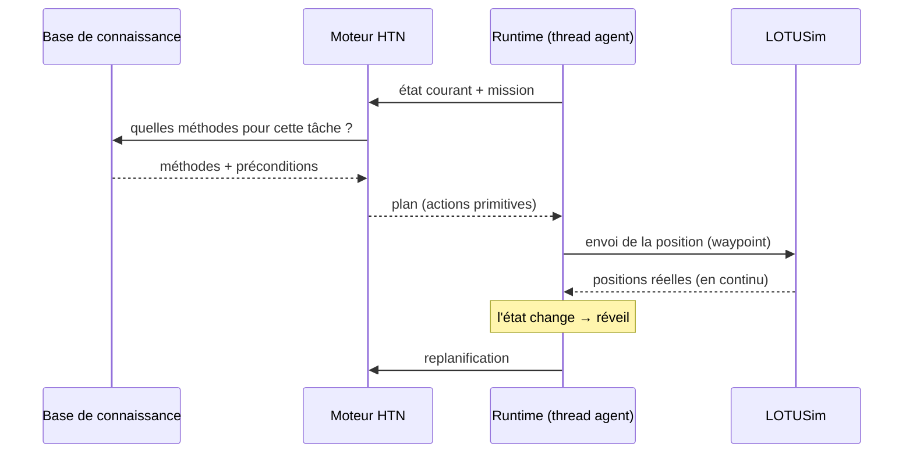

*Figure 11 — La boucle d'exécution, vue comme une séquence.*

---

<a id="p1-transition"></a>

## Transition vers la suite

À ce stade, le lecteur sait **ce que fait le système et pourquoi chaque outil a
été choisi**. Il ne sait pas encore l'installer, l'utiliser, ni le modifier.

- La **[Partie 2 (manuel utilisateur)](#p2)** explique l'installation complète, de
  LOTUSim jusqu'à l'application, puis l'usage de l'interface, écran par écran.
- La **[Partie 3 (manuel développeur)](#p3)** reprend l'architecture esquissée au § 1.8
  et la détaille : les threads, la boucle événementielle, le rôle exact de chaque
  fichier, le choix des formats, et un guide « où aller pour modifier quoi ».
- La **[Partie 4](#p4)** dresse l'inventaire honnête de ce qui n'est pas au point.

---

<a id="p2"></a>

# Partie 2 — Manuel utilisateur

> **⚠️ À VÉRIFIER / À RÉDIGER — cette partie n'existe pas encore.**
> Contrairement aux Parties 1, 3 et 4, aucun contenu n'a été rédigé pour cette
> partie au moment de l'assemblage du document de passation
> (2026-07-09). Ce fichier n'est qu'un espace réservé, pour que la
> numérotation et les renvois du reste du document restent cohérents en
> attendant sa rédaction.
>
> D'après ce que les Parties 1 et 3 annoncent déjà à son sujet, elle devrait
> couvrir :
> - l'installation complète, de LOTUSim jusqu'à l'application (dans l'ordre :
>   prérequis ROS 2 Humble, workspace `lotusim_ws`, Ollama, puis
>   `python3 app.py`) ;
> - l'usage de l'interface **écran par écran** (les trois onglets Scénarios /
>   Connaissances HTN / IA, décrits techniquement en [Partie 1 § 1.5](#p1-15)
>   et [Partie 3 § 3.4](#p3-34), mais jamais montrés ici en usage réel) ;
> - une revue guidée des scénarios de démonstration livrés dans
>   `scenarios/` (`2_agents_patrolling.py`, `demo_veille_drone_intru.py`,
>   `deux_agents_cercle.py`, `evitement_mutuel.py`, `reconnaissance_drone.py`
>   à la date de rédaction des autres parties — voir [Partie 3 § 3.3](#p3-33)
>   pour le rôle de chacun tel qu'observé dans le code, à transformer ici en
>   walkthrough utilisateur).
>
> Tant que cette partie n'est pas écrite, un repreneur qui a besoin
> d'installer/utiliser le projet doit s'appuyer sur `AI_GENERATOR_README.md`
> (à la racine du dépôt, qui ne couvre que l'onglet IA) et sur la lecture
> directe du code guidée par la [Partie 3](#p3).

---

<a id="p3"></a>

# Partie 3 — Manuel développeur

> **Nature de ce document.** Cette partie s'adresse à quelqu'un qui va **modifier
> le code**, pas seulement l'utiliser. Elle suppose la [Partie 1](#p1) lue (le
> vocabulaire HTN/ROS/UI/IA y est posé) et va nettement plus loin : comment le
> système se comporte réellement à l'exécution, pourquoi chaque choix
> d'architecture a été fait, où se trouve chaque fichier et à quoi il sert, et —
> surtout — dans quel fichier aller quand on veut changer un comportement
> précis.
>
> Toute affirmation ci-dessous est vérifiée contre le code du dépôt (branche
> `htn_implementation`) au moment de la rédaction, y compris par des tests
> **exécutés en direct** quand une simple lecture du code ne suffisait pas à
> trancher (signalé explicitement à l'endroit concerné). Rien n'est déduit de
> la présentation d'origine ni des slides — cette partie n'en reprend aucune.

---

<a id="p3-sommaire"></a>

## Sommaire de la partie

1. [Architecture détaillée : les trois blocs, et comment ça tourne vraiment](#p3-31)
2. [Pourquoi ces choix : formats et architecture](#p3-32)
3. [L'arborescence, fichier par fichier](#p3-33)
4. [Où aller pour modifier quoi](#p3-34)

---

<a id="p3-31"></a>

## 3.1 — Architecture détaillée : les trois blocs, et comment ça tourne vraiment

<a id="p3-311"></a>

### 3.1.1 — Les trois blocs

Le dépôt se divise en trois blocs dont la frontière **n'est pas organisationnelle
mais technique** : elle correspond exactement à la présence ou l'absence de ROS
dans le chemin d'import.

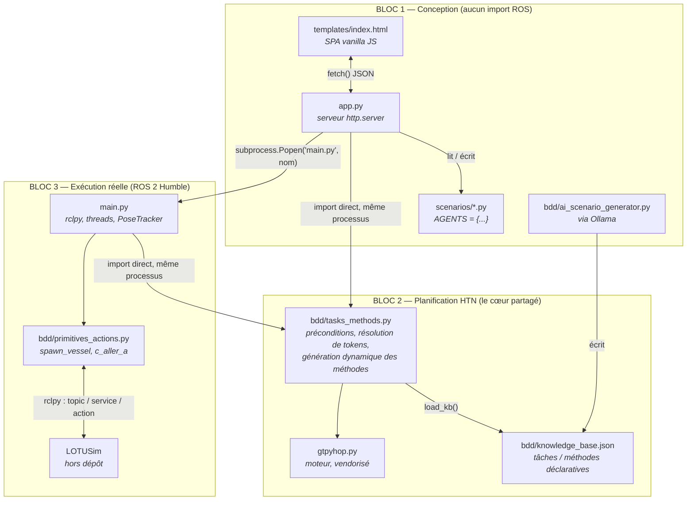

**Bloc 1 — Conception.** Tout ce qui sert à *fabriquer* un scénario ou à éditer la
base de connaissances. Aucun de ces fichiers n'importe `rclpy` ni aucun module
`lotusim_msgs` — c'est vérifiable directement : `app.py` importe `gtpyhop`,
`bdd.tasks_methods`, `bdd.primitives_actions` (le fichier, pas ses fonctions ROS
— voir § 3.1.8) et `bdd.ai_scenario_generator`, jamais `rclpy`.

**Bloc 2 — Planification.** Le cœur partagé : le moteur générique (`gtpyhop.py`,
tiers, jamais modifié) et la couche de traduction du domaine métier
(`bdd/tasks_methods.py`), qui lit `bdd/knowledge_base.json` et enregistre
dynamiquement des méthodes GTPyhop à partir de ce JSON. Ce bloc est **importé
tel quel par les deux autres** : c'est le même fichier `bdd/tasks_methods.py`
qui tourne dans le processus `app.py` (pour le calcul de plan « à blanc ») et
dans le processus `main.py` (pour l'exécution réelle) — mais chacun dans **son
propre processus, avec son propre objet `Domain`** (voir § 3.1.2).

**Bloc 3 — Exécution réelle.** `main.py` et `bdd/primitives_actions.py`, les
deux seuls fichiers Python du dépôt qui, au bout du compte, parlent à ROS. C'est
la frontière la plus stricte du projet, et elle est matérialisée deux fois :
d'abord par un choix d'import (§ 3.1.8), ensuite par un choix de processus —
`main.py` n'est jamais exécuté *dans* le processus de `app.py`, seulement lancé
*depuis* lui.

<a id="p3-312"></a>

### 3.1.2 — Un détail d'amorçage qui conditionne tout : le `Domain` doit exister avant l'import des méthodes

C'est le genre de détail invisible tant qu'il fonctionne, et complètement
bloquant dès qu'on le déplace. `gtpyhop.py` maintient un état global mutable,
`current_domain` (initialisé à `None`), que les fonctions `declare_actions`,
`declare_commands` et `declare_task_methods` modifient — et sur lequel elles
lèvent une exception explicite s'il n'existe pas encore :

```python
# gtpyhop.py
def declare_actions(*actions):
    if current_domain == None:
        raise Exception(f"cannot declare actions until a domain has been created.")
    ...
def declare_task_methods(task_name, *methods):
    if current_domain == None:
        raise Exception(f"cannot declare methods until a domain has been created.")
    ...
```

Or `bdd/tasks_methods.py` appelle `load_kb()` **à l'import du module** (dernière
ligne du fichier), et `load_kb()` appelle `gtpyhop.declare_task_methods(...)`
pour chaque tâche de la base de connaissances. De même,
`bdd/primitives_actions.py` appelle `gtpyhop.declare_actions(...)` et
`gtpyhop.declare_commands(...)` à l'import. Résultat : **l'ordre des imports
n'est pas cosmétique, il est obligatoire.** C'est exactement pourquoi `app.py`
et `main.py` créent leur `Domain` en toute première ligne utile, avant tout le
reste :

```python
# app.py
import gtpyhop
gtpyhop.Domain('ui_plan')          # <- créé AVANT
import bdd.tasks_methods           # noqa: E402   <- déclare ses méthodes DANS ce domaine
import bdd.primitives_actions      # noqa: E402
```

```python
# main.py
gtpyhop.Domain('htn_v1')           # <- créé AVANT
import sys as _sys; _sys.modules.setdefault('main', _sys.modules[__name__])
from bdd.primitives_actions import spawn_vessel
import bdd.tasks_methods           # <- déclare ses méthodes DANS ce domaine
```

Les commentaires `# noqa: E402` dans `app.py` ne sont pas cosmétiques non plus :
ils désactivent l'avertissement du linter « import pas en haut de fichier »,
précisément parce que cet import **doit** venir après `gtpyhop.Domain(...)` et
ne peut donc pas être remonté en haut du fichier sans casser le programme.

**Conséquence pratique pour le développeur :** `app.py` et `main.py` utilisent
**deux objets `Domain` distincts** (noms `'ui_plan'` et `'htn_v1'` — ces noms
n'ont aucun effet fonctionnel, ils ne servent qu'à l'affichage/debug de
`gtpyhop.py`, mais leur existence prouve qu'il s'agit bien de deux instances
séparées). Les deux processus ne partagent **aucune mémoire** : le seul canal
qui les relie est le système de fichiers — `bdd/knowledge_base.json` et
`scenarios/*.py`. C'est développé au § 3.1.9 (avec une vérification empirique)
et justifié au § 3.2.

<a id="p3-313"></a>

### 3.1.3 — Démarrage d'une exécution réelle : la séquence complète de `main.py`

Voici, dans l'ordre exact du code (`main.py`, fonctions `main()` puis
`run_agent()`), ce qui se passe entre `python3 main.py <scenario>` et le régime
de croisière.

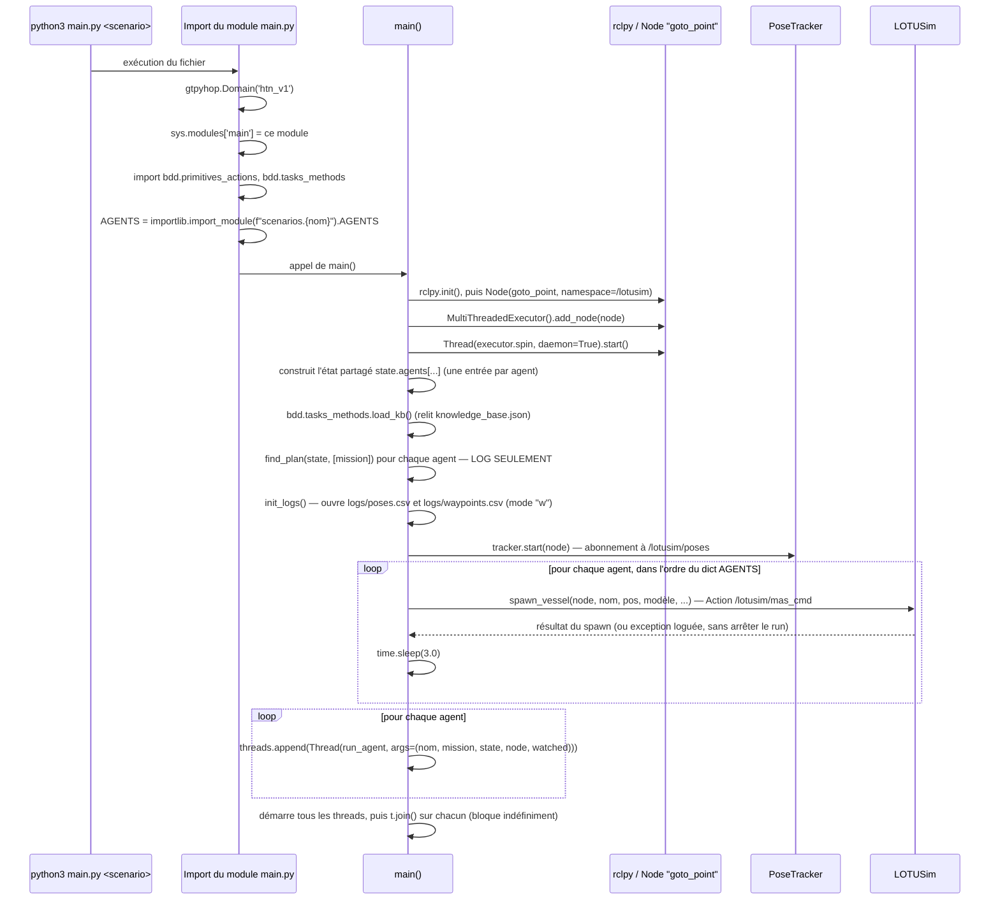

Quatre points méritent d'être soulignés, parce qu'ils surprennent à la lecture :

- **`AGENTS` est chargé avant même `rclpy.init()`.** L'import du scénario a
  lieu au niveau module (ligne `AGENTS = importlib.import_module(...)`, hors de
  toute fonction), donc avant que `main()` ne soit appelée. Un scénario dont le
  fichier ne compile pas fait planter le script **avant** toute connexion ROS.
- <a id="warn-4"></a>**Le spawn est strictement séquentiel et bloquant** : `spawn_vessel` attend la
  fin de l'Action ROS (`main._wait(fut, timeout=10.0)` puis
  `main._wait(res_fut, timeout=10.0)`), et un `time.sleep(3.0)` supplémentaire
  est ajouté après chaque spawn réussi. Pour un scénario à 5 agents, c'est au
  minimum ~15 secondes avant que le premier thread de planification démarre —
  **⚠️ À VÉRIFIER —** aucun commentaire dans le code n'explique ce délai de 3 s ;
  l'hypothèse la plus probable est de laisser à LOTUSim le temps de finaliser
  l'initialisation d'une entité avant d'en demander une autre, mais ce n'est
  **pas documenté** et
  mériterait d'être confirmé avec l'auteur d'origine avant d'être raccourci.
- **Un échec de spawn n'arrête pas le run** : `spawn_vessel` est appelé dans un
  `try/except Exception as e: node.get_logger().error(...)` — un agent dont le
  modèle est invalide ou dont LOTUSim refuse la création est simplement absent
  de la simulation, mais son thread de planification démarre quand même
  ensuite (il tournera dans le vide, sans jamais recevoir de position réelle).
- **Les threads ne se terminent jamais d'eux-mêmes** (`while rclpy.ok():` est
  une boucle infinie tant que ROS tourne) — `t.join()` bloque donc le thread
  principal indéfiniment ; la seule sortie normale du programme est un
  `KeyboardInterrupt` (Ctrl-C), intercepté explicitement pour fermer proprement
  les fichiers de log et l'exécuteur ROS (`finally:` en fin de `main()`).

<a id="p3-314"></a>

### 3.1.4 — La boucle événementielle, agent par agent

Chaque agent, une fois son thread démarré, exécute exactement cette fonction
(`main.py::run_agent`) :

```python
def run_agent(name, task, state, node, watched_names):
    wake = threading.Event()
    for watched in watched_names | {name}:
        tracker.register_watch(watched, wake)

    while rclpy.ok():
        _update_state_from_tracker(state)
        plan = gtpyhop.find_plan(state, [task])
        if plan is not False and plan:
            _execute_plan(plan, state)
        wake.wait(timeout=REPLAN_SAFETY_TIMEOUT)   # REPLAN_SAFETY_TIMEOUT = 5.0
        wake.clear()
```

Ce n'est **pas** une boucle qui « scanne » à intervalle fixe : c'est une boucle
qui **dort** (`wake.wait`) jusqu'à ce qu'on la réveille explicitement, avec un
filet de sécurité à 5 secondes au cas où le réveil événementiel serait manqué
(le commentaire du code le dit explicitement : ce timeout n'est *pas* le
mécanisme de cadencement normal, c'est un filet de sécurité). Le mécanisme de
réveil est détaillé au § 3.1.5.

Un point à ne jamais perdre de vue en modifiant ce fichier : **`watched_names`
est calculé une seule fois, avant le démarrage du thread**, par
`_watched_names_for()` :

```python
def _watched_names_for(name, info, kb, state):
    mission_task = info['mission'][0] if info.get('mission') else None
    tokens = bdd.tasks_methods.collect_watched_tokens(kb, mission_task)
    return bdd.tasks_methods.resolve_watched_agents(state, name, tokens)
```

`collect_watched_tokens` (`bdd/tasks_methods.py`) parcourt **récursivement
toutes les méthodes atteignables** depuis la mission de l'agent — pas seulement
celle actuellement applicable, puisque la branche active peut changer avec le
temps — et en extrait chaque token `__xxx__` utilisé comme cible d'une
précondition de distance ou comme argument de sous-tâche (`__self__` exclu, il
est implicitement toujours surveillé). `resolve_watched_agents` résout ensuite
ces tokens en noms concrets d'agents, **contre l'état initial uniquement**. Le
docstring du code le dit lui-même : c'est du best-effort — si l'identité de la
cible change en cours de route (par exemple un nouvel agent devient « l'intrus »
via une reprise de rôle), ce mécanisme ne le détecte pas ; c'est justement pour
couvrir ce cas limite que le filet de sécurité à 5 secondes existe, et pas
seulement pour parer un événement manqué.

<a id="p3-315"></a>

### 3.1.5 — Animation étape par étape : le réveil sur changement de position

Ce mécanisme est le plus dynamique du système — un schéma unique ne peut pas le
montrer. Voici la séquence décomposée en six images, pensée pour être montée en
GIF (chaque bloc Mermaid est une image indépendante représentant un instant).

**Image 1 — Repos.** Tous les threads d'agents dorment sur `wake.wait()`. Le
`PoseTracker` attend, lui, un message ROS sur le thread de l'exécuteur (qui
n'est PAS un thread d'agent — c'est le thread démarré par
`threading.Thread(target=executor.spin, daemon=True)` dans `main()`).

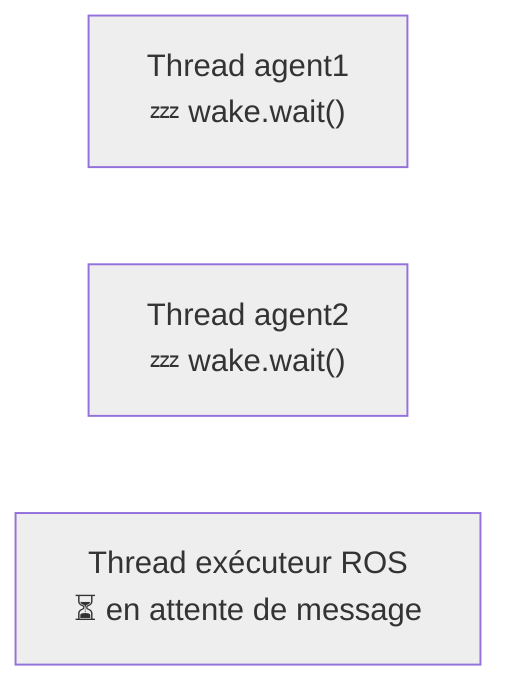

**Image 2 — LOTUSim publie.** Une entité a bougé ; LOTUSim publie un message
`VesselPositionArray` sur le topic `/lotusim/poses`.


**Image 3 — `PoseTracker._cb` s'exécute.** Toujours sur le thread de
l'exécuteur, sous verrou (`self._lock`) : pour chaque vaisseau du message, la
nouvelle position est comparée à l'ancienne.

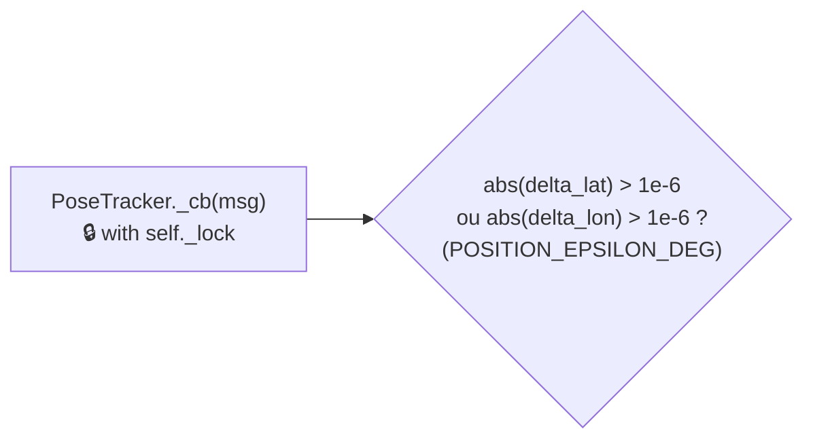

**Image 4 — Écriture du log, dans tous les cas.** Que la position ait
« vraiment » changé ou non, la ligne est écrite dans `logs/poses.csv` et le
fichier est **flushé immédiatement** (pas de buffering — coût CPU accepté pour
ne jamais perdre de données si le process est tué brutalement).

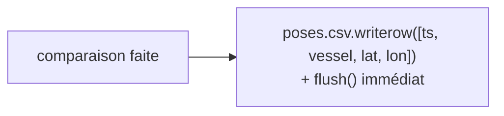

**Image 5 — Réveil ciblé, seulement si le changement est réel.** Si (et
seulement si) l'écart dépasse `POSITION_EPSILON_DEG`, **tous** les
`threading.Event` enregistrés pour ce nom de vaisseau précis sont réveillés —
potentiellement plusieurs agents à la fois, si plusieurs threads surveillent
la même cible.

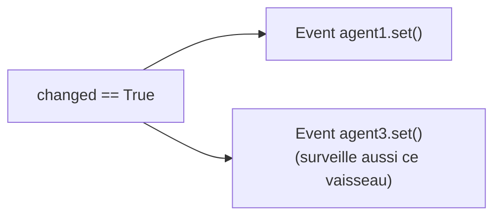

**Image 6 — Le(s) thread(s) réveillé(s) reprennent la main.** `wake.wait()`
retourne immédiatement (au lieu d'attendre les 5 secondes du filet de
sécurité) ; `_update_state_from_tracker(state)` rafraîchit alors la position
de **tous** les agents connus dans l'état partagé (pas seulement celle qui a
déclenché le réveil — voir § 3.1.7), puis `find_plan` est relancé.

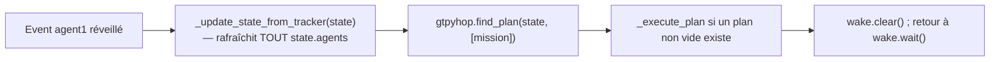

<a id="p3-316"></a>

### 3.1.6 — Animation étape par étape : cycle de vie complet d'un agent

Vue complémentaire à la § 3.1.3, centrée cette fois sur **un seul agent**, du
moment où son nom apparaît dans `AGENTS` jusqu'au régime permanent.

**Image 1 — L'agent n'existe encore que comme donnée.** Une entrée
`AGENTS['drone1'] = {...}` dans le fichier de scénario ; rien n'a encore été
créé côté ROS ni côté HTN.

**Image 2 — Entrée dans l'état partagé.** `main()` construit
`state.agents['drone1'] = {'pos': {...}, 'available': True, 'intruder_nearby': False, 'last_waypoint': None, **agent_conditions(info)}`.

**Image 3 — Plan « à blanc » pour le log.** `gtpyhop.find_plan(state, [info['mission']])`
est appelé une fois, ici uniquement pour écrire le résultat dans les logs ROS
(`node.get_logger().info(...)`) — ce plan n'est **pas exécuté** à ce stade.

**Image 4 — Existence physique dans LOTUSim.** `spawn_vessel(node, 'drone1', ...)`
— Action ROS `/lotusim/mas_cmd` — puis pause de 3 secondes avant l'agent
suivant.

**Image 5 — Naissance du thread dédié.** `threading.Thread(target=run_agent, args=('drone1', mission, state, node, watched), daemon=True).start()`.
À cet instant précis, `run_agent` enregistre ses observateurs :
`tracker.register_watch(w, wake)` pour chaque nom dans `watched_names | {'drone1'}`.

**Image 6 — Premier cycle réel.** `_update_state_from_tracker` (positions pas
encore reçues de LOTUSim à ce stade → `tracker.get('drone1')` renvoie `None`,
donc la position initiale du scénario reste utilisée) ; `find_plan` recalculé ;
si un plan non vide existe, `_execute_plan` envoie une vraie commande ROS
(`c_aller_a`, service `/lotusim/{agent}/waypoints`).

**Image 7 — Régime permanent.** `wake.wait(timeout=5.0)` ; réveil soit par un
changement de position réel sur une cible surveillée (§ 3.1.5), soit par le
filet de sécurité de 5 secondes ; à chaque réveil, retour à l'Image 6. Ce cycle
tourne indéfiniment jusqu'à l'arrêt du processus.

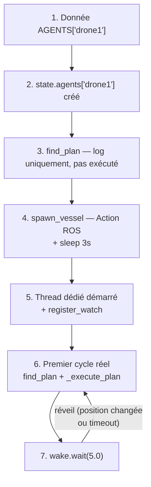

<a id="p3-317"></a>

### 3.1.7 — L'état partagé entre threads (et son absence de verrou)

Point à corriger par rapport à une lecture trop rapide du schéma d'architecture
([Partie 1, § 1.8](#p1-18)) : les agents **ne possèdent pas chacun leur état**. Un seul
objet `state` (`gtpyhop.State('initial_state')`) est créé dans `main()`, et
c'est **la même référence** qui est passée à chaque thread :

```python
state = gtpyhop.State('initial_state')
state.agents = {}
for name, info in AGENTS.items():
    state.agents[name] = { ... }
...
threads = [
    threading.Thread(target=run_agent, args=(name, info['mission'], state, node, watched), daemon=True)
    for name, info in AGENTS.items()
]
```

C'est ce partage qui permet à un agent de lire la position d'un *autre* agent
pour ses propres préconditions (`distance_below`/`distance_above` dans
`bdd/tasks_methods.py::_check`, qui font `state.agents.get(target_name, {})`).
Un état isolé par agent rendrait cette réactivité tout simplement impossible.

Ce partage n'est protégé par **aucun verrou côté `state.agents`**. Le seul
verrou du fichier (`PoseTracker._lock`) protège uniquement les structures
internes du tracker (`self._data`, `self._watchers`), pas `state.agents`
lui-même. Concrètement : `_update_state_from_tracker(state)` — appelée depuis
**chaque** thread d'agent, à chaque cycle — parcourt `for name in state.agents:`
et met à jour la position de **tous** les agents, pas seulement ceux que ce
thread surveille :

```python
def _update_state_from_tracker(state):
    for name in state.agents:
        pos = tracker.get(name)
        if pos:
            ...
            state.agents[name]['pos'] = pos
```

Autrement dit, chaque thread rafraîchit la vue complète du monde à chaque
réveil, pas seulement sa portion. Cela signifie aussi que plusieurs threads
peuvent écrire concurremment dans les mêmes clés de `state.agents` (par exemple
deux threads réveillés au même instant, tous deux en train de recopier la
position d'un troisième agent) : le GIL de CPython rend chaque affectation de
dictionnaire individuellement atomique, donc pas de corruption mémoire, mais
aucune garantie d'ordre entre lectures et écritures qui s'entrelacent — deux
threads consécutifs peuvent lire des instantanés légèrement différents de
l'état pendant qu'ils planifient. Le code ne semble pas en souffrir en
pratique (les préconditions de distance recalculent tout à chaque cycle, donc
un état légèrement périmé se corrige de lui-même au cycle suivant), mais c'est
une zone à garder en tête si un comportement intermittent, difficile à
reproduire, apparaît un jour dans un scénario à beaucoup d'agents.

<a id="p3-318"></a>

### 3.1.8 — Les sous-processus lancés

Le dépôt lance des processus séparés à deux endroits, et c'est délibéré dans
les deux cas :

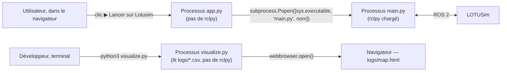

`app.py::launch_scenario` (route `POST /api/scenario/<name>/launch`) :

```python
proc = subprocess.Popen(
    [sys.executable, 'main.py', params['name']],
    cwd=os.path.dirname(os.path.abspath(__file__)),
)
self._send_json({'ok': True, 'pid': proc.pid})
```

Le PID est renvoyé au navigateur et affiché (`launchScenario()` côté JS), mais
**`app.py` ne surveille pas la suite de vie de ce processus** : pas de
récupération de code de sortie, pas de flux de logs remonté vers
l'interface. Si `main.py` plante immédiatement après le lancement (ROS non
sourcé, `lotusim_msgs` introuvable, etc.), l'interface affichera quand même
« lancé — PID xxxx » sans jamais signaler l'échec ; le seul moyen de le
constater est de regarder le terminal où `app.py` lui-même a été démarré (la
sortie standard du sous-processus hérite de celle du parent, `subprocess.Popen`
n'en capture aucune ici) ou d'inspecter `logs/`.

`visualize.py` est un outil complètement indépendant, lancé à la main depuis un
terminal (`python3 visualize.py`), qui ne communique avec rien d'autre que les
fichiers CSV sur disque.

<a id="p3-319"></a>

### 3.1.9 — Vérifié en direct : la base de connaissances vit en mémoire, pas seulement sur disque

Ce point n'est écrit nulle part dans le code sous forme de commentaire — il
découle de la combinaison de deux faits déjà énoncés (§ 3.1.2 : chaque
processus a son propre `Domain` ; `bdd/tasks_methods.py::load_kb()` n'est
appelée qu'à l'import du module, ou explicitement sur demande) — et il a une
conséquence pratique surprenante. Plutôt que de l'affirmer sur la seule lecture
du code, il a été **vérifié par un test en conditions réelles**, décrit ici
pour qu'un futur développeur puisse le reproduire :

1. Base de connaissances propre (sans tâche `test_task_temp`). Démarrage d'un
   `app.py` frais.
2. Requête `GET /api/scenario/<nom>/plan` sur un scénario dont la mission
   pointe vers `test_task_temp` (qui n'existe encore nulle part) →
   **`{"a1": "Erreur: depth 0: ('test_task_temp', 'a1') isn't an action, task, unigoal, or multigoal\n"}`**,
   attendu.
3. **Pendant que ce même processus `app.py` tourne toujours**, la tâche
   `test_task_temp` est ajoutée directement dans `bdd/knowledge_base.json` sur
   disque (exactement ce que fait
   `bdd/ai_scenario_generator.py::_enrich_kb_with_methods` + `_save_kb` lors
   d'une génération IA qui propose une nouvelle tâche).
4. Nouvelle requête `GET /api/scenario/<nom>/plan`, **sans passer par
   `POST /api/kb`** → **exactement la même erreur qu'à l'étape 2.** Le fichier
   sur disque contient pourtant la tâche.
5. Requête `POST /api/kb` (ce que fait le bouton « Sauvegarder la base de
   connaissances » de l'onglet Connaissances HTN, y compris quand on ne
   modifie rien — `app.py::save_kb` réécrit le fichier puis appelle
   inconditionnellement `bdd.tasks_methods.load_kb()`) → **le plan
   fonctionne enfin** (`{"a1": "[] — inactif (drone géré par agent dédié)"}`).

Cela confirme, sans ambiguïté, que **le processus `app.py` garde son propre
`Domain` en mémoire pour toute sa durée de vie**, et que la seule façon de le
resynchroniser avec le fichier `knowledge_base.json` est un appel explicite à
`POST /api/kb`. La route `GET /api/kb` (utilisée par l'onglet Connaissances HTN
pour *afficher* la base) ne fait qu'un `json.load(f)` direct sur le fichier —
elle ne touche jamais au `Domain` du processus.

**Conséquence pratique directement utile pour un développeur ou un
utilisateur avancé :** après une génération IA qui ajoute une tâche
personnalisée (`kb_updates.added_tasks` non vide dans la réponse de
`/api/generate-scenario`), cliquer sur « Calculer plan HTN » pour le scénario
fraîchement importé, **dans la même session du serveur**, échouera avec une
erreur de ce type tant que l'onglet Connaissances HTN n'a pas été sauvegardé au
moins une fois. Le JavaScript (`generateScenarioFromAI`, `templates/index.html`)
rafraîchit bien `kbData` côté client après une génération
(`fetch('/api/kb').then(...)` si `kb_updates` est non vide), mais **cela ne
recharge que l'affichage** — pas le `Domain` gtpyhop vivant côté serveur, qui
est ce que `find_plan`/`launch_scenario` utilisent réellement. Un `main.py`
lancé séparément, lui, n'a pas ce problème : c'est un tout nouveau processus,
qui lit `knowledge_base.json` au moment de son propre import.

---

<a id="p3-32"></a>

## 3.2 — Pourquoi ces choix : formats et architecture

### Pourquoi un JSON pour la base de connaissances

`bdd/knowledge_base.json` doit répondre à trois contraintes simultanées : être
**lisible/éditable par un humain** ([Partie 1, § 1.2, besoin n°1](#p1-12) — l'expert métier doit
pouvoir l'éditer), être **interprétable génériquement par du code** sans
modification du code à chaque nouvelle tâche (`bdd/tasks_methods.py::_make_method`
construit une closure Python à partir d'un dict `{preconditions, subtasks}` —
aucune tâche n'a de fonction Python dédiée), et être **manipulable telle quelle
des deux côtés de l'interface web** — le frontend (`templates/index.html`) la
récupère avec `fetch('/api/kb')` et la manipule en JavaScript natif
(`JSON.parse` implicite via `r.json()`), le backend la charge avec
`json.load()`. JSON est la seule option qui coche les trois cases sans étape de
traduction : pas de sérialiseur maison, pas de schéma binaire, le même texte
sert de format d'édition, de format de transport HTTP et de format de stockage.

### Pourquoi un fichier Python (`AGENTS = {...}`) pour les scénarios, et pas un JSON

C'est un choix différent de celui de la base de connaissances, pour une raison
précise et vérifiable : le champ `mission` d'un agent doit être un **tuple**
Python (par exemple `('aller_a_position', 'intrus', (1.280, 103.770))`), parce
que c'est exactement la forme qu'attend
`gtpyhop.find_plan(state, [agent['mission']])` — GTPyhop compare
`item1[0]` à des clés de dictionnaire et découpe `item1[1:]` comme arguments ;
un `tuple` (ou une `list`) fait l'affaire nativement. **JSON n'a pas de type
tuple** — tout y est une liste — ce qui obligerait à reconvertir chaque mission
au chargement (une étape de traduction qu'on a justement évitée pour la base
de connaissances côté client JS). En écrivant le scénario comme du vrai code
Python et en le chargeant par `importlib.import_module()` plutôt que par
`json.load()`, on récupère le tuple **tel quel**, sans glue code :

```python
# app.py::_load_agents
def _load_agents(name):
    full = f'scenarios.{name}'
    sys.modules.pop(full, None)   # force un rechargement — Python cache les imports par défaut
    try:
        return importlib.import_module(full).AGENTS
    except Exception:
        return None
```

Le `sys.modules.pop(full, None)` juste avant l'import n'est pas anodin non
plus : sans lui, un scénario modifié via l'UI puis relu dans le **même**
processus `app.py` (par exemple juste après un `saveScenario()`) renverrait la
version mise en cache par Python lors du tout premier import, pas la version
tout juste réécrite sur disque — exactement le même type de piège que celui
documenté au § 3.1.9 pour la base de connaissances, mais ici la solution
existe déjà dans le code (`sys.modules.pop`), alors qu'elle n'existe pas pour
`bdd.tasks_methods`.

### Pourquoi séparer « action » et « command » en HTN

Ce n'est pas une simple préférence de nommage : c'est ce qui permet à
**exactement le même moteur de recherche** (`gtpyhop.seek_plan`, avec son
retour-arrière — [Partie 1, § 1.3](#p1-13)) de servir à la fois pour une prévisualisation
sans risque (le bouton « Calculer plan HTN », `app.py::_compute_plan`) et pour
une exécution réelle avec effets de bord ROS (`main.py::_execute_plan`).

Pendant la recherche elle-même, GTPyhop peut explorer plusieurs branches et
revenir en arrière (`_apply_action_and_continue` appelle
`action(state.copy(), *args)` — noter le `.copy()`, une copie profonde
(`copy.deepcopy`) de tout l'état). Si `aller_a` envoyait un vrai waypoint ROS à
chaque appel, **chaque branche explorée pendant la recherche, y compris celles
qui échouent et sont abandonnées, enverrait une commande réelle à LOTUSim** —
la recherche cesserait d'être une pure exploration en mémoire. C'est pour ça
que `bdd/primitives_actions.py::aller_a` ne fait que muter une copie de
l'état :

```python
def aller_a(state, agent, pos):
    """Action pure : met à jour le state (simulation, pas de ROS)."""
    state.agents[agent]['pos'] = {'lat': pos[0], 'lon': pos[1]}
    state.agents[agent]['last_waypoint'] = pos
    return state
```

`c_aller_a` (préfixe `c_`, déclarée via `gtpyhop.declare_commands`, jamais
utilisée par le moteur de recherche lui-même) fait le même travail sur l'état
**et**, en plus, envoie le vrai service ROS. C'est `main.py::_execute_plan`,
du code propre à ce projet et non une fonctionnalité générique de GTPyhop, qui
choisit la commande de préférence à l'action une fois le plan **définitivement
retenu** :

```python
def _execute_plan(plan, state):
    for action in plan:
        cmd_fn = gtpyhop.current_domain._command_dict.get('c_' + action[0])
        if cmd_fn is None:
            cmd_fn = gtpyhop.current_domain._action_dict.get(action[0])
        if cmd_fn:
            cmd_fn(state, *action[1:])
```

`creation_agent` (activation d'un drone compagnon déjà présent dans le
scénario) n'a **aucune** commande `c_creation_agent` associée — c'est
volontaire, ce n'est qu'un marqueur d'état, jamais un ordre envoyé à LOTUSim
(voir le docstring de la fonction, `bdd/primitives_actions.py`) — et
`_execute_plan` retombe alors naturellement sur l'action pure, exactement
comme en mode dry-run.

### Pourquoi les imports ROS sont différés (à l'intérieur des fonctions, pas en tête de fichier)

Regardez la forme exacte de `bdd/primitives_actions.py` :

```python
import math
import gtpyhop
# ── PAS de "import rclpy" ni "from lotusim_msgs..." ici, en tête de fichier ──

def spawn_vessel(node, vessel, init_pos, model, linear_velocities_limits, angular_velocities_limits, heading=0.0):
    from rclpy.action import ActionClient          # <- import DANS la fonction
    from geographic_msgs.msg import GeoPoint
    from lotusim_msgs.msg import MASCmd as MASCmdMsg
    from lotusim_msgs.action import MASCmd
    import main
    ...

def c_aller_a(state, agent, pos):
    from geographic_msgs.msg import GeoPoint        # <- pareil
    from lotusim_msgs.srv import SetWaypoints
    import main
    ...
```

Ce n'est pas un oubli de nettoyage — c'est ce qui rend possible tout le § 3.1.1 :
`app.py` fait `import bdd.primitives_actions` en toute première ligne (avant
même le `Domain`, non — juste après, mais **au niveau module**, donc exécuté
immédiatement). Si `rclpy` était importé en tête de ce fichier, cet import
échouerait immédiatement dans un environnement où ROS 2 n'est pas sourcé — donc
`app.py` lui-même deviendrait injoignable sans ROS, ce qui casserait
complètement la promesse du Bloc 1 (« concevoir un scénario n'a besoin d'aucun
composant ROS », [Partie 1 § 1.4](#p1-14)). En repoussant l'import ROS à l'intérieur du
corps des fonctions, celui-ci ne s'exécute que si — et seulement si —
`spawn_vessel` ou `c_aller_a` sont réellement **appelées**, ce qui n'arrive
jamais depuis `app.py` (qui n'appelle que `gtpyhop.find_plan`, jamais
`_execute_plan`) et arrive systématiquement depuis `main.py` (où ROS est de
toute façon déjà initialisé au moment où ces fonctions sont invoquées).

`gtpyhop.declare_actions(aller_a, creation_agent)` et
`gtpyhop.declare_commands(c_aller_a)`, eux, s'exécutent bien à l'import du
module — mais ils ne font qu'enregistrer des **références de fonctions** dans
un dictionnaire ; ils n'exécutent jamais leur corps. C'est cette distinction
(enregistrer une fonction ≠ l'appeler) qui permet au module entier d'être
importable sans ROS, tout en la rendant utilisable avec ROS dès qu'on
l'appelle réellement.

Le `import main` (également différé, à l'intérieur des mêmes fonctions) répond
à un besoin différent : `spawn_vessel`/`c_aller_a` ont besoin d'accéder à des
objets qui n'existent **qu'une fois `main()` en cours d'exécution**
(`main._ros_node`, `main._wait`, `main._waypoint_log`, `main._waypoint_log_lock`,
`main._ts`) — au moment où `bdd.primitives_actions` est importé (tout en haut
de `main.py`), `main._ros_node` vaut encore `None`. Différer l'import au moment
de l'appel règle ça, à une condition : que `sys.modules['main']` existe déjà à
ce moment-là. C'est précisément le rôle de cette ligne, placée délibérément
tout en haut de `main.py`, juste après la création du `Domain` :

```python
import sys as _sys; _sys.modules.setdefault('main', _sys.modules[__name__])
```

Sans elle, `import main` échouerait quand `main.py` est exécuté directement
(`python3 main.py ...`) : Python enregistre alors ce module sous la clé
`'__main__'` dans `sys.modules`, jamais sous `'main'` — `setdefault` corrige
ça en ajoutant un second alias vers le même module, pour que
`bdd/primitives_actions.py` puisse le retrouver par son nom de fichier.

### Pourquoi un thread par agent

Le code ne le commente pas explicitement — mais la structure de `run_agent`
(§ 3.1.4) rend la raison directement observable : chaque agent bloque sur
`wake.wait(timeout=REPLAN_SAFETY_TIMEOUT)`. Si une seule boucle traitait tous
les agents à tour de rôle, l'attente événementielle de l'un bloquerait
mécaniquement le traitement de tous les autres — un agent en attente d'un
réveil qui n'arrive jamais (ou qui met du temps) gèlerait toute la simulation.
Avec un thread par agent (`main()`, boucle
`threads = [threading.Thread(target=run_agent, ...) for name, info in AGENTS.items()]`),
chaque agent attend, replanifie et exécute **indépendamment** des autres — le
seul point de rendez-vous entre eux est l'état partagé (§ 3.1.7), lu/écrit sans
verrou dédié.

C'est aussi un thread, et pas un process, par agent : les agents doivent
partager le même état (`state`) et le même nœud ROS (`node`) sans coût de
sérialisation — des processus séparés imposeraient soit de la mémoire partagée
explicite, soit un échange par messages, pour un gain de parallélisme réel
quasi nul ici (le goulot d'étranglement n'est jamais le calcul HTN lui-même,
qui est rapide, mais l'attente d'E/S réseau ROS — un thread suffit largement,
le GIL n'étant jamais le facteur limitant sur ce type de charge).

### Pourquoi deux `Domain` gtpyhop séparés plutôt qu'un seul partagé

Découle directement de la séparation en deux processus (Bloc 1 / Bloc 3,
§ 3.1.1) : `app.py` et `main.py` ne sont **jamais le même processus** — le
second est lancé comme sous-processus indépendant par le premier
(§ 3.1.8), donc ils ne peuvent physiquement pas partager un objet Python en
mémoire. Chacun crée son propre `Domain`, et chacun appelle sa propre
`load_kb()` (une fois à l'import pour `main.py`, à l'import puis sur demande
via `POST /api/kb` pour `app.py`). Le seul canal de synchronisation entre les
deux est le système de fichiers : `bdd/knowledge_base.json` et
`scenarios/*.py`. C'est une architecture par échange de fichiers, pas par
mémoire partagée ni par API réseau interne — cohérent avec le reste du projet
(pas de base de données, pas de message broker), mais c'est aussi la source
directe du piège décrit au § 3.1.9.

---

<a id="p3-33"></a>

## 3.3 — L'arborescence, fichier par fichier

### Racine

| Fichier | Rôle | Points d'entrée / fonctions clés |
|---|---|---|
| `app.py` | Serveur HTTP (stdlib `http.server`, aucune dépendance web) : sert l'UI, expose l'API JSON, calcule les plans « à blanc », lance `main.py` en sous-processus. | `_route()` (routeur), `_compute_plan()`, `_load_agents()`, `_write_scenario()`, classe `Handler`. Lancement : `python3 app.py [port]` (défaut 8080). |
| `main.py` | Exécution réelle contre LOTUSim : spawn des agents, un thread de planification par agent, tracking des positions ROS, logs CSV. | `main()`, `run_agent()`, `PoseTracker`, `_execute_plan()`, `_watched_names_for()`. Lancement : `python3 main.py <nom_scenario>` (nécessite ROS 2 Humble sourcé + `lotusim_msgs`). |
| `gtpyhop.py` | Moteur HTN générique, tiers (Univ. of Maryland, BSD-3-Clause-Clear), vendorisé tel quel. **Ne pas modifier.** | `Domain`, `State`, `find_plan()`, `seek_plan()`, `declare_actions/commands/task_methods()`. |
| `visualize.py` | Génère une carte HTML interactive (Leaflet, via CDN) des trajectoires à partir des logs CSV d'une exécution réelle. | `load_csv()` (tolère les logs corrompus par un arrêt brutal), `main()`. Lancement : `python3 visualize.py [poses.csv] [waypoints.csv]`. |
| `INSTALL_OLLAMA.sh` | Installe Ollama et télécharge le modèle `mistral` si absent. | Script shell autonome, aucune dépendance au reste du dépôt. |
| `AI_GENERATOR_README.md` | Documentation utilisateur du générateur IA (installation, usage, dépannage). | — |
| `.gitignore` | Ignore `__pycache__/`, `*.pyc`, `.pytest_cache/`, `logs/*.csv`. | `logs/map.html`, lui, est suivi par Git (à savoir avant de le committer par réflexe). |

### `bdd/` — logique métier et base de connaissances

| Fichier | Rôle | Fonctions/éléments clés |
|---|---|---|
| `knowledge_base.json` | Base de connaissances HTN déclarative : `resolve_tokens` (alias de résolution), `tasks` (tâches composites), `leaf_tasks` (signatures des tâches feuilles, utilisées côté UI pour générer les bons champs de formulaire), `primitive_actions` (documentation des actions ROS, non lue par le code — informatif seulement). | Rechargée par `bdd/tasks_methods.py::load_kb()` — voir § 3.1.9 pour les implications de fraîcheur. |
| `tasks_methods.py` | Cœur de la traduction KB → GTPyhop : préconditions, résolution de tokens `__xxx__`, génération dynamique de méthodes, méthodes feuilles de mouvement (verrouillées, en Python). | `_check()`, `_resolve()`/`_resolve_agent_token()`/`_find_agent_by_pattern()`/`_nearest_agent()`, `_make_method()`, `load_kb()`, `collect_watched_tokens()`/`resolve_watched_agents()`, et les méthodes de mouvement (`aller_a_agent_m`, `suivre_m`, `maintenir_contact_m`, `aller_a_position_m`, `orbiter_m`, `interposer_m`). |
| `primitives_actions.py` | Actions/commandes primitives : `aller_a`/`c_aller_a` (mouvement), `creation_agent` (activation drone compagnon, marqueur d'état seul), `spawn_vessel` (création réelle d'une entité ROS). | Imports ROS différés — voir § 3.2. |
| `utils.py` | Utilitaires génériques partagés : distance, zone, lecture de préconditions génériques, compat rétro `equipement` → `conditions`. | `distance_deg()`, `in_zone()`, `agent_conditions()`, `check_condition()`, constante `MIN_MOVE_DEG = 0.0003`. |
| `ai_scenario_generator.py` | Générateur de scénarios en langage naturel via Ollama/Mistral, avec une couche déterministe de garde-fous avant/après l'appel LLM (voir [Partie 1, § 1.6](#p1-16), pour le détail du pipeline). | Point d'entrée : `generate_scenario_from_description()`. ~1700 lignes, le fichier le plus dense du dépôt. |

### `scenarios/` — un fichier = un scénario

Chaque fichier définit une unique variable `AGENTS`, un dict `nom_agent -> {x, y,
model, heading, linear_velocities_limits, angular_velocities_limits,
conditions, mission}` où `mission` est un **tuple** (voir § 3.2). Chargés
dynamiquement par nom de fichier (sans l'extension `.py`) via `importlib`,
aussi bien par `app.py` que par `main.py`. Au moment de la rédaction :
`2_agents_patrolling.py`, `demo_veille_drone_intru.py`, `deux_agents_cercle.py`,
`evitement_mutuel.py`, `reconnaissance_drone.py` — chacun sert d'exemple pour
une mission ou une combinaison de missions différente (voir [Partie 2](#p2) pour le
détail de chacun). `_list_scenarios()` (`app.py`) exclut tout fichier
commençant par `_` — un moyen déjà disponible pour désactiver temporairement un
scénario de la liste sans le supprimer.

### `templates/`

| Fichier | Rôle |
|---|---|
| `index.html` | SPA monofichier (HTML + CSS + JS vanilla, ~2670 lignes), trois onglets (Scénarios / Connaissances HTN / IA). Communique avec `app.py` exclusivement via `fetch()` sur `/api/*`. Voir § 3.4 pour la carte des fonctions JS pertinentes selon ce que vous voulez modifier. |

### `tests/`

| Fichier | Rôle |
|---|---|
| `test_intruder_resolution.py` | 3 tests `unittest` sur `bdd.tasks_methods._resolve()` (résolution de `__intruder__`, `__base__`, `__any__`). Seul fichier de test du dépôt — `bdd/ai_scenario_generator.py` (le plus gros fichier) n'a aucun test. Lancement : `python3 -m pytest -q` (aucune dépendance ROS nécessaire). |

### `logs/`

| Fichier | Rôle |
|---|---|
| `poses.csv` | Toutes les positions reçues de LOTUSim pendant une exécution réelle (`timestamp, agent, lat, lon`), réécrit (`open(..., 'w')`, donc **écrasé**, pas concaténé) à chaque lancement de `main.py`. Ignoré par Git. |
| `waypoints.csv` | Chaque waypoint réellement envoyé à un agent (`c_aller_a`). Même remarque. |
| `map.html` | Généré par `visualize.py`. Suivi par Git (à la différence des deux CSV ci-dessus). |

---

<a id="p3-34"></a>

## 3.4 — Où aller pour modifier quoi

| Je veux… | Fichier(s) à ouvrir | À quoi faire attention |
|---|---|---|
| Ajouter une mission **composite**, réutilisant des mouvements déjà existants (aller vers un agent, orbiter, s'interposer, etc.) | `bdd/knowledge_base.json` — nouvelle entrée dans `tasks`, avec ses `methods` (chacune : `preconditions` + `subtasks`) | La **première** méthode dont la précondition est vraie l'emporte : placer le cas par défaut (`preconditions: []`) en dernier. Les tokens `__xxx__` utilisés doivent être connus (`__cible__`, `__intruder__`, `__base_location__`, `__zone__`, `__drone__`, `__any__`, `__self__`) ou correspondre à un rôle/marqueur `is_xxx` posé sur un agent. Aucun code Python à toucher. |
| Rendre cette mission sélectionnable dans le **générateur IA** comme mission « officielle » | En plus de ce qui précède : `bdd/ai_scenario_generator.py`, dict `_TOP_LEVEL_MISSIONS` (description en langage naturel injectée telle quelle dans le prompt) et, si la mission doit être détectée depuis des phrases « si `<condition>` : `<comportement>` », `_BRANCH_MISSION_KEYWORDS` | Sans cette étape, la mission reste utilisable manuellement dans l'éditeur de scénario, mais le LLM ne la proposera jamais de lui-même. |
| Ajouter une primitive de mouvement **réellement nouvelle** (une forme de trajectoire qu'aucune méthode existante ne sait produire) | `bdd/tasks_methods.py` (nouvelle fonction `xxx_m(state, agent, ...)`, déclarée via `gtpyhop.declare_task_methods('xxx', xxx_m)`) + `bdd/knowledge_base.json` (`leaf_tasks`, avec la liste des types d'arguments — lue par l'UI, voir `getArgSpec`/`inferTaskExtra` dans `templates/index.html`) | Respecter la convention d'idempotence des méthodes de mouvement existantes : renvoyer `False` **seulement** si la cible est réellement introuvable, `[]` si déjà à la position voulue (evite l'oscillation documentée en commentaire au-dessus de `aller_a_agent_m`), sinon `[('aller_a', agent, pos)]`. Si un effet ROS réel est nécessaire, ajouter aussi une commande `c_xxx` dans `bdd/primitives_actions.py` (imports ROS **dans** la fonction, jamais en tête de fichier — § 3.2) et la déclarer via `gtpyhop.declare_commands`. Retirer le mot-clé correspondant de `_UNSUPPORTED_SHAPE_KEYWORDS` (`bdd/ai_scenario_generator.py`) si le générateur IA doit désormais l'accepter. |
| Changer un paramètre numérique d'un comportement de mouvement existant (rayon d'orbite, seuil de capture, fraction d'interposition…) | `bdd/tasks_methods.py` pour les constantes globales (`ORBIT_ANGULAR_STEP`, `DEFAULT_ORBIT_RADIUS_DEG`, `ORBIT_RADIUS_MARGIN`, `INTERPOSE_FRACTION`), `bdd/utils.py` pour `MIN_MOVE_DEG` (seuil d'idempotence, en degrés), ou directement les `threshold` inscrits dans `bdd/knowledge_base.json` (ex. `0.0045` pour la capture de `suivre_agent`) | Ces valeurs sont en **degrés de latitude/longitude**, pas en mètres — une conversion approximative est déjà faite ailleurs dans le code (`_METERS_PER_DEGREE = 111_320` dans `bdd/ai_scenario_generator.py`) si besoin de raisonner en mètres. |
| Ajouter un nouveau **type de précondition** | `bdd/utils.py::check_condition()` pour un type générique (comparaison sur une seule variable de l'agent), `bdd/tasks_methods.py::_check()` pour un type qui a besoin de l'état complet (accès à d'autres agents, comme `distance_below/above`) | Ajouter aussi le rendu correspondant côté éditeur KB (`PRECOND_KIND`, `buildPrecondRow()` dans `templates/index.html`) si le type doit être éditable visuellement, sinon il ne sera modifiable qu'en éditant le JSON à la main. |
| Changer la façon dont un token `__xxx__` se résout en agent concret | `bdd/tasks_methods.py::_resolve_agent_token()` / `_find_agent_by_pattern()` / `_resolve()` pour la logique ; `bdd/knowledge_base.json::resolve_tokens` pour un simple alias | Un override explicite posé sur l'agent (`conditions.<nom_du_token> = "<agent_choisi>"`) l'emporte toujours sur la résolution automatique — voir le docstring de `_resolve_agent_token`. |
| Modifier l'interface (ajouter un champ, changer un onglet, changer l'apparence) | `templates/index.html` uniquement — un seul fichier, pas d'étape de build | La logique de dépendances entre agents (`getTaskAgentDeps()`/`resolveMissionDeps()`, JS) **duplique** une partie de la résolution de tokens qui existe côté Python (`bdd/tasks_methods.py`) pour afficher des avertissements avant même d'appeler le serveur — toute nouvelle convention de token côté Python doit être répercutée ici aussi, sous peine de divergence silencieuse. |
| Toucher à la communication ROS (nouveau topic, service, action) | `bdd/primitives_actions.py` (nouvelle fonction, imports ROS **dans** le corps de la fonction) ; `main.py` si un nouveau tracker/abonnement est nécessaire (à côté de `PoseTracker`) | Ne jamais importer `rclpy`/`geographic_msgs`/`lotusim_msgs` en tête de `bdd/primitives_actions.py` — ça casserait l'import de ce module par `app.py`, qui doit rester utilisable sans ROS (§ 3.2). |
| Changer le prompt envoyé au LLM, ou la logique de génération IA | `bdd/ai_scenario_generator.py::_build_prompt()` pour le texte du prompt | Toute nouvelle règle ajoutée au prompt doit être répercutée dans les vérifications déterministes qui contrôlent la réponse (`_parse_scenario_from_description()`, `_validate_suggested_method()`) — sinon le garde-fou ne « connaît » pas la nouvelle règle et peut soit la rejeter à tort, soit ne pas détecter sa violation. |
| Changer le modèle LLM utilisé par le générateur | `bdd/ai_scenario_generator.py::_query_ollama()`, paramètre `model` (en dur, `"mistral"`) | Aucun réglage exposé dans l'UI ni variable d'environnement — il faut modifier le code et avoir fait `ollama pull <modèle>` au préalable. |
| Ajouter un scénario de démonstration | Nouveau fichier `scenarios/<nom>.py` | Le plus simple est de dupliquer un scénario existant proche (ex. `deux_agents_cercle.py` pour un cas à 2 agents) et d'ajuster positions/missions/conditions ; `mission` doit rester un **tuple**, pas une liste ni une chaîne. |
| Déboguer un plan qui ne se calcule pas comme attendu | Bouton « Calculer plan HTN » de l'UI (`app.py::_compute_plan`) — sans risque, sans ROS | Si la mission utilise une tâche tout juste ajoutée (par la KB ou par l'IA) et que le plan échoue avec une erreur `isn't an action, task, unigoal, or multigoal`, voir § 3.1.9 avant de chercher un bug ailleurs — c'est presque toujours un problème de fraîcheur du `Domain` en mémoire, pas une erreur de KB. Pour un diagnostic plus fin, `gtpyhop.verbose` (0 à 3) peut être relevé temporairement dans le script utilisé. |
| Changer le format ou le contenu des logs / la visualisation | `main.py::init_logs()`/`PoseTracker._cb()` pour ce qui est écrit ; `visualize.py` pour ce qui est affiché | `poses.csv`/`waypoints.csv` sont **écrasés** (pas concaténés) à chaque lancement de `main.py` — sauvegarder ailleurs avant de relancer un run si l'historique précédent doit être conservé. |
| Changer le port ou le mode de lancement du serveur web | `app.py`, tout en bas (`if __name__ == '__main__':`) | Le docstring en tête de fichier (ligne 5) annonce `http://localhost:5000` — c'est **faux**, le défaut réel codé plus bas est `8080` ; ne pas se fier à ce commentaire s'il n'a pas été corrigé entre-temps. |

---

<a id="p3-transition"></a>

## Transition vers la suite

Cette partie a détaillé le **comment** et le **pourquoi** du fonctionnement
interne. Elle s'appuie sur, et complète, la [Partie 1](#p1) (le **quoi** et ses
justifications de haut niveau) et prépare la [Partie 2](#p2) (le manuel utilisateur,
qui n'a besoin de rien de tout ceci pour être suivi).

La **[Partie 4](#p4)** s'appuiera directement sur les points signalés ici — en
particulier § 3.1.9 (fraîcheur de la KB en mémoire), § 3.1.7 (état partagé sans
verrou), et le manque de tests sur `bdd/ai_scenario_generator.py` — pour
dresser l'inventaire honnête de ce qui reste fragile dans le projet.

---

<a id="p4"></a>

# Partie 4 — Limites et améliorations

> **Nature de ce document.** Relecture critique du code tel qu'il existe au
> moment de la rédaction (branche `htn_implementation`), pas une liste de
> vœux. Chaque point ci-dessous a été retrouvé dans le code réel — cité par
> fichier et fonction — et, quand une simple lecture ne suffisait pas à
> trancher, vérifié par un test exécuté en direct (signalé explicitement).
> Rien n'est présenté comme certain sans preuve.
>
> **Convention d'effort.** Faute d'historique de vélocité d'équipe sur ce
> projet, les pistes de correction sont chiffrées en taille de tee-shirt, avec
> un ordre de grandeur en temps pour rester concret :
> **XS** (< 1 h), **S** (quelques heures à une journée), **M** (quelques
> jours), **L** (plus d'une semaine / repense un morceau d'architecture).
> Ces ordres de grandeur sont des estimations de lecture de code, pas des
> engagements.

---

<a id="p4-sommaire"></a>

## Sommaire de la partie

1. [Axe IA : fiabilité du générateur de scénarios](#p4-41)
2. [Axe Modularité](#p4-42)
3. [Axe Optimisation / robustesse](#p4-43)
4. [Tableau récapitulatif, par taille d'effort](#p4-44)
5. [Pièges déjà rencontrés et résolus — à ne pas réintroduire](#p4-45)

---

<a id="p4-41"></a>

## 4.1 — Axe IA : fiabilité du générateur de scénarios

<a id="p4-411"></a>

### 4.1.1 — La « vérification de complétude » ne vérifie rien

**Symptôme.** Un scénario généré par l'IA peut être annoncé « sans erreur » par
l'interface (`issues.missing_tasks` vide) alors même que l'une de ses missions
réelles pointe vers une tâche inexistante ou mal formée dans la base de
connaissances.

**Cause, dans le code.** `bdd/ai_scenario_generator.py::validate_scenario_completeness()`
vérifie `scenario.get("mission", [])` — mais ce champ **scénario-niveau** est
mis à une valeur littérale constante juste avant, dans
`generate_scenario_from_description()` :

```python
# Every acting agent already carries its own resolved mission (set above) —
# this scenario-level field is only a display fallback, never LLM-authored.
mission_list = ["veiller __self__"]
...
scenario = {"name": slug, "agents": agents, "mission": mission_list}
```

`validate_scenario_completeness()` ne regarde **jamais**
`scenario["agents"][nom]["mission"]` (le champ qui contient les *vraies*
missions, une par agent, potentiellement `"reagir_conditions __self__"` ou
n'importe quelle tâche personnalisée). Elle vérifie systématiquement une seule
chaîne fixe, `"veiller __self__"` — et `veiller` existe *toujours* dans la
base de connaissances (c'est l'une des tâches les plus basiques). Le champ
`issues["missing_tasks"]` retourné est donc **structurellement toujours
vide**, quel que soit ce que l'IA a réellement généré.

**Impact.** L'utilisateur peut importer et tenter de lancer un scénario dont
une mission ne se résoudra jamais (précondition irréaliste, token non
résolvable, tâche personnalisée mal construite malgré les gardes-fous
structurels de `_validate_suggested_method`) sans le moindre avertissement de
cette fonction — le seul signal viendrait alors, bien plus tard, d'une erreur
brute au moment de « Calculer plan HTN » ou du lancement réel.

**Piste de correction.** Remplacer cette vérification vacuité par ce que le
bouton « Calculer plan HTN » fait déjà pour un scénario sauvegardé
(`app.py::_compute_plan`) : construire un `state` minimal à partir de
`scenario["agents"]` et appeler réellement
`gtpyhop.find_plan(state, [agent['mission']])` pour **chaque agent**, en
rapportant tout agent dont le plan vaut `False` ou lève une exception — pas
seulement une vérification de nom de tâche, une vérification que le plan se
calcule *effectivement*. Piège à anticiper : cette vérification tournerait
dans le même processus `app.py` que l'appel qui vient d'écrire une éventuelle
nouvelle tâche dans `knowledge_base.json` — sans un appel explicite à
`bdd.tasks_methods.load_kb()` juste avant, elle se heurterait exactement au
piège de fraîcheur documenté en [Partie 3, § 3.1.9](#p3-319), et échouerait à tort sur
toute tâche fraîchement ajoutée par l'IA elle-même. **Taille : S** (la
mécanique de calcul de plan existe déjà et est directement réutilisable ;
l'essentiel du travail est de construire un `state` équivalent à celui
qu'utilise `_compute_plan`, et d'ajouter le rechargement de KB manquant).

<a id="p4-412"></a>

### 4.1.2 — Un seul retry, donc deux appels LLM au maximum

**Symptôme.** Sur une description complexe (plusieurs agents, plusieurs
branches conditionnelles, rôles mixtes), le modèle 7B peut échouer sur les
deux tentatives autorisées et le générateur renvoie `cannot_model` — y compris
pour des scénarios qui seraient modélisables si le LLM les avait mieux
compris.

**Cause, dans le code.** `bdd/ai_scenario_generator.py` :
`MAX_RETRIES = 1`, utilisé dans
`for attempt in range(MAX_RETRIES + 1):` (`_parse_scenario_from_description`)
— deux appels à `_query_ollama` au maximum, quel que soit le nombre de
problèmes détectés au premier essai.

**Impact.** Compromis assumé entre fiabilité et temps de réponse (chaque appel
prend 30 à 90 s d'après `AI_GENERATOR_README.md` et le `timeout=90` de
`_query_ollama`) — mais non mesuré : rien dans le dépôt ne quantifie le taux
de réussite réel à 1 vs 2 vs 3 tentatives sur un jeu de descriptions
représentatif.

**Piste de correction.** Avant de toucher à la constante elle-même, construire
un petit jeu de descriptions de test (voir § 4.1.5) et mesurer le taux de
succès selon le nombre de tentatives — augmenter `MAX_RETRIES` sans données
ne serait qu'un pari sur le temps d'attente utilisateur. **Taille : XS** pour
le changement de constante seul ; **S** pour la mesure qui doit le précéder et
le justifier.

<a id="p4-413"></a>

### 4.1.3 — Le filet déterministe ne couvre qu'une syntaxe rigide

**Symptôme.** Une description qui exprime une logique conditionnelle en prose
libre (sans la forme exacte « si `<condition>` : `<comportement>` ») échappe
entièrement à la détection déterministe des branches et repose alors sur la
seule interprétation du LLM, sans le filet de sécurité qui, pour la syntaxe
reconnue, refuse explicitement plutôt que de deviner.

**Cause, dans le code.** `_GENERIC_BRANCH_LINE_PATTERN` dans
`bdd/ai_scenario_generator.py` :

```python
_GENERIC_BRANCH_LINE_PATTERN = re.compile(
    r'(?:^|[-*]\s*)(?:si|if)\s+([^:\n]+?)\s*:\s*([^\n]+)',
    re.IGNORECASE | re.MULTILINE,
)
```

Cette expression exige un « si »/« if » suivi d'un `:` séparant clairement
condition et comportement, sur une ligne. Une description telle que *« Quand
l'intrus s'approche à moins de 200 mètres, le patrouilleur doit l'intercepter,
sinon il continue sa ronde »* — sémantiquement identique à un « si...  :... »
— ne matche pas ce motif : `_detect_multi_condition_branches` renvoie
`(None, [])`, et le comportement retombe entièrement sur la génération LLM
libre, avec uniquement les vérifications structurelles génériques (comptage
d'agents, validité de mission) pour la rattraper — pas la vérification fine,
clause par clause, que ce détecteur offre pour la syntaxe reconnue.

**Impact.** Fiabilité inégale selon la façon dont l'utilisateur formule sa
description — un utilisateur qui ne connaît pas la syntaxe « si : » attendue
(documentée seulement dans l'aide contextuelle de l'onglet IA) obtient une
garantie plus faible sans le savoir.

**Piste de correction.** Élargir `_GENERIC_BRANCH_LINE_PATTERN` pour capturer
quelques tournures supplémentaires fréquentes (« quand X, Y », « dès que X,
Y », « si X alors Y ») serait un gain rapide mais incomplet par nature (la
prose libre est infinie). Une piste plus robuste : demander explicitement au
LLM, dans un pré-traitement, de reformuler la description en lignes « si :
» avant de lancer la détection déterministe — ce qui déplace le problème
plutôt que de le résoudre (le LLM peut mal reformuler), mais donne au moins un
texte reformulé affichable à l'utilisateur pour validation avant génération.
**Taille : S** pour l'extension du regex (gain partiel, rapide) ; **M** pour
la piste de reformulation assistée (nouveau détour LLM à concevoir et
valider).

<a id="p4-414"></a>

### 4.1.4 — Le comptage d'agents a des angles morts documentables

**Symptôme.** `expected_count` (le seul signal qui active la vérification
déterministe du nombre d'agents produits) reste `None` pour certaines
formulations légitimes, désactivant silencieusement ce garde-fou précis.

**Cause, dans le code.** `_expected_agent_count()` reconnaît deux formes : des
agents numérotés partageant un nom générique (`agent1`, `agent2`… via
`r'\b(?:agent|bateau|drone|usv|navire)[\s_]?(\d+)\b'`) et un compte explicite
suivi d'un nom générique (« deux bateaux », « 3 drones »). Une description qui
nomme les agents par des noms propres arbitraires (« Alpha, Bravo et Charlie
patrouillent la zone ») ne matche ni l'une ni l'autre forme —
`_expected_agent_count` renvoie `None`, et `count_wrong` (la vérification qui
compare le nombre d'agents produits au nombre attendu) ne se déclenche alors
plus jamais pour cette génération : `count_wrong = expected_count is not None and len(acting) != expected_count`.

**Impact.** Sur ce type de formulation, si le LLM oublie un agent ou en
invente un de trop, rien ne le détecte — contrairement au cas « deux
bateaux », où une erreur de comptage du LLM déclenche systématiquement un
second essai avec feedback correctif.

**Piste de correction.** Étendre la détection pour repérer une liste de noms
propres séparés par des virgules/« et » suivie d'un verbe d'action commun
(heuristique plus fragile, faux positifs probables sur des phrases qui ne
sont pas des énumérations d'agents) — à traiter avec prudence, un faux
positif ici *ajoute* une contrainte fausse plutôt que d'en retirer une
vraie. **Taille : M** (nécessite un jeu de descriptions de test pour calibrer
le taux de faux positifs avant activation, pas seulement écrire le regex).

<a id="p4-415"></a>

### 4.1.5 — Zéro test automatisé sur 1704 lignes de logique

**Symptôme.** `bdd/ai_scenario_generator.py` est, de très loin, le fichier le
plus dense en logique du dépôt (comptage regex, détection de branches,
validation structurelle, réparation de tokens, retry avec feedback) — et
`tests/` ne contient qu'un seul fichier, `test_intruder_resolution.py`, qui ne
le teste pas du tout.

**Cause.** Aucune, dans le code — c'est une absence, pas un choix documenté.

**Impact.** Toute modification du prompt, d'un regex ou d'une règle de
validation peut casser silencieusement un cas qui fonctionnait auparavant ; la
seule façon de le savoir aujourd'hui est un test manuel via l'UI, avec Ollama
réellement lancé, ce qui est lent et non reproductible à l'identique (le LLM
n'est pas déterministe malgré la température basse de `0.15`).

**Impact positif à noter, pour cadrer l'effort correctement :** la
**majorité** du fichier est en réalité du code Python pur, sans appel réseau —
`_expected_agent_count`, `_mentions_intruder`, `_mentions_passive_agent`,
`_detect_multi_condition_branches`, `_validate_suggested_method`,
`_repair_suggested_tokens`, `_clamp_coord`, `_normalize_mission`… toutes ces
fonctions ne dépendent que de leur texte d'entrée et sont testables
**immédiatement**, sans mock d'Ollama.

**Piste de correction.** Un premier lot de tests unitaires sur ces fonctions
pures (entrée texte → sortie attendue), sans toucher au réseau, couvrirait
déjà l'essentiel du risque de régression silencieuse. Un second lot, plus
coûteux, testerait le pipeline complet avec `_query_ollama` mocké (réponses
JSON enregistrées une fois, format « cassette », rejouées en boucle) pour
couvrir `_parse_scenario_from_description` et le mécanisme de retry sans
dépendre d'Ollama à chaque exécution de `pytest`. **Taille : M** pour le
premier lot (fonctions pures, un ou deux jours) ; **M** supplémentaire pour le
second lot (mock/cassettes du LLM, machinerie à construire).

<a id="p4-416"></a>

### 4.1.6 — Un plafond structurel, pas un bug : validation syntaxique, jamais sémantique

**À noter explicitement, pour cadrer les attentes du repreneur** : toutes les
vérifications décrites dans cette section (comptage, validité de mission,
tokens reconnus, structure des méthodes suggérées) sont **structurelles** — «
est-ce que ça va planter » — jamais **sémantiques** — « est-ce que ça fait
réellement ce que l'utilisateur a demandé ». Rien dans l'architecture actuelle
ne peut garantir qu'un scénario syntaxiquement valide correspond à l'intention
tactique décrite ; par exemple, rien n'empêche structurellement le LLM
d'assigner « eviter » à un agent alors que la description voulait clairement
« encercler » — les deux missions sont également valides pour la structure
du générateur, avec les mêmes exigences (`conditions.cible`, pas besoin de
rôle « intruder »).

Ce n'est pas un défaut réparable par un correctif ponctuel : c'est la limite
inhérente d'un modèle 7B local associé à des vérifications structurelles.
L'atténuation réaliste n'est pas dans le code du générateur, mais dans le
**processus** — le pipeline actuel encourage déjà ceci (l'écran de
prévisualisation avant import, [Partie 2](#p2)), mais rien ne le rend obligatoire. Une
piste concrète et peu coûteuse : appeler « Calculer plan HTN » **automatiquement**
sur le scénario généré avant même de le présenter à l'utilisateur (en
réutilisant le correctif de § 4.1.1), et **afficher le plan résultant** en
plus des seuls warnings texte — donner à l'utilisateur de quoi juger le
comportement réel, pas seulement la structure. **Taille : S**, une fois § 4.1.1
en place.

---

<a id="p4-42"></a>

## 4.2 — Axe Modularité

<a id="p4-421"></a>

### 4.2.1 — L'interface tient dans un unique fichier de ~2670 lignes

**Symptôme.** `templates/index.html` mélange HTML, CSS et JavaScript dans un
seul fichier. Toute modification de l'UI — même minime — touche ce même
fichier, quelle que soit la partie concernée (éditeur de scénario, éditeur de
KB, onglet IA).

**Cause.** Choix délibéré, documenté en [Partie 1 § 1.5](#p1-15) : zéro dépendance,
zéro étape de build, déployable sur n'importe quelle machine avec juste
Python. Ce n'est pas un oubli — c'est un compromis assumé dont le prix est
maintenant à chiffrer.

**Impact concret, observable dans ce dépôt même** : le diff non committé au
moment de la rédaction touche `templates/index.html` en même temps que
`bdd/ai_scenario_generator.py` et `bdd/knowledge_base.json`, sur des
préoccupations pourtant différentes (documentation UI d'un côté, logique IA de
l'autre) — un seul fichier géant augmente mécaniquement la probabilité de
conflits de fusion Git dès que deux changements simultanés touchent l'UI,
même pour des raisons sans rapport.

**Piste de correction, qui préserve la philosophie « zéro dépendance ».**
Scinder au minimum le CSS et le JS dans des fichiers statiques séparés
(`static/style.css`, `static/app.js`), servis par une route statique simple
ajoutée à `app.py::Handler` (quelques lignes, pas de nouvelle dépendance).
Pour aller plus loin sans introduire de bundler, découper le JavaScript en
modules ES natifs (`<script type="module">`, `import`/`export` supportés
nativement par tous les navigateurs modernes depuis longtemps, aucune
compilation nécessaire) — par exemple un module par onglet
(`scenarios.js`, `kb.js`, `ia.js`) plus un module d'utilitaires partagés.
**Taille : S** pour la séparation CSS/JS en fichiers statiques simples ;
**M** pour le découpage en modules ES (implique de vérifier soigneusement
tous les points de couplage implicite actuels, par exemple `kbData` utilisé
comme variable globale partagée entre plusieurs fonctions aujourd'hui
adjacentes dans le même fichier).

<a id="p4-422"></a>

### 4.2.2 — Aucun fichier de dépendances

**Symptôme.** Aucun `requirements.txt`, `pyproject.toml`, `setup.py` ni
`Pipfile` dans le dépôt.

**Cause.** Absence, constatée dans l'arborescence entière — pas un choix
documenté.

**Impact.** La seule dépendance PyPI réelle du projet, `requests` (utilisée
par `bdd/ai_scenario_generator.py` pour parler à Ollama en HTTP), n'est
déclarée nulle part formellement. Un nouveau poste de développement ne peut
pas faire `pip install -r requirements.txt` ; la reproductibilité de
l'environnement repose entièrement sur la mémoire de la personne qui l'a
installé. (Les dépendances ROS — `rclpy`, `geographic_msgs`, `lotusim_msgs` —
ne sont de toute façon pas installables par pip : elles viennent du workspace
ROS 2 externe et devraient être documentées séparément, pas dans ce fichier.)

**Piste de correction.** Un `requirements.txt` d'une ligne
(`requests>=2.25`) réglerait déjà l'essentiel. **Taille : XS** — l'un des
correctifs les moins coûteux de tout ce document.

<a id="p4-423"></a>

### 4.2.3 — Accumulation non maîtrisée des tâches générées par l'IA

**Symptôme.** Chaque génération IA qui produit un `suggested_methods` (ou une
branche `reagir_conditions` déterministe) ajoute une tâche à
`bdd/knowledge_base.json`, sans jamais rien fusionner de similaire ni marquer
ce qui vient de l'IA par opposition aux tâches de référence.

**Cause, dans le code.** `bdd/ai_scenario_generator.py::_enrich_kb_with_methods()` :

```python
tasks = kb.setdefault("tasks", {})
is_new_task = task_name not in tasks
task_def = tasks.setdefault(task_name, {"label": ..., "methods": []})
```

La déduplication ne se fait que **par nom exact de tâche** — si le LLM choisit
`reagir_conditions` deux fois pour deux descriptions différentes, les méthodes
s'accumulent proprement dans une seule tâche (c'est le cas normal,
fonctionnel). Mais si le LLM nomme différemment deux besoins pourtant proches
(par exemple `reagir_menace` puis `reagir_danger` sur deux générations
successives), rien ne les rapproche : deux tâches quasi-redondantes
apparaissent dans la base. De plus, **aucune suppression automatique** n'est
jamais déclenchée — `app.py::delete_scenario` retire uniquement le fichier de
scénario (`os.remove(path)`), jamais les tâches KB que ce scénario utilisait ;
une tâche générée par l'IA reste dans `knowledge_base.json` indéfiniment, même
si plus aucun scénario ne la référence. (La suppression manuelle, elle,
existe bel et bien — bouton « Supprimer la tâche » de l'onglet Connaissances
HTN — mais rien ne guide l'utilisateur vers ce qui est sûr ou utile à
supprimer.)

**Impact.** La base de connaissances grossit de façon monotone avec l'usage
du générateur IA. À terme, l'onglet Connaissances HTN se remplit de tâches à
usage unique, rendant plus difficile pour l'expert métier de distinguer les
tâches de référence (les 8 missions + les tâches feuilles) des tâches
générées ponctuellement — l'inverse de l'objectif d'accessibilité de la
[Partie 1, § 1.2](#p1-12).

**Piste de correction.** Deux mesures indépendantes et cumulables : (a)
préfixer automatiquement toute tâche créée via `_enrich_kb_with_methods` (par
exemple `ia_<nom>`) pour la distinguer visuellement dans l'éditeur, et
grouper ces tâches dans une section séparée de l'UI ; (b) un outil de
« purge » qui parcourt tous les fichiers `scenarios/*.py`, collecte tous les
noms de tâche réellement référencés (missions directes **et** tâches
composites imbriquées, via `subtasks[].task` récursivement — la même logique
que `collect_watched_tokens` sait déjà faire pour les tokens), et propose à
l'utilisateur de supprimer les tâches KB orphelines. **Taille : S** pour le
préfixage seul (quelques heures) ; **M** pour l'outil de purge (la traversée
récursive existe déjà en partie dans le code, mais l'outil lui-même, son UI
et ses tests sont à construire).

<a id="p4-424"></a>

### 4.2.4 — Aucun mécanisme de spawn dynamique en cours de simulation

**Symptôme.** Tous les agents d'un scénario doivent être connus à l'avance et
sont spawnés une fois pour toutes au démarrage de `main.py`. Il n'existe aucun
moyen de faire apparaître un nouvel agent une fois la simulation en cours
(un renfort qui arrive après un délai, une réponse dynamique à un événement).

**Cause, dans le code.** `main()` construit la liste des threads une seule
fois, avant de les démarrer :

```python
threads = [
    threading.Thread(target=run_agent, args=(name, info['mission'], state, node, watched), daemon=True)
    for name, info in AGENTS.items()
]
for t in threads:
    t.start()
```

Rien, ensuite, ne revient jamais ajouter un thread à cette liste. La tâche
`creation_agent` — celle qui, sémantiquement, devrait « déployer » un agent —
ne fait, par conception documentée dans son propre docstring
(`bdd/primitives_actions.py::creation_agent`), que **poser un marqueur d'état**
sur un agent déjà pré-déclaré et déjà actif depuis le début : « this action
does NOT spawn a new ROS entity […] there is currently no mechanism to spawn
a brand-new ROS entity *and* its own planning thread mid-plan ». Ce n'est pas
une lacune cachée : c'est documentée comme une limite volontaire, avec un
pointeur explicite vers ce qu'il faudrait faire pour l'étendre.

**Impact.** Force à « pré-spawner » tous les agents potentiellement
nécessaires dès le départ (avec une mission passive jusqu'à activation), ce
qui est un contournement fonctionnel mais alourdit la composition des
scénarios et limite le réalisme de situations où le nombre d'acteurs doit
évoluer (renfort tardif, intrusion imprévue en cours de route plutôt que
positionnée dès le début avec un délai de trajectoire).

**Piste de correction.** Faire évoluer `creation_agent` pour qu'elle appelle
réellement `spawn_vessel()` (au lieu du seul marqueur d'état actuel) pour un
agent défini dans le scénario mais marqué « spawn différé », puis démarre
dynamiquement un nouveau thread `run_agent` pour lui — ce qui suppose de
synchroniser l'ajout à une liste de threads déjà en cours d'exécution (la
liste actuelle est construite une fois, statiquement, avant tout `t.start()`)
et d'étendre le schéma de scénario (`AGENTS`) pour permettre un statut
« non spawné au démarrage » par agent. <a id="warn-5"></a>**⚠️ À VÉRIFIER —**
**Taille : L** — implique de repenser la boucle principale de `main.py`, de
valider le comportement avec LOTUSim réel (le comportement d'un spawn tardif
côté simulateur n'est pas documenté dans ce dépôt), et d'étendre les tests ;
plusieurs jours de travail, pas une correction ponctuelle.

---

<a id="p4-43"></a>

## 4.3 — Axe Optimisation / robustesse

<a id="p4-431"></a>

### 4.3.1 — Timeout de sécurité fixe, indépendant du nombre d'agents

**Symptôme.** Chaque agent réévalue tout son plan (`gtpyhop.find_plan`, avec
sa descente HTN et son retour-arrière potentiel) au minimum toutes les 5
secondes, même en l'absence de tout changement pertinent — c'est le rôle
assumé du filet de sécurité ([Partie 3, § 3.1.4](#p3-314)), mais sa valeur est unique et
fixe.

**Cause, dans le code.** `main.py` : `REPLAN_SAFETY_TIMEOUT = 5.0`, utilisée
telle quelle dans `wake.wait(timeout=REPLAN_SAFETY_TIMEOUT)` pour tous les
agents, sans égard au nombre d'agents actifs ni à la profondeur de leur arbre
de tâches.

**Impact.** Négligeable aux échelles actuellement démontrées dans le dépôt (2
à 3 agents par scénario). Le risque est de sérialisation au niveau du GIL de
CPython si le nombre d'agents et la fréquence de replanification
augmentaient significativement en même temps — non mesuré, non observé dans
ce dépôt, mais plausible par construction (tous les threads d'agents
partagent un seul interpréteur Python).

**Piste de correction.** Rendre `REPLAN_SAFETY_TIMEOUT` configurable par
scénario (ajout d'une clé optionnelle lue dans `AGENTS` ou dans un futur
réglage global de scénario) avant d'envisager quoi que ce soit de plus
sophistiqué. **Taille : S.** Une piste plus ambitieuse — ne recalculer
réellement que si `_update_state_from_tracker` a détecté un changement
significatif, au lieu de recalculer inconditionnellement à chaque réveil, y
compris celui du timeout de sécurité — demande d'abord de mesurer si le
recalcul périodique a un coût réel avant de complexifier le mécanisme.
**Taille : M**, et seulement après profilage.

<a id="p4-432"></a>

### 4.3.2 — Les pauses de 3 secondes entre chaque spawn ne sont pas justifiées dans le code

**Symptôme.** Le temps de démarrage d'une exécution réelle croît linéairement
avec le nombre d'agents : `time.sleep(3.0)` après **chaque** spawn réussi,
en plus de l'attente déjà faite pour la confirmation ROS elle-même
(`main._wait(fut, timeout=10.0)` puis `main._wait(res_fut, timeout=10.0)`).
Pour 5 agents, c'est un minimum de ~15 secondes rien que pour ce délai
supplémentaire, avant même que le premier thread de planification démarre.

**Cause, dans le code.** `main.py`, boucle de spawn :

```python
for name, info in AGENTS.items():
    try:
        spawn_vessel(node, name, (info['x'], info['y']), info['model'], ...)
    except Exception as e:
        node.get_logger().error(...)
    time.sleep(3.0)
```

Aucun commentaire n'explique ce délai (même point déjà relevé en
[Partie 3, § 3.1.3](#warn-4)). Comme le spawn attend déjà explicitement la
confirmation ROS de l'Action `/lotusim/mas_cmd` avant ce `sleep`, ce n'est pas
un correctif de synchronisation manquante — c'est un délai *ajouté après* une
confirmation déjà reçue, ce qui suggère un contournement empirique d'un
comportement de LOTUSim non documenté ici (entités qui interfèrent si spawnées
trop vite, peut-être).

**Impact.** Ralentit chaque itération de test/debug d'un scénario à plusieurs
agents ; coût cumulatif à chaque relance pendant le développement.

**Piste de correction.** Chiffrée précisément : mesurer empiriquement, contre
une instance LOTUSim réelle, le délai minimal réellement nécessaire (essais à
0.5 s, 1 s, 2 s) avant de le réduire — ne pas le supprimer sans preuve, car il
peut masquer un vrai problème de course còté simulateur. Si LOTUSim expose un
signal explicite de « entité prête » (par exemple une première publication de
sa position sur `/lotusim/poses`, déjà reçue par `PoseTracker`), l'attendre
activement remplacerait un délai fixe par une confirmation réelle. **Taille :
S** pour la mesure empirique par essais successifs ; **M** si un vrai signal
de disponibilité existe côté LOTUSim et doit être câblé (nécessite une
investigation côté simulateur, hors du périmètre de ce dépôt).

<a id="p4-433"></a>

### 4.3.3 — Logs écrasés à chaque run, flush systématique à chaque message

**Symptôme.** `logs/poses.csv` et `logs/waypoints.csv` sont **écrasés** (pas
concaténés) à chaque lancement de `main.py` — aucun historique automatique
des runs précédents. Par ailleurs, chaque position reçue déclenche un flush
disque immédiat, systématiquement.

**Cause, dans le code.** `main.py::init_logs()` :
`pf = open('logs/poses.csv', 'w', newline='')` (mode `'w'`, pas `'a'`). Et
`PoseTracker._cb()` : `_pose_log_file.flush()` inconditionnel, à **chaque**
message `/lotusim/poses` reçu, changement de position ou non (le commentaire
en tête de fichier l'explique : éviter la perte de données/corruption en
octets NUL sur un arrêt brutal — comportement déjà documenté comme
intentionnel, pas un oubli).

**Impact.** (a) Aucune trace automatique d'un run précédent si on relance
sans copier les fichiers à la main au préalable — déjà arrivé dans ce dépôt :
`logs/poses.csv` observé à 7273 lignes ne représente qu'un seul run, le
dernier. (b) Le flush systématique a un coût I/O réel à chaque message ROS
reçu — non mesuré ici, donc à profiler avant de le changer, puisqu'il s'agit
d'un compromis déjà pesé et documenté (perte de données vs performance), pas
d'un oubli à corriger aveuglément.

**Piste de correction.** (a) Horodater le nom de fichier par run
(`logs/poses_<timestamp>.csv`) pour ne plus écraser l'historique — gain
immédiat, aucun risque. **Taille : XS.** (b) Ne toucher au flush systématique
qu'après une mesure réelle de son coût en usage représentatif (nombre
d'agents et fréquence de publication typiques) — un changement non mesuré
d'un comportement déjà justifié serait exactement le genre de correction à
éviter. **Taille : S** pour le profilage, correction elle-même **XS** à **S**
selon ce qu'il révèle.

<a id="p4-434"></a>

### 4.3.4 — État partagé entre threads sans verrou dédié

**Symptôme** et **cause** : détaillés en [Partie 3, § 3.1.7](#p3-317) — un seul objet
`state` est passé par référence à tous les threads d'agents ; seules les
structures internes de `PoseTracker` sont protégées par un verrou, jamais
`state.agents` lui-même. Repris ici uniquement pour le chiffrage, dans l'esprit
de cette partie.

**Impact.** Aucune anomalie observée à ce jour dans ce dépôt (les
préconditions de distance recalculent tout à chaque cycle, donc un état
légèrement périmé se corrige de lui-même au cycle suivant) — mais aucune
garantie formelle non plus. Le risque croît avec le nombre d'agents et la
fréquence de replanification simultanée.

**Piste de correction.** Un verrou explicite (`threading.Lock`) autour des
sections critiques de lecture/écriture de `state.agents`
(`_update_state_from_tracker`, `_check` dans `bdd/tasks_methods.py`) réglerait
le problème au prix d'une contention accrue entre threads. Une alternative
plus proche de l'esprit actuel du code : chaque agent travaille, à chaque
cycle, sur un **instantané** cohérent de l'état (copie légère prise en début
de cycle) plutôt que sur la structure partagée en direct. **Taille : M** —
touche potentiellement de nombreux points de lecture dans
`bdd/tasks_methods.py` et `main.py`, et nécessite un test de charge à
plusieurs agents pour vérifier qu'un problème réel est bien résolu, puisque
aucun n'est actuellement reproduit.

<a id="p4-435"></a>

### 4.3.5 — `c_aller_a` ne vérifie jamais que le waypoint a réellement été reçu

**Symptôme.** Un waypoint envoyé à un agent peut échouer côté ROS (timeout,
service indisponible) sans que rien dans le code ne le détecte : l'état
interne et les logs indiquent un succès alors que le bateau réel n'a peut-être
jamais reçu la commande.

**Cause, dans le code.** Comparer `bdd/primitives_actions.py::c_aller_a` à
`spawn_vessel`, dans le même fichier. `spawn_vessel` vérifie explicitement le
résultat de chaque attente :

```python
main._wait(fut, timeout=10.0)
if not fut.done() or fut.result() is None:
    raise RuntimeError(f"spawn_vessel: pas de réponse pour '{vessel}'")
```

`c_aller_a`, elle, ne fait **aucune** vérification équivalente :

```python
fut = cli.call_async(req)
main._wait(fut)
node.get_logger().info(f"[{agent}] → ({pos[0]:.5f}, {pos[1]:.5f})")
...
state.agents[agent]['pos'] = {'lat': pos[0], 'lon': pos[1]}
state.agents[agent]['last_waypoint'] = pos
```

Que `fut` soit réellement terminée ou non après `main._wait(fut)` (qui, par
défaut, attend au plus 10 s puis rend la main sans lever d'exception si rien
ne s'est passé — voir sa définition, `main.py::_wait`), le code continue :
il logue un succès, écrit dans `waypoints.csv`, et surtout met à jour
`last_waypoint`.

**Impact — et c'est le point important.** `last_waypoint` est précisément le
champ que **toutes** les méthodes de mouvement de `bdd/tasks_methods.py`
utilisent comme garde d'idempotence (§ 4.5, pièges déjà résolus, point 1 et
2) pour décider de ne **pas** renvoyer une commande déjà envoyée. Si
`c_aller_a` marque `last_waypoint` comme atteint alors que la commande ROS
réelle n'a jamais abouti, l'agent croira pour toujours avoir déjà envoyé
l'ordre — et ne le retentera **jamais**, cycle après cycle, tant que la
position réelle ne change pas d'elle-même. Un échec silencieux du service
ROS peut donc produire un bateau qui n'a jamais reçu sa consigne, sans
qu'aucune replanification ultérieure ne corrige la situation.

**Piste de correction.** Reprendre exactement le motif déjà utilisé dans
`spawn_vessel`, dans le même fichier : vérifier `fut.done()`/`fut.result()`
après `main._wait(fut)`, ne mettre à jour `state.agents[agent]['pos']` /
`last_waypoint` **que** sur confirmation réelle, et sur échec, loguer une
erreur explicite sans marquer `last_waypoint` — ce qui laisse la garde
d'idempotence autoriser un nouvel essai au cycle suivant. **Taille : S** — le
patron à suivre existe déjà, dans le même fichier, à 40 lignes de distance.

<a id="p4-436"></a>

### 4.3.6 — La base de connaissances vit en mémoire, pas seulement sur disque (rappel chiffré)

Documenté et **vérifié par un test exécuté en direct** en [Partie 3, § 3.1.9](#p3-319) :
le `Domain` gtpyhop d'un `app.py` déjà démarré ne se resynchronise avec
`bdd/knowledge_base.json` que sur un appel explicite à `POST /api/kb` — jamais
automatiquement, y compris juste après qu'une génération IA a écrit une
nouvelle tâche sur disque via `_save_kb()`. Repris ici uniquement pour le
chiffrage.

**Piste de correction la plus directe.** Dans `app.py`, handler
`generate_scenario` (route `POST /api/generate-scenario`) : après avoir
obtenu `kb_updates` de `generate_scenario_from_description()`, si
`kb_updates.get('added_tasks') or kb_updates.get('added_methods')`, appeler
`bdd.tasks_methods.load_kb()` avant de répondre — exactement l'appel que fait
déjà `save_kb()` un peu plus haut dans le même fichier. **Taille : XS** (une
poignée de lignes, dans un fichier déjà importé et déjà utilisé dans ce
handler) — l'un des correctifs à plus fort impact pour le coût le plus
faible de tout ce document, puisqu'il supprime un piège qui affecte
directement la fiabilité perçue du générateur IA (§ 4.1.1 en dépend
également).

---

<a id="p4-44"></a>

## 4.4 — Tableau récapitulatif, par taille d'effort

| # | Axe | Point | Taille |
|---|---|---|---|
| 4.3.6 | Optimisation | Recharger la KB en mémoire après une génération IA | **XS** |
| 4.2.2 | Modularité | Ajouter un `requirements.txt` minimal | **XS** |
| 4.3.3(a) | Optimisation | Horodater les fichiers de logs par run | **XS** |
| 4.1.2 | IA | Revoir `MAX_RETRIES` (changement de constante seul) | **XS** |
| 4.3.5 | Optimisation | Vérifier le résultat réel de `c_aller_a` (copier le motif de `spawn_vessel`) | **S** |
| 4.1.1 | IA | Remplacer la vérification vacuité par un vrai calcul de plan | **S** |
| 4.1.6 | IA | Afficher le plan calculé avant import (une fois 4.1.1 fait) | **S** |
| 4.2.1(a) | Modularité | Séparer CSS/JS de `index.html` en fichiers statiques | **S** |
| 4.2.3(a) | Modularité | Préfixer les tâches générées par l'IA (`ia_...`) | **S** |
| 4.3.1 | Optimisation | Rendre `REPLAN_SAFETY_TIMEOUT` configurable | **S** |
| 4.3.2 | Optimisation | Mesurer le délai minimal réel entre spawns | **S** |
| 4.1.3(a) | IA | Étendre le regex de détection de branches à d'autres tournures | **S** |
| 4.1.2 (mesure) | IA | Jeu de descriptions-tests pour mesurer le taux de succès par nombre de retries | **S** |
| 4.1.5 | IA | Tests unitaires sur les fonctions pures du générateur | **M** |
| 4.1.4 | IA | Détection de comptage sur noms propres arbitraires | **M** |
| 4.1.3(b) | IA | Reformulation assistée par LLM avant détection déterministe | **M** |
| 4.2.1(b) | Modularité | Découper le JS en modules ES natifs | **M** |
| 4.2.3(b) | Modularité | Outil de purge des tâches KB orphelines | **M** |
| 4.3.4 | Optimisation | Verrouiller ou « snapshotter » l'état partagé entre threads | **M** |
| 4.1.5 (bis) | IA | Mock/cassettes du LLM pour tester le pipeline complet | **M** |
| 4.2.4 | Modularité | Spawn dynamique réel en cours de simulation | **L** |

---

<a id="p4-45"></a>

## 4.5 — Pièges déjà rencontrés et résolus — à ne pas réintroduire

Ce tableau est construit à partir des commentaires laissés **dans le code
lui-même** — chaque ligne correspond à un bug réellement rencontré, dont la
trace explicative est toujours présente à l'endroit du correctif. Il sert un
seul but : éviter qu'une future modification, faite sans lire ces
commentaires, ne réintroduise le même problème.

| Piège | Où | Symptôme observé | Correctif appliqué |
|---|---|---|---|
| **`False` traité comme un échec de méthode, `[]` comme un succès vide** — GTPyhop les distingue strictement (`seek_plan` : `subtasks != False and subtasks != None`) | `bdd/tasks_methods.py`, toutes les méthodes de mouvement | La 2ᵉ méthode de `suivre_agent` (poursuite) prenait le dessus un cycle sur deux, parce que la 1ʳᵉ méthode (retour base) « échouait » (`False`) simplement parce que le waypoint de base était déjà en cours d'envoi — oscillation visible du bateau | Retourner `[]` (succès, sans nouvelle action) au lieu de `False` quand le waypoint voulu est déjà en cours (garde d'idempotence sur `last_waypoint`) |
| **`aller_a_position_m` sans garde d'idempotence** | `bdd/tasks_methods.py::aller_a_position_m` | `rentrer_a_la_base` ne faisait jamais réellement arriver l'agent à la base — le waypoint identique était renvoyé à chaque cycle de replanification (l'agent surveille toujours sa propre position, donc replanifie à chaque micro-mouvement), réinitialisant la progression du suiveur de trajectoire LOTUSim à chaque fois — visible comme un bateau qui « tourne sur place » | Ajout de la même garde d'idempotence (`last_waypoint` / `in_zone`) que les autres méthodes de mouvement |
| **Méthodes dupliquées à chaque sauvegarde de la base de connaissances** | `bdd/tasks_methods.py::load_kb()` | `gtpyhop.declare_task_methods()` **accumule** par conception (prévu pour répartir des déclarations entre plusieurs fichiers) — mais `load_kb()` est rappelée à chaque sauvegarde KB et à chaque génération IA ; sans nettoyage préalable, chaque rechargement empilait une copie de plus de chaque méthode, multipliant silencieusement préconditions/sous-tâches et décalant l'ordre des méthodes à chaque édition | `gtpyhop.current_domain._task_method_dict.pop(task_name, None)` avant de ré-enregistrer les méthodes de chaque tâche |
| **Rebond au bord du rayon d'orbite (arrondi flottant)** | `bdd/tasks_methods.py::orbiter_m` | Un rayon d'orbite exactement égal au seuil de déclenchement de `distance_below` se trouve pile sur la frontière d'arrondi flottant — un cos/sin ponctuel pouvait pousser la distance calculée juste au-dessus, faisant croire l'agent « trop loin » et le faisant sauter directement sur la position exacte de la cible pendant un cycle, avant de reprendre l'orbite | `ORBIT_RADIUS_MARGIN = 0.9` — orbite strictement à l'intérieur (90 %) du rayon de déclenchement, jamais pile dessus |
| **Clause perdue silencieusement dans une condition composée** (ex. « commande = attaquer ET distance(...) ≤ 200 m ») | `bdd/ai_scenario_generator.py`, ancien système à plusieurs détecteurs séparés (remplacé par `_detect_multi_condition_branches`) | Chaque détecteur ne regardait qu'un seul type de condition ; une condition combinant deux clauses de types différents ne gardait que la clause reconnue par le premier détecteur qui matchait, abandonnant l'autre sans avertissement — et une 3ᵉ branche entière (« si commande = fuir ») a déjà été perdue de cette façon | Un détecteur unique (`_parse_branch_conditions`) qui découpe sur « ET »/« AND » et classe **chaque clause indépendamment** ; si une seule clause ne se reconnaît pas, refus explicite du scénario entier plutôt que construction partielle silencieuse |
| **Token halluciné en syntaxe de placeholder pour un nom d'agent littéral** | `bdd/ai_scenario_generator.py::_repair_suggested_tokens` | Le LLM enveloppe parfois un nom d'agent réel dans la syntaxe réservée aux tokens (ex. `__agent2__` pour désigner littéralement l'agent `agent2`), que rien ne résout puisque ce n'est un rôle/marqueur d'aucun agent | Réécriture automatique de tout token `__x__` non reconnu vers le nom d'agent réel correspondant (comparaison insensible à la casse), s'il correspond à un agent effectivement présent dans la génération |
| **Scénario halluciné sur un texte sans signal comportemental réel** (ex. « test\nagent 1\nagent 2 ») | `bdd/ai_scenario_generator.py::_has_actionable_signal` | Un simple compte d'agents ou des noms nus, sans aucune indication de comportement, étaient auparavant traités comme suffisants pour appeler le LLM — qui invente alors un scénario plausible mais sans rapport avec l'intention réelle, ancré sur la mission la plus représentée dans le prompt | Exiger un mot-clé de mission reconnu ou une mention d'intrus/menace **avant** même d'appeler le modèle ; sinon, poser directement une question de clarification |
| **Précondition de distance à soi-même, toujours vraie ou toujours fausse** | `bdd/ai_scenario_generator.py::_validate_suggested_method` | Une tâche suggérée par le LLM pouvait comparer un agent à lui-même (`target: "__self__"`) dans une précondition de distance — toujours 0, donc la méthode ne se déclenchait jamais comme prévu, silencieusement | Rejet explicite de toute précondition de distance ciblant `__self__`, avec message d'erreur nommé, avant écriture dans la base de connaissances |
| **Tâche personnalisée proposée mais jamais réellement assignée** (« orphaned suggestion ») | `bdd/ai_scenario_generator.py`, détection `orphaned_suggestion` | Le LLM pouvait construire une tâche complète via `suggested_methods`, puis assigner à l'agent concerné une mission de repli différente (ex. `suivre_agent` au lieu de la tâche personnalisée) — la tâche personnalisée s'écrivait quand même dans la base comme code mort, et le comportement réel obtenu ne correspondait plus à la description d'origine | Détection explicite du cas « tâche suggérée non utilisée par aucune mission d'agent » et retry/refus, plutôt qu'écriture silencieuse d'une tâche qui ne sert jamais |

---

<a id="p4-cloture"></a>

## Clôture du document de passation

Cette Partie 4 referme le document en quatre parties. Pour un repreneur qui
arriverait directement ici sans avoir lu le reste : le système fonctionne, il
est testé (au sens propre du terme pour les threads/HTN/ROS — voir [Partie 3](#p3) ;
et manuellement pour l'IA), et chaque limite listée ci-dessus est connue et
circonscrite, pas un mystère à redécouvrir. La priorité recommandée, à la
seule lumière de l'effort et de l'impact combinés, est le trio § 4.3.6
(recharger la KB après génération IA), § 4.1.1 (vérification de plan réelle)
et § 4.3.5 (vérifier le résultat de `c_aller_a`) — les trois tiennent chacun
en quelques lignes, s'appuient sur du code déjà existant dans le même
fichier, et corrigent chacun un comportement silencieusement incorrect plutôt
qu'une simple amélioration de confort.

---

<a id="annexe-images"></a>

## Annexe A — Images référencées et leur statut

Vérification faite au moment de l'assemblage (2026-07-09) : le dossier
`docs/img/` **n'existe pas du tout** dans le dépôt (`ls docs/img/` échoue).
Les 8 images ci-dessous, toutes référencées dans la Partie 1 (aucune image
n'est référencée dans les Parties 3 ou 4, qui s'appuient exclusivement sur des
diagrammes Mermaid — voir plus bas), s'afficheront donc cassées tant qu'elles
n'auront pas été déposées à cet endroit. Les balises `` ont été
laissées telles quelles dans le texte (structure conservée) plutôt que
retirées, pour ne pas perdre la légende et l'intention de chaque figure.

| Fichier attendu | Référencé dans | Légende prévue | Statut |
|---|---|---|---|
| `docs/img/intro_env.png` | [§ 1.1](#p1-11) | Un fichier de scénario alimente LOTUSim, qui produit une visualisation de la simulation | ❌ absent |
| `docs/img/htn_exemple.png` | [§ 1.3](#p1-13) | Décomposition d'une tâche abstraite en méthodes, puis en actions élémentaires (source externe : towardsdatascience.com) | ❌ absent |
| `docs/img/ui_mockup.png` | [§ 1.5](#p1-15) | Maquette de l'interface : les trois écrans principaux | ❌ absent |
| `docs/img/archi_initiation.jpg` | [§ 1.8](#p1-18) | Architecture, phase d'initiation | ❌ absent |
| `docs/img/archi_running_1.jpg` | [§ 1.8](#p1-18) | Architecture, phase d'exécution : le moteur HTN produit un plan | ❌ absent |
| `docs/img/archi_running_2.jpg` | [§ 1.8](#p1-18) | Architecture, phase d'exécution : la boucle avec retour des positions | ❌ absent |
| `docs/img/archi_ui.jpg` | [§ 1.8](#p1-18) | Architecture, côté interface | ❌ absent |
| `docs/img/resume.jpg` | [§ 1.8](#p1-18) | Synthèse du fonctionnement complet | ❌ absent |

**Diagrammes Mermaid — vérification distincte.** Les 14 diagrammes Mermaid du
document (4 en Partie 1, 10 en Partie 3, aucun en Partie 4) ne dépendent
d'aucun fichier externe — ils sont validés à l'assemblage en les faisant
analyser par le véritable moteur syntaxique Mermaid (paquet npm `mermaid`,
exécuté sous Node.js avec un DOM minimal fourni par `jsdom`), pas par simple
relecture visuelle. Un bug réel a été trouvé et corrigé de cette façon : le
diagramme de séquence de la [Partie 3, § 3.1.3](#p3-313) contenait un
point-virgule littéral dans un message (`rclpy.init() ; Node(...)`), que la
grammaire `sequenceDiagram` de Mermaid interprète comme un séparateur
d'instructions et non comme du texte — cassant le parsing. Corrigé en
reformulant la ligne sans point-virgule. Après correction, **14/14 diagrammes
analysent sans erreur**.

---

<a id="annexe-verif"></a>

## Annexe B — Points marqués ⚠️ À VÉRIFIER

Cinq points, répartis dans les Parties 1, 3 et 4, restent des hypothèses ou
des faits non confirmables depuis ce seul dépôt — chacun est marqué **⚠️ À
VÉRIFIER** à l'endroit exact où il apparaît dans le texte, avec une ancre
cliquable listée ici pour y revenir. Un point n'a été inclus ici que s'il
reste une réelle inconnue après lecture du code — pas simplement un endroit
où le raisonnement est déduit plutôt que cité mot pour mot d'un commentaire
(dans ce cas, la déduction elle-même est présentée avec ses preuves à l'appui
dans le corps du texte, sans qu'il reste besoin de vérification supplémentaire
pour la comprendre).

| # | Où | Le point non confirmé | Pourquoi ça compte |
|---|---|---|---|
| [1](#warn-1) | [Partie 1, § 1.1](#p1-11) | Le format de scénario natif décrit (`Environnement / Agent_1 / Position initiale...`) vient de la présentation d'origine, jamais recroisé avec le code réel de LOTUSim (simulateur externe, absent de ce dépôt). | Si LOTUSim a changé de format depuis la présentation, la Partie 1 § 1.1 serait basée sur une description obsolète — sans conséquence sur le reste du document (qui ne dépend que du format intermédiaire `AGENTS = {...}`, lui bien vérifié), mais trompeur si cité isolément. |
| [2](#warn-2) | [Partie 1, § 1.4](#p1-14) | Le nœud ROS créé par `main.py` s'appelle `goto_point` (`Node("goto_point", namespace="/lotusim")`) — aucune explication ni convention documentée trouvée pour ce nom. | Purement cosmétique (le nom n'a pas d'effet fonctionnel connu), mais un repreneur qui cherche à comprendre l'historique du projet pourrait vouloir savoir d'où il vient. |
| [3](#warn-3) | [Partie 1, § 1.4](#p1-14) | Le choix de `MultiThreadedExecutor` plutôt que `SingleThreadedExecutor` est expliqué par déduction du fonctionnement du code (permettre à plusieurs appels ROS bloquants de plusieurs agents de progresser sans s'attendre), pas par un commentaire ou une confirmation de l'auteur d'origine. | Si la vraie raison est différente, un futur changement de cette ligne pourrait réintroduire un problème de blocage que ce choix résolvait pour une raison qu'on n'aurait pas identifiée. |
| [4](#warn-4) | [Partie 3, § 3.1.3](#p3-313) (et rappelé en [Partie 4, § 4.3.2](#p4-432)) | Le `time.sleep(3.0)` entre chaque spawn d'agent (`main.py`) n'est expliqué par aucun commentaire ; l'hypothèse posée (laisser LOTUSim finaliser une entité avant la suivante) n'est pas confirmée. | Impact direct et chiffrable si résolu : le temps de démarrage d'un scénario à N agents est aujourd'hui de ~3 s × N rien que pour ce délai (Partie 4 § 4.3.2 propose une piste de mesure empirique). |
| [5](#warn-5) | [Partie 4, § 4.2.4](#p4-424) | Le comportement réel de LOTUSim face à un spawn tardif (un agent créé après le début de la simulation, pas au démarrage) n'est pas documenté dans ce dépôt — pertinent uniquement si la piste « spawn dynamique » de cette section est un jour implémentée. | Bloquant pour évaluer sérieusement la faisabilité de cette piste avant de l'entreprendre (taille **L** déjà annoncée en connaissance de cette inconnue). |

*(Rappel — l'écart de rédaction lui-même, la [Partie 2 manquante](#p2), n'est
pas listé ici comme un « point à vérifier » au sens de ce tableau : ce n'est
pas une incertitude sur le code, c'est un contenu simplement pas encore écrit,
déjà signalé clairement en tête de son propre fichier et dans le sommaire
général ci-dessus.)*
