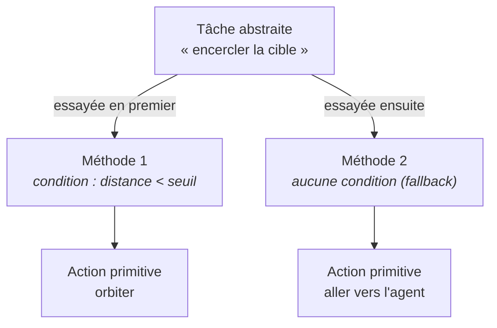
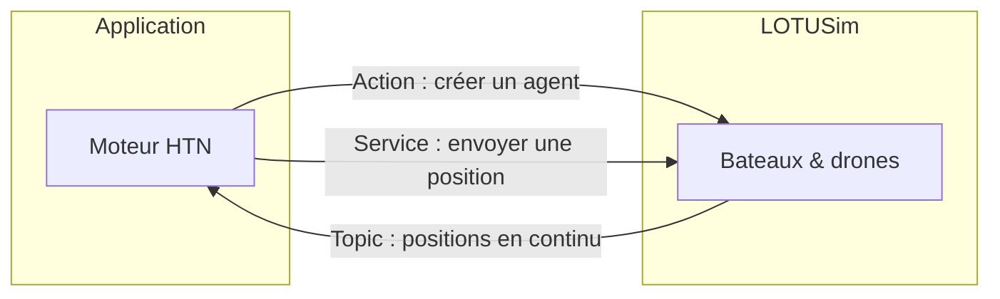
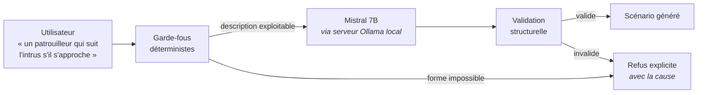
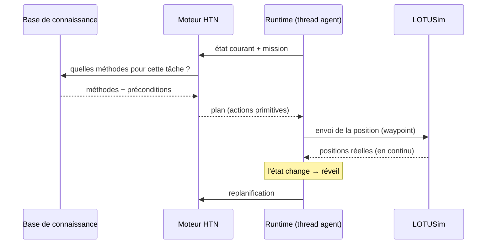

<a id="p1"></a>

# Partie 1 — Comprendre les outils

> **Nature de ce document.** Cette partie est un *cours magistral*. Son but n'est
> pas de lister les technologies employées, mais de faire **comprendre** chacune :
> quel problème elle résout, comment elle fonctionne, et pourquoi elle a été
> retenue ici plutôt qu'une autre. Un lecteur qui n'a jamais vu le projet doit
> pouvoir la lire d'un bout à l'autre sans rien connaître au préalable.
>
> Elle reprend et développe en rédaction l'intégralité de la présentation
> *« Générateur de scénario pour LOTUSim »* (slides 1 à 22), à l'exception des
> slides de conclusion.
>
> ---
> **⚠️ Note pour Claude Code.** Ce fichier est un brouillon avancé, écrit sans
> accès au code source. Ta tâche :
> 1. Vérifier **chaque affirmation technique** contre le code réel et corriger
>    ce qui est inexact.
> 2. Compléter tous les blocs marqués `[À COMPLÉTER DEPUIS LE CODE : …]`.
> 3. Conserver la structure, le ton pédagogique et la rédaction en paragraphes
>    (surtout **ne pas** reconvertir en listes à puces).
> 4. Vérifier que les images référencées existent bien dans `docs/img/`.
>
> **⚠️ Réponse de Claude Code (relecture du 2026-07-09).** Le dossier `docs/img/`
> **n'existe pas du tout** dans le dépôt à cette date — aucune des 10 images
> référencées plus bas (`intro_env.png`, `htn_exemple.png`, `ui_mockup.png`,
> `archi_initiation.jpg`, `archi_running_1.jpg`, `archi_running_2.jpg`,
> `archi_ui.jpg`, `resume.jpg`) n'est présente. Les balises `` sont
> laissées telles quelles ci-dessous (structure conservée, comme demandé), mais
> elles s'afficheront cassées tant que ces fichiers n'auront pas été déposés
> dans `docs/img/`. Par ailleurs, plusieurs affirmations techniques du brouillon
> initial se sont révélées inexactes une fois confrontées au code — chacune est
> signalée et corrigée à l'endroit où elle apparaît, avec la preuve trouvée dans
> le code (fichier/ligne, ou commande exécutée).

---

<a id="p1-sommaire"></a>

## Sommaire de la partie

1. [Le contexte et la problématique](#p1-11)
2. [La description du besoin (le fil rouge)](#p1-12)
3. [HTN — Hierarchical Task Network](#p1-13)
4. [ROS — Robot Operating System](#p1-14)
5. [L'interface utilisateur](#p1-15)
6. [Ollama — la génération par IA](#p1-16)
7. [Le besoin, entièrement couvert](#p1-17)
8. [Vue d'ensemble de l'architecture](#p1-18)

---

<a id="p1-11"></a>

## 1.1 — Le contexte et la problématique

*(reprise rédigée de la slide 2, « Introduction »)*

### Le contexte

LOTUSim est un **simulateur multi-agent**. Il fait évoluer, dans un même monde,
des entités marines, sous-marines et aériennes — des bateaux de surface, des
sous-marins, des drones — qui se déplacent selon des règles physiques définies.
L'objectif de ce simulateur est de **reproduire des situations opérationnelles** :
on veut rejouer, en environnement contrôlé, ce qui se passerait réellement en mer.

*Note de vérification — cette description du parc d'entités se confirme
indirectement côté code : la liste blanche des modèles spawnables dans
`bdd/ai_scenario_generator.py` (`VALID_MODELS`) contient bien les trois familles
citées — surface (`wamv`, `fremm`, `pha`), sous-marin (`bluerov2_heavy`, `lrauv`)
et aérien (`x500`, `x500_base`) — plus `commando`, `dtmb_hull`, `mine` (non
qualifiés plus précisément dans le code) et `cube`, qui n'est pas un agent mais
un simple repère visuel statique (utilisé pour matérialiser une `__zone__`).*

Pour décrire ce qu'il doit se passer dans une simulation, LOTUSim consomme un
**fichier de scénario**. Ce fichier a une structure simple, qu'on peut résumer ainsi :

```
Environnement
  Agent_1
     Position initiale
     Positions à suivre
  Agent_2
     Position initiale
```

Autrement dit : chaque agent reçoit un point de départ, et éventuellement une
liste de points par lesquels passer. Le simulateur les fait naviguer, et on
observe le résultat dans la visualisation 3D ou sur une carte 2D.

<a id="warn-1"></a>

*Note de vérification — **⚠️ À VÉRIFIER —** ce format est celui, natif, consommé
directement par LOTUSim. Il est distinct du format `AGENTS = {...}` (fichiers
`scenarios/*.py`) manipulé par ce dépôt, qui est un format intermédiaire propre
à la couche HTN décrite dans cette partie : LOTUSim lui-même ne connaît pas ce
second format, il ne voit jamais que les positions/commandes que le runtime lui
envoie au fil de l'exécution (voir § 1.4 et § 1.8). Le fichier LOTUSim natif tel
que décrit ici n'est pas présent dans ce dépôt (le simulateur est un projet
externe) — NON TROUVÉ DANS LE CODE, cette section reste donc basée sur la
présentation d'origine, non recroisée avec le code de LOTUSim lui-même.*


*Figure 1 — Le fonctionnement d'origine : un fichier de scénario déterministe alimente LOTUSim, qui restitue la simulation.*

### La problématique

Ce fonctionnement, aussi simple soit-il, pose **trois problèmes** qui, ensemble,
rendent l'outil difficile à exploiter pour construire de vrais exercices tactiques.

Le premier est une **complexité d'utilisation**. Écrire un scénario suppose de
manipuler directement un fichier de configuration, avec sa syntaxe propre et ses
coordonnées géographiques saisies à la main. C'est une barrière immédiate pour
quiconque n'est pas familier du format — et notamment pour l'expert métier, qui
est pourtant celui qui sait ce qu'un scénario réaliste devrait contenir.

Le deuxième problème est plus fondamental : le **fichier est déterministe**. Les
positions à suivre sont fixées avant le lancement, une fois pour toutes. En
conséquence, **les agents ne réagissent pas à leur environnement**. Si un intrus
dévie de sa route, le patrouilleur censé le surveiller continue imperturbablement
sa trajectoire préprogrammée. Or c'est précisément la réaction qui fait
l'intérêt d'un scénario tactique.

Le troisième problème découle des deux premiers : il est **impossible de
construire un scénario réaliste avec plusieurs agents ayant chacun une mission**.
On pourrait, à la rigueur, calculer à la main la trajectoire d'un agent isolé.
Mais dès que plusieurs agents doivent interagir — l'un poursuit, l'autre fuit,
un troisième couvre une zone — les trajectoires deviennent interdépendantes et
ne peuvent plus être écrites d'avance : elles dépendent de ce que font les autres,
en temps réel.

> **La question à laquelle tout le projet répond :** comment passer d'un fichier
> de positions figées à des **agents qui embarquent une mission** et décident
> eux-mêmes, en continu, de ce qu'ils doivent faire ?

---

<a id="p1-12"></a>

## 1.2 — La description du besoin (le fil rouge)

*(reprise rédigée des slides 3 et 4, puis 7, 8, 10, 11, 13, 14, 16)*

Avant de choisir la moindre technologie, le besoin a été formulé sous la forme
d'un objectif unique, tenant en une phrase :

> ### **Créer des scénarios tactiques complexes, accessibles à tous.**

Cette phrase contient déjà une tension. « **Complexes** » et « **accessibles à
tous** » tirent dans des directions opposées : plus un outil permet d'exprimer
des comportements riches, plus il est en général difficile à prendre en main.
Tout l'enjeu du projet est de tenir les deux bouts.

De cet objectif ont été dérivés **cinq besoins concrets**, qui forment le fil
conducteur de toute la présentation :

1. **Définir une base de connaissance opérationnelle.** Il faut un endroit où
   décrire, une fois pour toutes, ce que signifient les missions du métier
   (« veiller », « encercler », « suivre ») et comment on les accomplit.
2. **Implémenter des agents qui embarquent chacun une mission.** Chaque agent
   ne reçoit plus une liste de points, mais un objectif, qu'il traduit lui-même
   en actions.
3. **Implémenter des agents qui interagissent avec l'environnement.** Un agent
   doit percevoir la situation réelle (où sont les autres) et y réagir.
4. **Proposer une interface simple et intuitive**, pour que la création d'un
   scénario ne suppose pas d'écrire du code.
5. **Proposer une option IA pour produire des scénarios à partir du langage
   naturel**, afin d'abaisser encore la barrière d'entrée.

La suite de cette partie présente les quatre technologies retenues. Chacune vient
**répondre à un ou plusieurs de ces besoins**, et la présentation d'origine les
introduit précisément dans cet ordre, en cochant les besoins un à un :

| Besoin | Technologie qui y répond |
|---|---|
| Définir une base de connaissance opérationnelle | **HTN** (définit une base de données) |
| Implémenter des agents qui embarquent une mission | **HTN** (calcule un plan) |
| Implémenter des agents qui interagissent avec l'environnement | **ROS** |
| Proposer une interface simple et intuitive | **UI** |
| Proposer une option IA à partir du langage naturel | **Ollama** |

Ce tableau est la carte du reste du document. On le reconstruit maintenant
ligne par ligne.

---

<a id="p1-13"></a>

## 1.3 — HTN — Hierarchical Task Network

*(reprise rédigée des slides 5 et 6 ; répond aux besoins 1 et 2)*

### Le problème que ça résout

Reprenons l'objectif : un agent doit *encercler* un bateau. S'il en est loin, il
doit s'en approcher ; s'il est proche, il doit se mettre à tourner autour ; et si
la cible s'éloigne à nouveau, il doit **rebasculer tout seul** vers l'approche.

L'approche naïve consisterait à écrire cette logique à la main, sous forme d'une
machine à états : *si distance > seuil alors approcher, sinon orbiter*. Cela
fonctionne pour un comportement. Mais il faut le réécrire intégralement pour
chaque nouveau comportement, gérer soi-même les transitions, et le tout devient
un enchevêtrement de conditions impossible à maintenir dès qu'on dépasse quelques
missions. Surtout, ce code ne serait ni lisible ni modifiable par un expert
métier, qui est pourtant la personne légitime pour dire ce qu'« encercler » veut
dire.

### L'idée : la planification

La réponse est de ne plus programmer *le comportement*, mais de faire calculer ce
comportement par un **planificateur**. Un planificateur est un algorithme dont le
rôle tient en une phrase :

> **Calculer une séquence d'actions qui permet de passer d'un état initial à un
> état but.**

HTN — pour *Hierarchical Task Network*, réseau de tâches hiérarchique — est une
famille de planificateurs dont le principe propre est de **décomposer
hiérarchiquement les tâches, des plus abstraites jusqu'aux actions élémentaires**.
On part d'un objectif de haut niveau et on le raffine, étage par étage, jusqu'à
obtenir des ordres que le simulateur sait exécuter directement.

### Le mécanisme : quatre notions

Tout HTN se manipule avec quatre notions, et quatre seulement :

| Notion | Description |
|---|---|
| **Tâche abstraite** | Un objectif à atteindre |
| **Méthode** | Une façon d'accomplir une tâche, suivant des conditions |
| **Sous-tâche** | Ce que produit une méthode (une autre tâche, ou une action) |
| **Action primitive** | Une opération élémentaire, exécutable par le simulateur |

Le moteur fonctionne ainsi. Il reçoit une **tâche abstraite** (« encercler ») et
va chercher les **méthodes** enregistrées pour cette tâche. Chaque méthode porte
des **conditions** d'applicabilité. Le moteur les essaie **dans l'ordre** et
retient la première dont les conditions sont vraies **dans l'état courant du
monde** — c'est-à-dire compte tenu des positions réelles des agents à cet instant.
*(Précision : si la sous-tâche produite par la méthode retenue échoue plus tard
en aval — plus profond dans la décomposition —, le moteur revient en arrière et
essaie la méthode suivante, même si la précondition de la première était
satisfaite. C'est un vrai mécanisme de retour-arrière (`seek_plan`/
`_refine_task_and_continue` dans `gtpyhop.py`), pas seulement un choix figé au
premier essai — dans la pratique de ce projet, les méthodes sont presque
toujours à une seule sous-tâche, donc ce retour-arrière se manifeste rarement,
mais il existe.)*

La méthode retenue produit une ou plusieurs **sous-tâches**. Si une sous-tâche est
elle-même abstraite, on recommence : on cherche ses méthodes, on en choisit une,
elle produit d'autres sous-tâches. La descente s'arrête lorsqu'on atteint des
**actions primitives** : des opérations élémentaires que le simulateur exécute
telles quelles, comme « envoyer ce waypoint à ce bateau ».

Le résultat de cette descente est un **plan** : la liste ordonnée des actions
primitives à exécuter.

**Une nuance de mise en œuvre, propre à ce projet.** GTPyhop distingue en réalité
deux notions au niveau le plus bas, et ce projet utilise les deux : l'**action**
(une fonction Python qui met seulement à jour l'état interne, utilisée pendant
le calcul du plan — et par le mode « calcul du plan à blanc » de l'interface, qui
n'exécute jamais rien de réel) et la **commande** (préfixée `c_`, qui déclenche le
véritable effet de bord ROS, envoyé à LOTUSim). Dans `bdd/primitives_actions.py`,
`aller_a` est l'action (état seul) et `c_aller_a` en est la commande (envoie
réellement le waypoint via ROS) ; à l'exécution réelle (`main.py::_execute_plan`),
le moteur cherche d'abord une commande `c_<nom>`, et ne retombe sur l'action que
si aucune commande n'est déclarée pour ce nom. `creation_agent` (qui « active »
un drone compagnon déjà présent dans le scénario) n'a volontairement **aucune**
commande associée : c'est un simple marqueur d'état, jamais un ordre envoyé à
LOTUSim (voir § 1.8 et la [Partie 3](#p3) pour le détail de cette limitation). Il ne
s'agit donc pas d'une quatrième/cinquième notion HTN à proprement parler — la
théorie continue de ne compter que quatre notions — mais d'un détail
d'implémentation qu'un repreneur croisera dès l'ouverture de
`bdd/primitives_actions.py`.

Voici, schématiquement, ce que donne la décomposition — ici sur un domaine
« voyage », plus lisible qu'un exemple naval :


*Figure 2 — Décomposition d'une tâche abstraite en méthodes, puis en actions élémentaires. Source : « Task Decomposition Example for Simple Travel Domain », towardsdatascience.com.*

On peut représenter la même idée sous forme d'arbre :



> **Le déclic à avoir.** On ne décrit jamais le comportement final. On décrit
> **les façons possibles d'agir et leurs conditions**. Le comportement *émerge*
> de la planification, et il est **recalculé** dès que la situation change. C'est
> ce qui rend les agents réactifs sans qu'aucune machine à états n'ait été écrite.

Deux conséquences pratiques, qui structureront tout le code :

- **Ajouter un comportement composite = ajouter des méthodes.** On ne touche pas
  au moteur (`gtpyhop.py`, jamais modifié) — il suffit de décrire la nouvelle
  tâche dans `bdd/knowledge_base.json`. Cela vaut tant que ce comportement peut
  s'exprimer en enchaînant des actions primitives **déjà existantes** (aller vers
  un agent, orbiter, s'interposer, etc.). Un comportement qui a besoin d'une
  action primitive *réellement nouvelle* — une trajectoire en carré ou en spirale,
  par exemple, qui n'a pas de fonction Python pour la calculer — demande, lui, une
  vraie modification de `bdd/tasks_methods.py`. C'est exactement pour cette
  raison que le générateur IA (§ 1.6) refuse catégoriquement certaines formes de
  trajectoire plutôt que de les approximer : il n'existe aucune méthode purement
  déclarative pour les produire.
- Comme les méthodes sont essayées dans l'ordre, **l'ordre de déclaration est
  porteur de sens**. Une méthode sans condition (donc toujours applicable) placée
  en premier masquerait définitivement toutes les suivantes ; c'est pourquoi les
  méthodes « par défaut » se placent toujours en dernier.

### Pourquoi ce choix

Trois raisons ont motivé HTN, et elles sont d'ordres différents.

**Une raison technique :** les notions de tâches, de méthodes et de récursivité
sont **natives** au formalisme, et l'**algorithme existe déjà**. Il n'y avait
donc rien à réinventer — seulement à décrire le domaine métier.

**Une raison d'efficacité :** la décomposition **guide la recherche**. Contrairement
à un planificateur classique qui explorerait à l'aveugle l'espace de toutes les
séquences d'actions possibles, le HTN ne considère que les décompositions
autorisées par les méthodes qu'on lui a fournies. La recherche est donc
considérablement plus efficace.

**Une raison métier, et c'est sans doute la plus déterminante :** la **doctrine
militaire raisonne elle-même par décomposition d'ordres**, de la mission globale
jusqu'aux tâches assignées à chaque unité. Le formalisme HTN ne fait donc pas que
« marcher » : il **épouse la façon de penser du domaine**. Une méthode HTN peut
se relire comme un ordre, et une base de connaissances comme un manuel de doctrine.

### D'où vient l'outil

Le moteur n'a pas été écrit pour ce projet. Il s'agit de **GTPyhop**, une
bibliothèque de planification HTN développée à l'**Université du Maryland**
(équipe de Dana Nau, l'un des noms historiques du domaine), publiée sous licence
libre **BSD-3-Clause-Clear** (la variante « Clear », qui écarte explicitement
toute concession de brevet — distincte de la BSD-3-Clause standard ; l'en-tête
exact du fichier porte `SPDX-License-Identifier: BSD-3-Clause-Clear`).

Point important pour le repreneur : elle est **incluse telle quelle dans le
dépôt**, sous la forme d'un unique fichier `gtpyhop.py` à la racine. Elle n'est
donc **pas installée via pip**, et il ne faut **pas la modifier** sans une raison
très précise — sans quoi toute mise à jour ultérieure deviendrait impossible.
*(Curiosité sans conséquence pratique : l'en-tête du fichier annonce la
« version 1.1 », mais le message imprimé automatiquement à chaque import du
module affiche « Imported GTPyhop version 1.0. » — une incohérence interne au
fichier tiers lui-même, antérieure à ce projet et non introduite par lui. Ce
message s'affiche à chaque lancement de `app.py`, `main.py`, et même pendant
`pytest`.)*

### À retenir

> HTN, c'est : *« je décris des missions et les façons de les remplir sous
> conditions ; le moteur choisit, et re-choisit tout seul, en fonction de la
> situation réelle. »*
>
> Il répond directement à deux besoins : il **définit la base de connaissance
> opérationnelle** (les tâches et méthodes du métier) et il **calcule le plan**
> que chaque agent embarque comme mission.

---

<a id="p1-14"></a>

## 1.4 — ROS — Robot Operating System

*(reprise rédigée de la slide 9 ; répond au besoin 3)*

### Le problème que ça résout

HTN sait décider *quoi faire*. Mais l'application et le simulateur sont **deux
programmes distincts**, qui tournent séparément. Il faut donc un moyen pour que
l'application transmette ses ordres à LOTUSim (« crée ce bateau », « va à ce
point »), et surtout pour que LOTUSim renvoie en permanence **les positions
réelles** des agents — sans lesquelles aucune réaction à l'environnement n'est
possible.

C'est exactement le besoin n° 3 : *implémenter des agents qui interagissent avec
l'environnement*. Sans canal de communication temps réel, le HTN replanifierait
dans le vide, sur un état du monde périmé.

### L'idée

Malgré son nom, ROS (*Robot Operating System*) n'est pas un système
d'exploitation. C'est une **couche de communication entre programmes**, très
répandue en robotique. Elle propose plusieurs mécanismes ; le projet en utilise
**trois**, chacun adapté à une nature d'échange différente.

| Mécanisme | Principe | Utilisation dans LOTUSim |
|---|---|---|
| **Topic** | Un programme publie en continu ; n'importe quel programme peut s'abonner | **Tracker les positions des agents en temps réel** |
| **Service** | Un programme envoie une requête et attend une réponse | **Envoyer une position à un agent** |
| **Action** | Un service, avec en plus un suivi de progression et un résultat | **Faire apparaître un agent** |

Le réflexe à acquérir tient en trois lignes. Un **flux continu** qu'on subit se
lit sur un **Topic** (on s'abonne, on est prévenu). Une **question ponctuelle**
dont on attend la réponse passe par un **Service**. Une **opération longue** dont
on veut suivre l'avancement passe par une **Action**.

Le sens de circulation est asymétrique, et c'est essentiel : les **positions
arrivent** en *push*, l'application ne les demande jamais, elle est prévenue ;
tandis que les **ordres partent** à l'initiative de l'application.



*Figure 3 — Les trois canaux ROS et leur sens de circulation.*

### Le mécanisme, côté LOTUSim

Concrètement, la communication avec LOTUSim se réduit à **trois opérations** :

- **Créer un agent** — via une *Action*, car la création d'une entité dans le
  simulateur prend un certain temps et l'on veut en connaître l'issue.
- **Déplacer un agent** — via un *Service* : on envoie une position, on attend
  l'acquittement.
- **Tracker un agent, en temps réel** — via un *Topic* : LOTUSim publie sans
  interruption les positions de toutes les entités, et l'application s'y abonne.

C'est cette troisième opération qui referme la boucle : les positions reçues
mettent à jour l'état du monde, ce qui **déclenche une replanification HTN**.
La réactivité des agents naît de là.

<a id="warn-2"></a>

**Ce que dit le code, précisément** (`main.py`) : le nœud ROS créé au démarrage
s'appelle `goto_point`, dans le namespace `/lotusim`
(`Node("goto_point", namespace="/lotusim")`) — **⚠️ À VÉRIFIER —** un nom qui ne
correspond à aucune convention documentée par ailleurs dans le dépôt,
vraisemblablement un héritage d'une version antérieure du projet (NON TROUVÉ
DANS LE CODE d'explication plus précise). Les trois canaux annoncés ci-dessus
correspondent exactement à ceci :

| Canal | Nom ROS | Type de message | Utilisé par |
|---|---|---|---|
| Topic | `/lotusim/poses` | `VesselPositionArray` (`lotusim_msgs.msg`) | `PoseTracker._cb` (`main.py`) — met à jour les positions et réveille les agents concernés |
| Action | `/lotusim/mas_cmd` | `MASCmd` (`lotusim_msgs.action`) | `spawn_vessel` (`bdd/primitives_actions.py`) — fait apparaître un agent au démarrage |
| Service | `/lotusim/{agent}/waypoints` (un service par agent) | `SetWaypoints` (`lotusim_msgs.srv`) | `c_aller_a` (`bdd/primitives_actions.py`) — envoie un unique waypoint à un agent nommé |

Les définitions `lotusim_msgs` (messages, service, action) ne sont **pas dans ce
dépôt** : elles viennent du workspace ROS 2 externe qui contient LOTUSim
lui-même, compilé séparément (confirmé présent, dans l'environnement où cet audit
a été mené, sous `~/lotusim_ws`). Le dépôt applicatif ne fait qu'importer ce
paquet comme n'importe quel paquet ROS déjà sourcé dans l'environnement — aucun
script de ce dépôt ne le télécharge ni ne le compile.

<a id="warn-3"></a>

Le `MultiThreadedExecutor` (plutôt qu'un `SingleThreadedExecutor`, l'exécuteur
ROS 2 par défaut) est instancié dans `main()` et tourne dans un thread daemon
séparé (`threading.Thread(target=executor.spin, daemon=True)`), en parallèle des
threads de planification (un par agent, voir § 1.8). **⚠️ À VÉRIFIER —** le code
ne commente pas ce choix explicitement, mais la raison la plus probable est la
suivante : plusieurs agents peuvent avoir, au même instant, un appel de service
ou d'action ROS en attente (par exemple plusieurs `spawn_vessel` ou plusieurs
envois de waypoint qui se chevauchent) ; un exécuteur mono-thread traiterait ces
callbacks un par un, retardant potentiellement la libération d'un agent bloqué
sur `main._wait(fut, ...)` (fonction d'attente définie dans `main.py`, utilisée
à la fois par `spawn_vessel` et par `c_aller_a`) pendant qu'un autre callback
est en cours. *(Cette explication est une déduction du fonctionnement du code,
pas une justification trouvée en commentaire — à confirmer avec l'auteur
d'origine si besoin.)*

### Pourquoi ce choix

Il faut être honnête : **ce n'est pas un choix, c'est une contrainte**. LOTUSim
est bâti sur ROS 2 et n'expose son interface que par ce biais. La version employée
est **ROS 2 Humble**, l'environnement imposé par le simulateur ; l'API Python
correspondante s'appelle `rclpy`, et les définitions de messages proviennent du
paquet `lotusim_msgs`, fourni par le workspace LOTUSim.

Cette contrainte a toutefois une **conséquence architecturale majeure**, qui a
été exploitée délibérément : **seule l'exécution dépend de ROS**. Concevoir un
scénario — l'écrire, l'éditer dans l'interface, le générer par IA — n'a besoin
d'aucun composant ROS. Cette frontière est le principe organisateur de toute
l'architecture, détaillée en [Partie 3](#p3).

### À retenir

> ROS, c'est *« le téléphone entre l'application et le simulateur »*. Trois
> lignes différentes : on **écoute** en continu (Topic), on **demande** (Service),
> on **lance une opération suivie** (Action). C'est lui qui permet aux agents
> d'interagir avec l'environnement.

---

<a id="p1-15"></a>

## 1.5 — L'interface utilisateur

*(reprise rédigée de la slide 12 ; répond au besoin 4)*

### Le problème que ça résout

À ce stade, le système sait faire des choses remarquables : décrire des missions,
les planifier, les exécuter, réagir en temps réel. Mais tout cela reste piloté par
des fichiers Python et un fichier JSON. On a résolu « scénarios tactiques
complexes » ; il reste **« accessibles à tous »**.

Le besoin n° 4 est donc de proposer une **interface simple et intuitive**,
permettant à un opérateur non-développeur de composer un scénario sans écrire une
seule ligne de code.

### L'idée

Une interface **web**, servie localement et ouverte dans un navigateur, organisée
en **trois onglets** correspondant aux trois activités possibles :

- **Scénarios** — composer un scénario : placer les agents, leur attribuer un
  modèle, une position initiale et une mission.
- **Connaissances HTN** — éditer la base de connaissance opérationnelle
  elle-même : les tâches, les méthodes, leurs conditions.
- **IA** — décrire un scénario en langage naturel et le faire générer.


*Figure 4 — Maquette de l'interface (slide « UI - Mockup »), montrant l'écran de composition d'un scénario, l'éditeur de tâches et méthodes, et l'écran de génération par IA.*

Le point remarquable est que l'onglet « Connaissances HTN » **expose directement
le formalisme** au lecteur : une tâche, ses méthodes, leurs préconditions et
leurs sous-tâches. L'expert métier édite donc la doctrine dans les mêmes termes
que ceux du planificateur, ce qui n'aurait pas été possible avec un formalisme
moins proche du domaine (voir § 1.3).

### Le mécanisme : un choix radical de sobriété

La façon dont cette interface est construite mérite d'être expliquée, car elle
relève d'un parti pris net.

Le **backend** (`app.py`) n'utilise **que la bibliothèque standard de Python**,
via le module `http.server`. Il n'y a **ni Flask, ni Django, ni aucune dépendance
web**. Le **frontend** (`templates/index.html`) est écrit en **JavaScript
« vanilla »** : aucun framework, aucune ressource chargée depuis Internet, aucune
étape de compilation. *(Ce choix n'est pas accidentel : les traces de
configuration locale du projet montrent qu'un backend Flask a été essayé puis
abandonné au profit de `http.server`, précisément pour ne dépendre de rien
d'installé séparément.)* Cette sobriété concerne l'interface d'édition
elle-même ; l'outil annexe `visualize.py` (qui produit une carte de trajectoires
après une exécution réelle, voir [Partie 3](#p3)) est le seul endroit du dépôt qui
charge une ressource externe (la bibliothèque cartographique Leaflet, via un
CDN) — il ne fait pas partie de l'interface des trois onglets et n'est pas
requis pour composer ou lancer un scénario.

Le serveur HTTP de `app.py` expose une petite API REST en JSON, entièrement
consommée par le JavaScript de `templates/index.html` via `fetch()`. Voici les
routes réellement définies dans le routeur (`app.py::_route`) :

| Méthode | Route | Rôle |
|---|---|---|
| GET | `/` | Sert la page `templates/index.html` |
| GET | `/api/scenarios` | Liste les noms des scénarios disponibles (fichiers `scenarios/*.py`) |
| GET | `/api/kb` | Renvoie le contenu complet de `knowledge_base.json` |
| GET | `/api/scenario/<name>` | Renvoie la définition d'un scénario (agents, positions, modèle, conditions, mission sous forme de texte) |
| GET | `/api/scenario/<name>/plan` | Calcule le plan HTN « à blanc » pour chaque agent du scénario, **sans aucune exécution ROS** (dry-run pur, voir § 1.8) |
| POST | `/api/kb` | Écrit `knowledge_base.json` avec le corps envoyé, puis recharge la base dans le domaine HTN actif |
| POST | `/api/scenario/<name>` | Écrit (ou crée) le fichier `scenarios/<name>.py` à partir du formulaire envoyé |
| POST | `/api/scenario/<name>/launch` | Lance `python3 main.py <name>` dans un sous-processus séparé — c'est le **seul** point d'entrée qui déclenche une exécution ROS réelle |
| POST | `/api/generate-scenario` | Appelle le générateur IA (§ 1.6) à partir d'une description en langage naturel |
| DELETE | `/api/scenario/<name>` | Supprime le fichier de scénario correspondant |

Le point notable pour la suite ([Partie 3](#p3-33)) est la route de lancement : elle ne
fait **pas** exécuter la simulation dans le processus de `app.py` lui-même, elle
démarre `main.py` comme **sous-processus indépendant**
(`subprocess.Popen([sys.executable, 'main.py', name], ...)`). C'est ce qui
matérialise concrètement, au niveau du système d'exploitation et pas seulement
« sur le papier », la séparation annoncée au § 1.4 : le processus qui sert
l'interface n'importe jamais `rclpy`, seul le processus `main.py` qu'il lance le
fait.

### Pourquoi ce choix

L'argument est le **déploiement**. Le document se lance sur n'importe quelle
machine disposant de Python, sans installer quoi que ce soit, sans étape de
build, sans version de framework susceptible de casser six mois plus tard. Pour
un outil destiné à être repris et exécuté dans des environnements contraints
(une machine de simulation, potentiellement hors-ligne), c'est décisif.

Le **prix à payer est assumé et doit être connu du repreneur** : toute
l'interface tient dans **un seul fichier HTML d'environ 2 673 lignes**, mêlant
structure, style et logique. C'est peu modulaire, et c'est aujourd'hui la
principale dette technique du projet (voir [Partie 4, § 4.2.1](#p4-421)).

### À retenir

> L'UI, c'est *« le minimum qui marche partout »*. On échange délibérément la
> modularité contre une simplicité de déploiement totale. Elle répond au besoin
> d'une interface simple et intuitive, et rend le formalisme HTN directement
> éditable par l'expert métier.

---

<a id="p1-16"></a>

## 1.6 — Ollama — la génération par IA

*(reprise rédigée de la slide 15 ; répond au besoin 5)*

### Le problème que ça résout

Même dotée d'une interface graphique, la création d'un scénario suppose de savoir
quelles missions existent, ce qu'elles signifient, et quels agents leur associer.
Le besoin n° 5 vise à abaisser encore cette barrière : **décrire le scénario en
français**, et le laisser se construire tout seul.

### L'idée et le mécanisme

**Ollama** est un outil qui permet de **faire tourner des LLM (modèles de langage)
en local**. Son fonctionnement se résume en quatre étapes :

1. **Installer Ollama** sur la machine.
2. **Télécharger un modèle**, qui est alors **stocké localement**.
3. Ollama **démarre un petit serveur local** qui fait tourner le LLM.
4. L'application **se connecte via une API** à ce serveur.

Le modèle retenu est **Mistral** (version 7B, environ 4 Go sur le disque —
confirmé : le modèle réellement chargé dans l'environnement de vérification
pèse 4,37 Go sur disque, en quantification `Q4_K_M`). Le nom du modèle est
codé en dur dans `_query_ollama(prompt, model="mistral")`
(`bdd/ai_scenario_generator.py`) : rien dans l'interface ne permet de le changer,
il faut éditer le code source (voir [Partie 3, § 3.4](#p3-34)).

Ce choix apporte **trois propriétés déterminantes** : la solution est **gratuite**,
elle est **locale** (aucune donnée du scénario ne quitte la machine, ce qui compte
dans un contexte de défense), et elle fonctionne **hors-ligne**.



*Figure 5 — Le pipeline de génération : le LLM est encadré, en amont et en aval, par du code déterministe.*

### Le garde-fou, qui est le vrai sujet

Il faut énoncer clairement la limite : **en local, la capacité du modèle est
réduite**. Un modèle 7B se trompe, hallucine, et échoue en particulier sur ce qui
demande de la rigueur — compter correctement les agents, lire des distances,
structurer des branches conditionnelles.

La réponse apportée n'est donc pas de « faire confiance à l'IA », mais d'**ajouter
une couche de fiabilisation** autour d'elle, à la fois **avant** l'appel au
modèle et **après**. Concrètement, dans `bdd/ai_scenario_generator.py`, cette
couche se déroule en six temps.

D'abord, un **filtre de pertinence, avant même d'envoyer quoi que ce soit au
modèle** (`_has_actionable_signal`) : si la description ne contient ni mention
d'un intrus/d'une menace ni aucun mot-clé de mission reconnu, aucun appel LLM
n'est fait — l'application pose directement deux questions de clarification à
l'utilisateur. À ce même stade, certaines demandes sont refusées d'emblée sans
appeler le modèle : une forme de trajectoire que rien dans le code ne sait tracer
(carré, spirale, zigzag, étoile — `_mentions_unsupported_shape`, voir § 1.3), ou
une interposition demandée sans condition de déclenchement associée.

Ensuite, une **extraction déterministe des faits que le texte donne
explicitement**, effectuée par des expressions régulières sur la description
brute plutôt que confiée au modèle : le nombre d'agents attendus, le nombre
d'intrus/cibles, un seuil de distance chiffré (« moins de 100 m »), et surtout
la détection de **toute** ligne du type « si `<condition>` : `<comportement>` »
(`_detect_multi_condition_branches`). Quand ce dernier cas est détecté, la tâche
conditionnelle correspondante (`reagir_conditions` dans la base de connaissance)
est construite **entièrement par du code, sans passer par le LLM** pour cette
partie précise — le LLM ne sert alors qu'à décrire les agents eux-mêmes.

Le modèle est ensuite appelé (température basse, sortie JSON forcée, 90 secondes
de délai maximum) avec un prompt qui énumère explicitement les huit missions
disponibles et les règles de comptage. Sa réponse est comparée aux faits extraits
à l'étape précédente : si le nombre d'agents ou d'intrus ne correspond pas, si
une mission n'est pas reconnue, ou si une tâche que le modèle propose lui-même
est structurellement incohérente (par exemple une précondition de distance qui
compare un agent à lui-même — toujours vraie, donc inutile), **une seconde et
dernière tentative est faite**, avec un message de correction précis décrivant
l'erreur constatée. Le nombre d'appels au modèle est donc borné à deux par
génération.

Le principe le plus important vient après cette tentative : **en cas
d'incapacité persistante à générer un scénario cohérent, un message d'erreur
explicite est renvoyé, jamais un scénario approximatif**. Il n'y a pas de
*fallback* silencieux. La raison est qu'un scénario **plausible mais faux** est
bien plus dangereux qu'un refus clair : l'utilisateur le lancerait sans savoir
qu'il ne fait pas ce qu'il croit. Le refus nomme la cause exacte (l'agent, la
mission ou le token en défaut) — à distinguer d'un ajustement purement
mécanique : si le nombre d'agents ou d'intrus est simplement insuffisant après
la génération, le code complète lui-même le scénario (en dupliquant un agent
existant, ou en synthétisant un intrus par défaut) plutôt que de refuser, parce
que cette correction-là ne devine aucun comportement, seulement une quantité.

Enfin, **la base de connaissances peut être enrichie** avec les nouvelles tâches
proposées par le modèle (ou construites par la détection déterministe évoquée
plus haut). Sur ce dernier point, une correction s'impose par rapport à ce que
laissait entendre une version précédente de cette explication : **cet
enrichissement est écrit sur disque (`knowledge_base.json`) automatiquement,
côté serveur, dès la génération** — il n'attend pas une validation explicite de
l'utilisateur, et a lieu même si l'utilisateur, ensuite, décide de ne *pas*
importer le scénario proposé comme fichier final. Le seul geste que
l'utilisateur valide explicitement est l'**import du scénario** lui-même (bouton
« Importer comme scénario »), pas la modification de la base de connaissances,
qui a déjà eu lieu à ce moment-là. Le repreneur qui souhaiterait revenir en
arrière sur une tâche ajoutée par erreur doit le faire manuellement, depuis
l'onglet « Connaissances HTN ».

### À retenir

> L'IA, c'est *« un assistant local qui propose, mais qui a le droit — et le
> devoir — de dire : je ne sais pas faire ça. »* La fiabilité ne vient pas du
> modèle : elle vient du **code déterministe qui l'encadre**, avant et après
> l'appel — étant entendu que l'écriture dans la base de connaissances, elle,
> n'est pas soumise à une validation supplémentaire de l'utilisateur.

---

<a id="p1-17"></a>

## 1.7 — Le besoin, entièrement couvert

*(reprise rédigée de la slide 16, l'aboutissement du fil rouge)*

Les cinq besoins formulés au § 1.2 trouvent chacun leur réponse. Le tableau de
départ peut maintenant être relu dans son état final :

| Besoin | Réponse apportée |
|---|---|
| Définir une base de connaissance opérationnelle | **HTN** définit une base de données de tâches et de méthodes |
| Implémenter des agents qui embarquent chacun une mission | **HTN** calcule un plan pour chaque agent |
| Implémenter des agents qui interagissent avec l'environnement | **ROS** transmet les ordres et remonte les positions en temps réel |
| Proposer une interface simple et intuitive | **UI** web, sans dépendance |
| Proposer une option IA pour produire des scénarios à partir du langage naturel | **Ollama** + Mistral, en local |

La tension initiale entre « complexes » et « accessibles à tous » est résolue par
une répartition des rôles : **HTN porte la complexité** (il encaisse la logique
tactique et la réactivité), tandis que **l'UI et l'IA portent l'accessibilité**
(elles n'exposent jamais cette complexité à l'utilisateur).

---

<a id="p1-18"></a>

## 1.8 — Vue d'ensemble de l'architecture

*(reprise rédigée des slides 17 à 21 ; la [Partie 3](#p3) y reviendra en profondeur)*

Cette section donne la vue d'ensemble telle qu'elle a été présentée. Elle suffit
à comprendre le fonctionnement général ; le **[manuel développeur (Partie 3)](#p3)**
détaillera les threads, les fichiers et les formats.

### Phase d'initiation

Au démarrage, un **scénario** (un fichier Python) est chargé. Il fournit l'état
initial du monde : quels agents existent, où ils sont, quel modèle ils utilisent,
et quelle mission chacun porte. Le **runtime** Python prend le relais et fait
apparaître ces agents dans **LOTUSim**.


*Figure 6 — Architecture, phase d'initiation : le scénario alimente le runtime, qui crée les agents dans LOTUSim.*

### Phase d'exécution

C'est ici que tout se joue. Le **moteur HTN** reçoit l'état initial et la mission
d'un agent, et va chercher dans la **base de connaissance** — les tâches et
méthodes, réalisées au préalable par l'expert métier — de quoi construire un
**plan**.


*Figure 7 — Architecture, phase d'exécution : la base de connaissance alimente le moteur HTN, qui produit un plan pour chaque agent.*

Ce plan est ensuite exécuté : le runtime traduit ses actions primitives en
commandes ROS, **envoie les positions** à LOTUSim, et **reçoit en retour les
positions réelles** des agents. Chaque agent dispose de son propre **thread** et
calcule, à chaque cycle, son propre **plan** — en revanche, et ce point mérite
d'être corrigé par rapport à une lecture trop littérale du schéma, **l'état du
monde n'est pas cloisonné par agent** : dans `main.py`, un unique objet `state`
est créé une fois (`state.agents = {...}`, une entrée par agent) puis **partagé,
par référence, entre tous les threads de planification**. C'est précisément ce
partage qui permet à un agent de lire la position d'un *autre* agent pour ses
propres préconditions (distance à une cible, à un intrus, etc.) — un état
réellement isolé par agent rendrait cette réactivité impossible. Ce partage n'est
protégé par aucun verrou explicite côté `state.agents` (seul l'accès aux données
internes du `PoseTracker` — la source des positions ROS — est protégé par un
verrou ; voir [Partie 3, § 3.1.7](#p3-317) pour les implications pratiques de ce choix).


*Figure 8 — Architecture, phase d'exécution : la boucle fermée. Les positions reçues de LOTUSim mettent à jour l'état, ce qui peut déclencher une replanification.*

Sur ce schéma, on distingue nettement les éléments annoncés dans les sections
précédentes : la **base de connaissance** (tâches et méthodes en **JSON**,
actions en **Python**), le **moteur HTN**, le **runtime** avec son *thread par
agent* contenant un **plan** propre puisé dans un **état partagé**, et enfin
**LOTUSim**, relié par les deux flèches d'envoi et de réception des positions.

### La partie interface

L'interface s'insère en amont de cette chaîne : elle produit les scénarios et
édite la base de connaissance, sans jamais interagir directement avec ROS —
au sens strict du terme : le processus de l'interface (`app.py`) n'importe
jamais `rclpy` ; il se contente de lancer `main.py` comme sous-processus séparé
lorsqu'on demande l'exécution réelle d'un scénario (voir § 1.5).


*Figure 9 — Architecture, côté interface : l'UI et le générateur IA alimentent le scénario et la base de connaissance.*

C'est la traduction visible du principe énoncé au § 1.4 : **la conception ne
dépend pas de ROS, seule l'exécution en dépend**.

### Résumé du fonctionnement complet

*(reprise rédigée de la slide 21, « Résumé »)*


*Figure 10 — Synthèse : de la construction du scénario jusqu'à la boucle d'exécution.*

Le fonctionnement d'ensemble se raconte en cinq temps :

1. **L'utilisateur peut construire un scénario** — via l'interface, l'IA, ou
   directement dans un fichier.
2. **L'état initial et la mission sont passés en paramètre de l'algorithme HTN.**
3. **L'algorithme va chercher dans la base de connaissance** — la liste des
   tâches et des méthodes, réalisée au préalable — de quoi **créer un plan**.
4. **Une instance de chaque agent tourne avec son plan**, et ce plan est
   **recalculé** dès qu'un événement est déclenché par les positions ROS reçues.
5. **L'instance envoie les positions de l'agent en continu**, pour suivre le plan.

Ce cinquième point mérite qu'on s'y arrête, car il contient toute la boucle : les
positions envoyées produisent un mouvement, ce mouvement produit de nouvelles
positions reçues, ces positions modifient l'état, et cet état peut invalider les
conditions de la méthode en cours — donc déclencher une **replanification**. C'est
cette boucle, et rien d'autre, qui fait qu'un agent « réagit à son environnement ».



*Figure 11 — La boucle d'exécution, vue comme une séquence.*

---

<a id="p1-transition"></a>

## Transition vers la suite

À ce stade, le lecteur sait **ce que fait le système et pourquoi chaque outil a
été choisi**. Il ne sait pas encore l'installer, l'utiliser, ni le modifier.

- La **[Partie 2 (manuel utilisateur)](#p2)** explique l'installation complète, de
  LOTUSim jusqu'à l'application, puis l'usage de l'interface, écran par écran.
- La **[Partie 3 (manuel développeur)](#p3)** reprend l'architecture esquissée au § 1.8
  et la détaille : les threads, la boucle événementielle, le rôle exact de chaque
  fichier, le choix des formats, et un guide « où aller pour modifier quoi ».
- La **[Partie 4](#p4)** dresse l'inventaire honnête de ce qui n'est pas au point.
