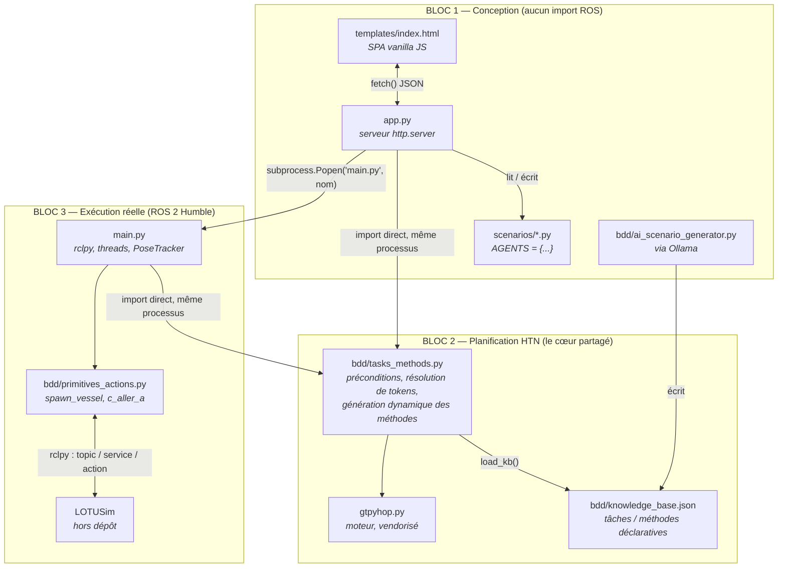
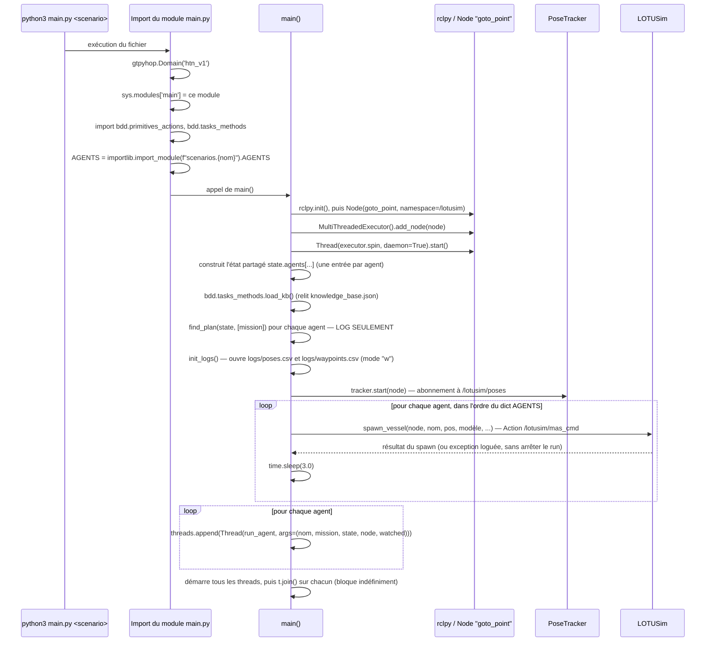
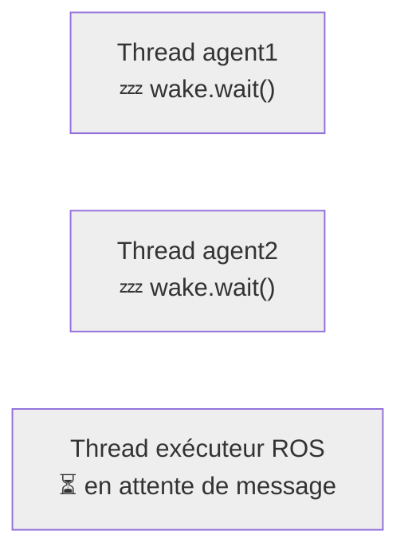
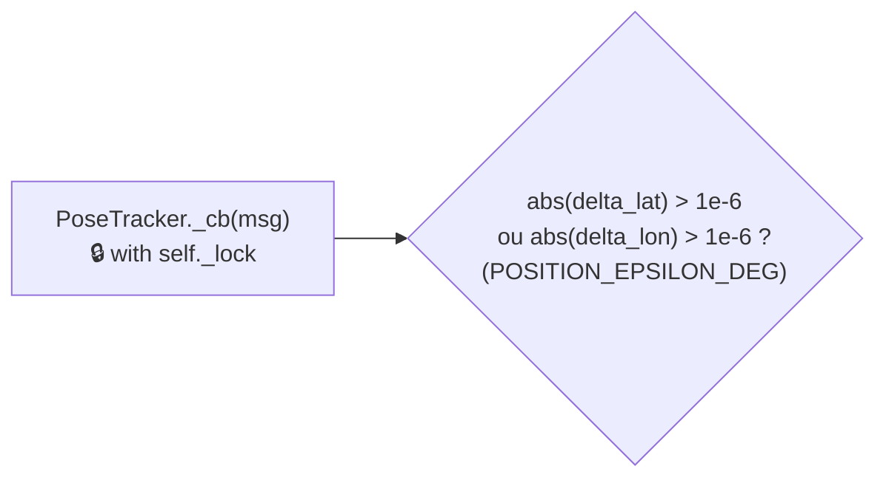
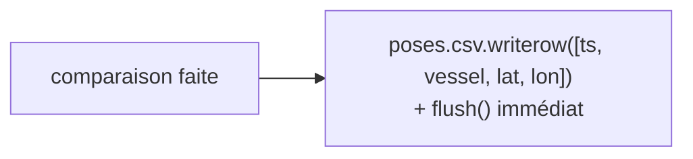
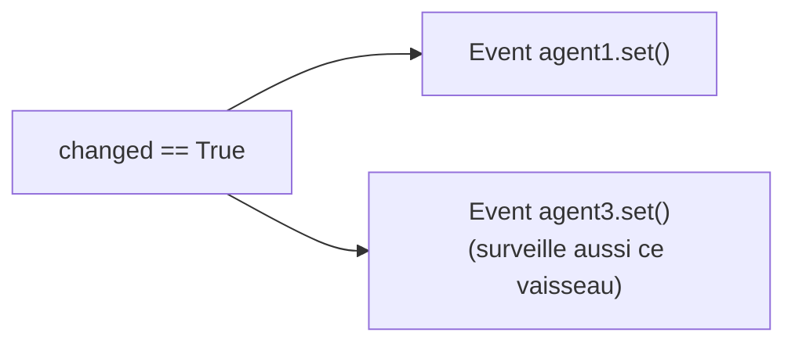
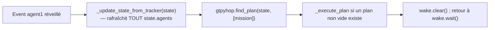
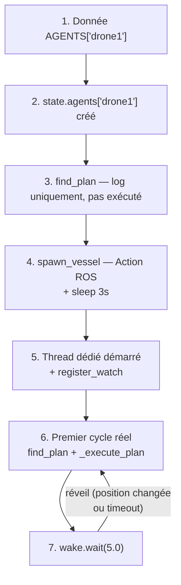
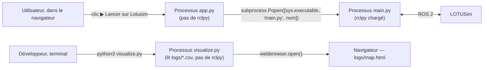

<a id="p3"></a>

# Partie 3 — Manuel développeur

> **Nature de ce document.** Cette partie s'adresse à quelqu'un qui va **modifier
> le code**, pas seulement l'utiliser. Elle suppose la [Partie 1](#p1) lue (le
> vocabulaire HTN/ROS/UI/IA y est posé) et va nettement plus loin : comment le
> système se comporte réellement à l'exécution, pourquoi chaque choix
> d'architecture a été fait, où se trouve chaque fichier et à quoi il sert, et —
> surtout — dans quel fichier aller quand on veut changer un comportement
> précis.
>
> Toute affirmation ci-dessous est vérifiée contre le code du dépôt (branche
> `htn_implementation`) au moment de la rédaction, y compris par des tests
> **exécutés en direct** quand une simple lecture du code ne suffisait pas à
> trancher (signalé explicitement à l'endroit concerné). Rien n'est déduit de
> la présentation d'origine ni des slides — cette partie n'en reprend aucune.

---

<a id="p3-sommaire"></a>

## Sommaire de la partie

1. [Architecture détaillée : les trois blocs, et comment ça tourne vraiment](#p3-31)
2. [Pourquoi ces choix : formats et architecture](#p3-32)
3. [L'arborescence, fichier par fichier](#p3-33)
4. [Où aller pour modifier quoi](#p3-34)

---

<a id="p3-31"></a>

## 3.1 — Architecture détaillée : les trois blocs, et comment ça tourne vraiment

<a id="p3-311"></a>

### 3.1.1 — Les trois blocs

Le dépôt se divise en trois blocs dont la frontière **n'est pas organisationnelle
mais technique** : elle correspond exactement à la présence ou l'absence de ROS
dans le chemin d'import.



**Bloc 1 — Conception.** Tout ce qui sert à *fabriquer* un scénario ou à éditer la
base de connaissances. Aucun de ces fichiers n'importe `rclpy` ni aucun module
`lotusim_msgs` — c'est vérifiable directement : `app.py` importe `gtpyhop`,
`bdd.tasks_methods`, `bdd.primitives_actions` (le fichier, pas ses fonctions ROS
— voir § 3.1.8) et `bdd.ai_scenario_generator`, jamais `rclpy`.

**Bloc 2 — Planification.** Le cœur partagé : le moteur générique (`gtpyhop.py`,
tiers, jamais modifié) et la couche de traduction du domaine métier
(`bdd/tasks_methods.py`), qui lit `bdd/knowledge_base.json` et enregistre
dynamiquement des méthodes GTPyhop à partir de ce JSON. Ce bloc est **importé
tel quel par les deux autres** : c'est le même fichier `bdd/tasks_methods.py`
qui tourne dans le processus `app.py` (pour le calcul de plan « à blanc ») et
dans le processus `main.py` (pour l'exécution réelle) — mais chacun dans **son
propre processus, avec son propre objet `Domain`** (voir § 3.1.2).

**Bloc 3 — Exécution réelle.** `main.py` et `bdd/primitives_actions.py`, les
deux seuls fichiers Python du dépôt qui, au bout du compte, parlent à ROS. C'est
la frontière la plus stricte du projet, et elle est matérialisée deux fois :
d'abord par un choix d'import (§ 3.1.8), ensuite par un choix de processus —
`main.py` n'est jamais exécuté *dans* le processus de `app.py`, seulement lancé
*depuis* lui.

<a id="p3-312"></a>

### 3.1.2 — Un détail d'amorçage qui conditionne tout : le `Domain` doit exister avant l'import des méthodes

C'est le genre de détail invisible tant qu'il fonctionne, et complètement
bloquant dès qu'on le déplace. `gtpyhop.py` maintient un état global mutable,
`current_domain` (initialisé à `None`), que les fonctions `declare_actions`,
`declare_commands` et `declare_task_methods` modifient — et sur lequel elles
lèvent une exception explicite s'il n'existe pas encore :

```python
# gtpyhop.py
def declare_actions(*actions):
    if current_domain == None:
        raise Exception(f"cannot declare actions until a domain has been created.")
    ...
def declare_task_methods(task_name, *methods):
    if current_domain == None:
        raise Exception(f"cannot declare methods until a domain has been created.")
    ...
```

Or `bdd/tasks_methods.py` appelle `load_kb()` **à l'import du module** (dernière
ligne du fichier), et `load_kb()` appelle `gtpyhop.declare_task_methods(...)`
pour chaque tâche de la base de connaissances. De même,
`bdd/primitives_actions.py` appelle `gtpyhop.declare_actions(...)` et
`gtpyhop.declare_commands(...)` à l'import. Résultat : **l'ordre des imports
n'est pas cosmétique, il est obligatoire.** C'est exactement pourquoi `app.py`
et `main.py` créent leur `Domain` en toute première ligne utile, avant tout le
reste :

```python
# app.py
import gtpyhop
gtpyhop.Domain('ui_plan')          # <- créé AVANT
import bdd.tasks_methods           # noqa: E402   <- déclare ses méthodes DANS ce domaine
import bdd.primitives_actions      # noqa: E402
```

```python
# main.py
gtpyhop.Domain('htn_v1')           # <- créé AVANT
import sys as _sys; _sys.modules.setdefault('main', _sys.modules[__name__])
from bdd.primitives_actions import spawn_vessel
import bdd.tasks_methods           # <- déclare ses méthodes DANS ce domaine
```

Les commentaires `# noqa: E402` dans `app.py` ne sont pas cosmétiques non plus :
ils désactivent l'avertissement du linter « import pas en haut de fichier »,
précisément parce que cet import **doit** venir après `gtpyhop.Domain(...)` et
ne peut donc pas être remonté en haut du fichier sans casser le programme.

**Conséquence pratique pour le développeur :** `app.py` et `main.py` utilisent
**deux objets `Domain` distincts** (noms `'ui_plan'` et `'htn_v1'` — ces noms
n'ont aucun effet fonctionnel, ils ne servent qu'à l'affichage/debug de
`gtpyhop.py`, mais leur existence prouve qu'il s'agit bien de deux instances
séparées). Les deux processus ne partagent **aucune mémoire** : le seul canal
qui les relie est le système de fichiers — `bdd/knowledge_base.json` et
`scenarios/*.py`. C'est développé au § 3.1.9 (avec une vérification empirique)
et justifié au § 3.2.

<a id="p3-313"></a>

### 3.1.3 — Démarrage d'une exécution réelle : la séquence complète de `main.py`

Voici, dans l'ordre exact du code (`main.py`, fonctions `main()` puis
`run_agent()`), ce qui se passe entre `python3 main.py <scenario>` et le régime
de croisière.



Quatre points méritent d'être soulignés, parce qu'ils surprennent à la lecture :

- **`AGENTS` est chargé avant même `rclpy.init()`.** L'import du scénario a
  lieu au niveau module (ligne `AGENTS = importlib.import_module(...)`, hors de
  toute fonction), donc avant que `main()` ne soit appelée. Un scénario dont le
  fichier ne compile pas fait planter le script **avant** toute connexion ROS.
- <a id="warn-4"></a>**Le spawn est strictement séquentiel et bloquant** : `spawn_vessel` attend la
  fin de l'Action ROS (`main._wait(fut, timeout=10.0)` puis
  `main._wait(res_fut, timeout=10.0)`), et un `time.sleep(3.0)` supplémentaire
  est ajouté après chaque spawn réussi. Pour un scénario à 5 agents, c'est au
  minimum ~15 secondes avant que le premier thread de planification démarre —
  **⚠️ À VÉRIFIER —** aucun commentaire dans le code n'explique ce délai de 3 s ;
  l'hypothèse la plus probable est de laisser à LOTUSim le temps de finaliser
  l'initialisation d'une entité avant d'en demander une autre, mais ce n'est
  **pas documenté** et
  mériterait d'être confirmé avec l'auteur d'origine avant d'être raccourci.
- **Un échec de spawn n'arrête pas le run** : `spawn_vessel` est appelé dans un
  `try/except Exception as e: node.get_logger().error(...)` — un agent dont le
  modèle est invalide ou dont LOTUSim refuse la création est simplement absent
  de la simulation, mais son thread de planification démarre quand même
  ensuite (il tournera dans le vide, sans jamais recevoir de position réelle).
- **Les threads ne se terminent jamais d'eux-mêmes** (`while rclpy.ok():` est
  une boucle infinie tant que ROS tourne) — `t.join()` bloque donc le thread
  principal indéfiniment ; la seule sortie normale du programme est un
  `KeyboardInterrupt` (Ctrl-C), intercepté explicitement pour fermer proprement
  les fichiers de log et l'exécuteur ROS (`finally:` en fin de `main()`).

<a id="p3-314"></a>

### 3.1.4 — La boucle événementielle, agent par agent

Chaque agent, une fois son thread démarré, exécute exactement cette fonction
(`main.py::run_agent`) :

```python
def run_agent(name, task, state, node, watched_names):
    wake = threading.Event()
    for watched in watched_names | {name}:
        tracker.register_watch(watched, wake)

    while rclpy.ok():
        _update_state_from_tracker(state)
        plan = gtpyhop.find_plan(state, [task])
        if plan is not False and plan:
            _execute_plan(plan, state)
        wake.wait(timeout=REPLAN_SAFETY_TIMEOUT)   # REPLAN_SAFETY_TIMEOUT = 5.0
        wake.clear()
```

Ce n'est **pas** une boucle qui « scanne » à intervalle fixe : c'est une boucle
qui **dort** (`wake.wait`) jusqu'à ce qu'on la réveille explicitement, avec un
filet de sécurité à 5 secondes au cas où le réveil événementiel serait manqué
(le commentaire du code le dit explicitement : ce timeout n'est *pas* le
mécanisme de cadencement normal, c'est un filet de sécurité). Le mécanisme de
réveil est détaillé au § 3.1.5.

Un point à ne jamais perdre de vue en modifiant ce fichier : **`watched_names`
est calculé une seule fois, avant le démarrage du thread**, par
`_watched_names_for()` :

```python
def _watched_names_for(name, info, kb, state):
    mission_task = info['mission'][0] if info.get('mission') else None
    tokens = bdd.tasks_methods.collect_watched_tokens(kb, mission_task)
    return bdd.tasks_methods.resolve_watched_agents(state, name, tokens)
```

`collect_watched_tokens` (`bdd/tasks_methods.py`) parcourt **récursivement
toutes les méthodes atteignables** depuis la mission de l'agent — pas seulement
celle actuellement applicable, puisque la branche active peut changer avec le
temps — et en extrait chaque token `__xxx__` utilisé comme cible d'une
précondition de distance ou comme argument de sous-tâche (`__self__` exclu, il
est implicitement toujours surveillé). `resolve_watched_agents` résout ensuite
ces tokens en noms concrets d'agents, **contre l'état initial uniquement**. Le
docstring du code le dit lui-même : c'est du best-effort — si l'identité de la
cible change en cours de route (par exemple un nouvel agent devient « l'intrus »
via une reprise de rôle), ce mécanisme ne le détecte pas ; c'est justement pour
couvrir ce cas limite que le filet de sécurité à 5 secondes existe, et pas
seulement pour parer un événement manqué.

<a id="p3-315"></a>

### 3.1.5 — Animation étape par étape : le réveil sur changement de position

Ce mécanisme est le plus dynamique du système — un schéma unique ne peut pas le
montrer. Voici la séquence décomposée en six images, pensée pour être montée en
GIF (chaque bloc Mermaid est une image indépendante représentant un instant).

**Image 1 — Repos.** Tous les threads d'agents dorment sur `wake.wait()`. Le
`PoseTracker` attend, lui, un message ROS sur le thread de l'exécuteur (qui
n'est PAS un thread d'agent — c'est le thread démarré par
`threading.Thread(target=executor.spin, daemon=True)` dans `main()`).



**Image 2 — LOTUSim publie.** Une entité a bougé ; LOTUSim publie un message
`VesselPositionArray` sur le topic `/lotusim/poses`.


**Image 3 — `PoseTracker._cb` s'exécute.** Toujours sur le thread de
l'exécuteur, sous verrou (`self._lock`) : pour chaque vaisseau du message, la
nouvelle position est comparée à l'ancienne.



**Image 4 — Écriture du log, dans tous les cas.** Que la position ait
« vraiment » changé ou non, la ligne est écrite dans `logs/poses.csv` et le
fichier est **flushé immédiatement** (pas de buffering — coût CPU accepté pour
ne jamais perdre de données si le process est tué brutalement).



**Image 5 — Réveil ciblé, seulement si le changement est réel.** Si (et
seulement si) l'écart dépasse `POSITION_EPSILON_DEG`, **tous** les
`threading.Event` enregistrés pour ce nom de vaisseau précis sont réveillés —
potentiellement plusieurs agents à la fois, si plusieurs threads surveillent
la même cible.



**Image 6 — Le(s) thread(s) réveillé(s) reprennent la main.** `wake.wait()`
retourne immédiatement (au lieu d'attendre les 5 secondes du filet de
sécurité) ; `_update_state_from_tracker(state)` rafraîchit alors la position
de **tous** les agents connus dans l'état partagé (pas seulement celle qui a
déclenché le réveil — voir § 3.1.7), puis `find_plan` est relancé.



<a id="p3-316"></a>

### 3.1.6 — Animation étape par étape : cycle de vie complet d'un agent

Vue complémentaire à la § 3.1.3, centrée cette fois sur **un seul agent**, du
moment où son nom apparaît dans `AGENTS` jusqu'au régime permanent.

**Image 1 — L'agent n'existe encore que comme donnée.** Une entrée
`AGENTS['drone1'] = {...}` dans le fichier de scénario ; rien n'a encore été
créé côté ROS ni côté HTN.

**Image 2 — Entrée dans l'état partagé.** `main()` construit
`state.agents['drone1'] = {'pos': {...}, 'available': True, 'intruder_nearby': False, 'last_waypoint': None, **agent_conditions(info)}`.

**Image 3 — Plan « à blanc » pour le log.** `gtpyhop.find_plan(state, [info['mission']])`
est appelé une fois, ici uniquement pour écrire le résultat dans les logs ROS
(`node.get_logger().info(...)`) — ce plan n'est **pas exécuté** à ce stade.

**Image 4 — Existence physique dans LOTUSim.** `spawn_vessel(node, 'drone1', ...)`
— Action ROS `/lotusim/mas_cmd` — puis pause de 3 secondes avant l'agent
suivant.

**Image 5 — Naissance du thread dédié.** `threading.Thread(target=run_agent, args=('drone1', mission, state, node, watched), daemon=True).start()`.
À cet instant précis, `run_agent` enregistre ses observateurs :
`tracker.register_watch(w, wake)` pour chaque nom dans `watched_names | {'drone1'}`.

**Image 6 — Premier cycle réel.** `_update_state_from_tracker` (positions pas
encore reçues de LOTUSim à ce stade → `tracker.get('drone1')` renvoie `None`,
donc la position initiale du scénario reste utilisée) ; `find_plan` recalculé ;
si un plan non vide existe, `_execute_plan` envoie une vraie commande ROS
(`c_aller_a`, service `/lotusim/{agent}/waypoints`).

**Image 7 — Régime permanent.** `wake.wait(timeout=5.0)` ; réveil soit par un
changement de position réel sur une cible surveillée (§ 3.1.5), soit par le
filet de sécurité de 5 secondes ; à chaque réveil, retour à l'Image 6. Ce cycle
tourne indéfiniment jusqu'à l'arrêt du processus.



<a id="p3-317"></a>

### 3.1.7 — L'état partagé entre threads (et son absence de verrou)

Point à corriger par rapport à une lecture trop rapide du schéma d'architecture
([Partie 1, § 1.8](#p1-18)) : les agents **ne possèdent pas chacun leur état**. Un seul
objet `state` (`gtpyhop.State('initial_state')`) est créé dans `main()`, et
c'est **la même référence** qui est passée à chaque thread :

```python
state = gtpyhop.State('initial_state')
state.agents = {}
for name, info in AGENTS.items():
    state.agents[name] = { ... }
...
threads = [
    threading.Thread(target=run_agent, args=(name, info['mission'], state, node, watched), daemon=True)
    for name, info in AGENTS.items()
]
```

C'est ce partage qui permet à un agent de lire la position d'un *autre* agent
pour ses propres préconditions (`distance_below`/`distance_above` dans
`bdd/tasks_methods.py::_check`, qui font `state.agents.get(target_name, {})`).
Un état isolé par agent rendrait cette réactivité tout simplement impossible.

Ce partage n'est protégé par **aucun verrou côté `state.agents`**. Le seul
verrou du fichier (`PoseTracker._lock`) protège uniquement les structures
internes du tracker (`self._data`, `self._watchers`), pas `state.agents`
lui-même. Concrètement : `_update_state_from_tracker(state)` — appelée depuis
**chaque** thread d'agent, à chaque cycle — parcourt `for name in state.agents:`
et met à jour la position de **tous** les agents, pas seulement ceux que ce
thread surveille :

```python
def _update_state_from_tracker(state):
    for name in state.agents:
        pos = tracker.get(name)
        if pos:
            ...
            state.agents[name]['pos'] = pos
```

Autrement dit, chaque thread rafraîchit la vue complète du monde à chaque
réveil, pas seulement sa portion. Cela signifie aussi que plusieurs threads
peuvent écrire concurremment dans les mêmes clés de `state.agents` (par exemple
deux threads réveillés au même instant, tous deux en train de recopier la
position d'un troisième agent) : le GIL de CPython rend chaque affectation de
dictionnaire individuellement atomique, donc pas de corruption mémoire, mais
aucune garantie d'ordre entre lectures et écritures qui s'entrelacent — deux
threads consécutifs peuvent lire des instantanés légèrement différents de
l'état pendant qu'ils planifient. Le code ne semble pas en souffrir en
pratique (les préconditions de distance recalculent tout à chaque cycle, donc
un état légèrement périmé se corrige de lui-même au cycle suivant), mais c'est
une zone à garder en tête si un comportement intermittent, difficile à
reproduire, apparaît un jour dans un scénario à beaucoup d'agents.

<a id="p3-318"></a>

### 3.1.8 — Les sous-processus lancés

Le dépôt lance des processus séparés à deux endroits, et c'est délibéré dans
les deux cas :



`app.py::launch_scenario` (route `POST /api/scenario/<name>/launch`) :

```python
proc = subprocess.Popen(
    [sys.executable, 'main.py', params['name']],
    cwd=os.path.dirname(os.path.abspath(__file__)),
)
self._send_json({'ok': True, 'pid': proc.pid})
```

Le PID est renvoyé au navigateur et affiché (`launchScenario()` côté JS), mais
**`app.py` ne surveille pas la suite de vie de ce processus** : pas de
récupération de code de sortie, pas de flux de logs remonté vers
l'interface. Si `main.py` plante immédiatement après le lancement (ROS non
sourcé, `lotusim_msgs` introuvable, etc.), l'interface affichera quand même
« lancé — PID xxxx » sans jamais signaler l'échec ; le seul moyen de le
constater est de regarder le terminal où `app.py` lui-même a été démarré (la
sortie standard du sous-processus hérite de celle du parent, `subprocess.Popen`
n'en capture aucune ici) ou d'inspecter `logs/`.

`visualize.py` est un outil complètement indépendant, lancé à la main depuis un
terminal (`python3 visualize.py`), qui ne communique avec rien d'autre que les
fichiers CSV sur disque.

<a id="p3-319"></a>

### 3.1.9 — Vérifié en direct : la base de connaissances vit en mémoire, pas seulement sur disque

Ce point n'est écrit nulle part dans le code sous forme de commentaire — il
découle de la combinaison de deux faits déjà énoncés (§ 3.1.2 : chaque
processus a son propre `Domain` ; `bdd/tasks_methods.py::load_kb()` n'est
appelée qu'à l'import du module, ou explicitement sur demande) — et il a une
conséquence pratique surprenante. Plutôt que de l'affirmer sur la seule lecture
du code, il a été **vérifié par un test en conditions réelles**, décrit ici
pour qu'un futur développeur puisse le reproduire :

1. Base de connaissances propre (sans tâche `test_task_temp`). Démarrage d'un
   `app.py` frais.
2. Requête `GET /api/scenario/<nom>/plan` sur un scénario dont la mission
   pointe vers `test_task_temp` (qui n'existe encore nulle part) →
   **`{"a1": "Erreur: depth 0: ('test_task_temp', 'a1') isn't an action, task, unigoal, or multigoal\n"}`**,
   attendu.
3. **Pendant que ce même processus `app.py` tourne toujours**, la tâche
   `test_task_temp` est ajoutée directement dans `bdd/knowledge_base.json` sur
   disque (exactement ce que fait
   `bdd/ai_scenario_generator.py::_enrich_kb_with_methods` + `_save_kb` lors
   d'une génération IA qui propose une nouvelle tâche).
4. Nouvelle requête `GET /api/scenario/<nom>/plan`, **sans passer par
   `POST /api/kb`** → **exactement la même erreur qu'à l'étape 2.** Le fichier
   sur disque contient pourtant la tâche.
5. Requête `POST /api/kb` (ce que fait le bouton « Sauvegarder la base de
   connaissances » de l'onglet Connaissances HTN, y compris quand on ne
   modifie rien — `app.py::save_kb` réécrit le fichier puis appelle
   inconditionnellement `bdd.tasks_methods.load_kb()`) → **le plan
   fonctionne enfin** (`{"a1": "[] — inactif (drone géré par agent dédié)"}`).

Cela confirme, sans ambiguïté, que **le processus `app.py` garde son propre
`Domain` en mémoire pour toute sa durée de vie**, et que la seule façon de le
resynchroniser avec le fichier `knowledge_base.json` est un appel explicite à
`POST /api/kb`. La route `GET /api/kb` (utilisée par l'onglet Connaissances HTN
pour *afficher* la base) ne fait qu'un `json.load(f)` direct sur le fichier —
elle ne touche jamais au `Domain` du processus.

**Conséquence pratique directement utile pour un développeur ou un
utilisateur avancé :** après une génération IA qui ajoute une tâche
personnalisée (`kb_updates.added_tasks` non vide dans la réponse de
`/api/generate-scenario`), cliquer sur « Calculer plan HTN » pour le scénario
fraîchement importé, **dans la même session du serveur**, échouera avec une
erreur de ce type tant que l'onglet Connaissances HTN n'a pas été sauvegardé au
moins une fois. Le JavaScript (`generateScenarioFromAI`, `templates/index.html`)
rafraîchit bien `kbData` côté client après une génération
(`fetch('/api/kb').then(...)` si `kb_updates` est non vide), mais **cela ne
recharge que l'affichage** — pas le `Domain` gtpyhop vivant côté serveur, qui
est ce que `find_plan`/`launch_scenario` utilisent réellement. Un `main.py`
lancé séparément, lui, n'a pas ce problème : c'est un tout nouveau processus,
qui lit `knowledge_base.json` au moment de son propre import.

---

<a id="p3-32"></a>

## 3.2 — Pourquoi ces choix : formats et architecture

### Pourquoi un JSON pour la base de connaissances

`bdd/knowledge_base.json` doit répondre à trois contraintes simultanées : être
**lisible/éditable par un humain** ([Partie 1, § 1.2, besoin n°1](#p1-12) — l'expert métier doit
pouvoir l'éditer), être **interprétable génériquement par du code** sans
modification du code à chaque nouvelle tâche (`bdd/tasks_methods.py::_make_method`
construit une closure Python à partir d'un dict `{preconditions, subtasks}` —
aucune tâche n'a de fonction Python dédiée), et être **manipulable telle quelle
des deux côtés de l'interface web** — le frontend (`templates/index.html`) la
récupère avec `fetch('/api/kb')` et la manipule en JavaScript natif
(`JSON.parse` implicite via `r.json()`), le backend la charge avec
`json.load()`. JSON est la seule option qui coche les trois cases sans étape de
traduction : pas de sérialiseur maison, pas de schéma binaire, le même texte
sert de format d'édition, de format de transport HTTP et de format de stockage.

### Pourquoi un fichier Python (`AGENTS = {...}`) pour les scénarios, et pas un JSON

C'est un choix différent de celui de la base de connaissances, pour une raison
précise et vérifiable : le champ `mission` d'un agent doit être un **tuple**
Python (par exemple `('aller_a_position', 'intrus', (1.280, 103.770))`), parce
que c'est exactement la forme qu'attend
`gtpyhop.find_plan(state, [agent['mission']])` — GTPyhop compare
`item1[0]` à des clés de dictionnaire et découpe `item1[1:]` comme arguments ;
un `tuple` (ou une `list`) fait l'affaire nativement. **JSON n'a pas de type
tuple** — tout y est une liste — ce qui obligerait à reconvertir chaque mission
au chargement (une étape de traduction qu'on a justement évitée pour la base
de connaissances côté client JS). En écrivant le scénario comme du vrai code
Python et en le chargeant par `importlib.import_module()` plutôt que par
`json.load()`, on récupère le tuple **tel quel**, sans glue code :

```python
# app.py::_load_agents
def _load_agents(name):
    full = f'scenarios.{name}'
    sys.modules.pop(full, None)   # force un rechargement — Python cache les imports par défaut
    try:
        return importlib.import_module(full).AGENTS
    except Exception:
        return None
```

Le `sys.modules.pop(full, None)` juste avant l'import n'est pas anodin non
plus : sans lui, un scénario modifié via l'UI puis relu dans le **même**
processus `app.py` (par exemple juste après un `saveScenario()`) renverrait la
version mise en cache par Python lors du tout premier import, pas la version
tout juste réécrite sur disque — exactement le même type de piège que celui
documenté au § 3.1.9 pour la base de connaissances, mais ici la solution
existe déjà dans le code (`sys.modules.pop`), alors qu'elle n'existe pas pour
`bdd.tasks_methods`.

### Pourquoi séparer « action » et « command » en HTN

Ce n'est pas une simple préférence de nommage : c'est ce qui permet à
**exactement le même moteur de recherche** (`gtpyhop.seek_plan`, avec son
retour-arrière — [Partie 1, § 1.3](#p1-13)) de servir à la fois pour une prévisualisation
sans risque (le bouton « Calculer plan HTN », `app.py::_compute_plan`) et pour
une exécution réelle avec effets de bord ROS (`main.py::_execute_plan`).

Pendant la recherche elle-même, GTPyhop peut explorer plusieurs branches et
revenir en arrière (`_apply_action_and_continue` appelle
`action(state.copy(), *args)` — noter le `.copy()`, une copie profonde
(`copy.deepcopy`) de tout l'état). Si `aller_a` envoyait un vrai waypoint ROS à
chaque appel, **chaque branche explorée pendant la recherche, y compris celles
qui échouent et sont abandonnées, enverrait une commande réelle à LOTUSim** —
la recherche cesserait d'être une pure exploration en mémoire. C'est pour ça
que `bdd/primitives_actions.py::aller_a` ne fait que muter une copie de
l'état :

```python
def aller_a(state, agent, pos):
    """Action pure : met à jour le state (simulation, pas de ROS)."""
    state.agents[agent]['pos'] = {'lat': pos[0], 'lon': pos[1]}
    state.agents[agent]['last_waypoint'] = pos
    return state
```

`c_aller_a` (préfixe `c_`, déclarée via `gtpyhop.declare_commands`, jamais
utilisée par le moteur de recherche lui-même) fait le même travail sur l'état
**et**, en plus, envoie le vrai service ROS. C'est `main.py::_execute_plan`,
du code propre à ce projet et non une fonctionnalité générique de GTPyhop, qui
choisit la commande de préférence à l'action une fois le plan **définitivement
retenu** :

```python
def _execute_plan(plan, state):
    for action in plan:
        cmd_fn = gtpyhop.current_domain._command_dict.get('c_' + action[0])
        if cmd_fn is None:
            cmd_fn = gtpyhop.current_domain._action_dict.get(action[0])
        if cmd_fn:
            cmd_fn(state, *action[1:])
```

`creation_agent` (activation d'un drone compagnon déjà présent dans le
scénario) n'a **aucune** commande `c_creation_agent` associée — c'est
volontaire, ce n'est qu'un marqueur d'état, jamais un ordre envoyé à LOTUSim
(voir le docstring de la fonction, `bdd/primitives_actions.py`) — et
`_execute_plan` retombe alors naturellement sur l'action pure, exactement
comme en mode dry-run.

### Pourquoi les imports ROS sont différés (à l'intérieur des fonctions, pas en tête de fichier)

Regardez la forme exacte de `bdd/primitives_actions.py` :

```python
import math
import gtpyhop
# ── PAS de "import rclpy" ni "from lotusim_msgs..." ici, en tête de fichier ──

def spawn_vessel(node, vessel, init_pos, model, linear_velocities_limits, angular_velocities_limits, heading=0.0):
    from rclpy.action import ActionClient          # <- import DANS la fonction
    from geographic_msgs.msg import GeoPoint
    from lotusim_msgs.msg import MASCmd as MASCmdMsg
    from lotusim_msgs.action import MASCmd
    import main
    ...

def c_aller_a(state, agent, pos):
    from geographic_msgs.msg import GeoPoint        # <- pareil
    from lotusim_msgs.srv import SetWaypoints
    import main
    ...
```

Ce n'est pas un oubli de nettoyage — c'est ce qui rend possible tout le § 3.1.1 :
`app.py` fait `import bdd.primitives_actions` en toute première ligne (avant
même le `Domain`, non — juste après, mais **au niveau module**, donc exécuté
immédiatement). Si `rclpy` était importé en tête de ce fichier, cet import
échouerait immédiatement dans un environnement où ROS 2 n'est pas sourcé — donc
`app.py` lui-même deviendrait injoignable sans ROS, ce qui casserait
complètement la promesse du Bloc 1 (« concevoir un scénario n'a besoin d'aucun
composant ROS », [Partie 1 § 1.4](#p1-14)). En repoussant l'import ROS à l'intérieur du
corps des fonctions, celui-ci ne s'exécute que si — et seulement si —
`spawn_vessel` ou `c_aller_a` sont réellement **appelées**, ce qui n'arrive
jamais depuis `app.py` (qui n'appelle que `gtpyhop.find_plan`, jamais
`_execute_plan`) et arrive systématiquement depuis `main.py` (où ROS est de
toute façon déjà initialisé au moment où ces fonctions sont invoquées).

`gtpyhop.declare_actions(aller_a, creation_agent)` et
`gtpyhop.declare_commands(c_aller_a)`, eux, s'exécutent bien à l'import du
module — mais ils ne font qu'enregistrer des **références de fonctions** dans
un dictionnaire ; ils n'exécutent jamais leur corps. C'est cette distinction
(enregistrer une fonction ≠ l'appeler) qui permet au module entier d'être
importable sans ROS, tout en la rendant utilisable avec ROS dès qu'on
l'appelle réellement.

Le `import main` (également différé, à l'intérieur des mêmes fonctions) répond
à un besoin différent : `spawn_vessel`/`c_aller_a` ont besoin d'accéder à des
objets qui n'existent **qu'une fois `main()` en cours d'exécution**
(`main._ros_node`, `main._wait`, `main._waypoint_log`, `main._waypoint_log_lock`,
`main._ts`) — au moment où `bdd.primitives_actions` est importé (tout en haut
de `main.py`), `main._ros_node` vaut encore `None`. Différer l'import au moment
de l'appel règle ça, à une condition : que `sys.modules['main']` existe déjà à
ce moment-là. C'est précisément le rôle de cette ligne, placée délibérément
tout en haut de `main.py`, juste après la création du `Domain` :

```python
import sys as _sys; _sys.modules.setdefault('main', _sys.modules[__name__])
```

Sans elle, `import main` échouerait quand `main.py` est exécuté directement
(`python3 main.py ...`) : Python enregistre alors ce module sous la clé
`'__main__'` dans `sys.modules`, jamais sous `'main'` — `setdefault` corrige
ça en ajoutant un second alias vers le même module, pour que
`bdd/primitives_actions.py` puisse le retrouver par son nom de fichier.

### Pourquoi un thread par agent

Le code ne le commente pas explicitement — mais la structure de `run_agent`
(§ 3.1.4) rend la raison directement observable : chaque agent bloque sur
`wake.wait(timeout=REPLAN_SAFETY_TIMEOUT)`. Si une seule boucle traitait tous
les agents à tour de rôle, l'attente événementielle de l'un bloquerait
mécaniquement le traitement de tous les autres — un agent en attente d'un
réveil qui n'arrive jamais (ou qui met du temps) gèlerait toute la simulation.
Avec un thread par agent (`main()`, boucle
`threads = [threading.Thread(target=run_agent, ...) for name, info in AGENTS.items()]`),
chaque agent attend, replanifie et exécute **indépendamment** des autres — le
seul point de rendez-vous entre eux est l'état partagé (§ 3.1.7), lu/écrit sans
verrou dédié.

C'est aussi un thread, et pas un process, par agent : les agents doivent
partager le même état (`state`) et le même nœud ROS (`node`) sans coût de
sérialisation — des processus séparés imposeraient soit de la mémoire partagée
explicite, soit un échange par messages, pour un gain de parallélisme réel
quasi nul ici (le goulot d'étranglement n'est jamais le calcul HTN lui-même,
qui est rapide, mais l'attente d'E/S réseau ROS — un thread suffit largement,
le GIL n'étant jamais le facteur limitant sur ce type de charge).

### Pourquoi deux `Domain` gtpyhop séparés plutôt qu'un seul partagé

Découle directement de la séparation en deux processus (Bloc 1 / Bloc 3,
§ 3.1.1) : `app.py` et `main.py` ne sont **jamais le même processus** — le
second est lancé comme sous-processus indépendant par le premier
(§ 3.1.8), donc ils ne peuvent physiquement pas partager un objet Python en
mémoire. Chacun crée son propre `Domain`, et chacun appelle sa propre
`load_kb()` (une fois à l'import pour `main.py`, à l'import puis sur demande
via `POST /api/kb` pour `app.py`). Le seul canal de synchronisation entre les
deux est le système de fichiers : `bdd/knowledge_base.json` et
`scenarios/*.py`. C'est une architecture par échange de fichiers, pas par
mémoire partagée ni par API réseau interne — cohérent avec le reste du projet
(pas de base de données, pas de message broker), mais c'est aussi la source
directe du piège décrit au § 3.1.9.

---

<a id="p3-33"></a>

## 3.3 — L'arborescence, fichier par fichier

### Racine

| Fichier | Rôle | Points d'entrée / fonctions clés |
|---|---|---|
| `app.py` | Serveur HTTP (stdlib `http.server`, aucune dépendance web) : sert l'UI, expose l'API JSON, calcule les plans « à blanc », lance `main.py` en sous-processus. | `_route()` (routeur), `_compute_plan()`, `_load_agents()`, `_write_scenario()`, classe `Handler`. Lancement : `python3 app.py [port]` (défaut 8080). |
| `main.py` | Exécution réelle contre LOTUSim : spawn des agents, un thread de planification par agent, tracking des positions ROS, logs CSV. | `main()`, `run_agent()`, `PoseTracker`, `_execute_plan()`, `_watched_names_for()`. Lancement : `python3 main.py <nom_scenario>` (nécessite ROS 2 Humble sourcé + `lotusim_msgs`). |
| `gtpyhop.py` | Moteur HTN générique, tiers (Univ. of Maryland, BSD-3-Clause-Clear), vendorisé tel quel. **Ne pas modifier.** | `Domain`, `State`, `find_plan()`, `seek_plan()`, `declare_actions/commands/task_methods()`. |
| `visualize.py` | Génère une carte HTML interactive (Leaflet, via CDN) des trajectoires à partir des logs CSV d'une exécution réelle. | `load_csv()` (tolère les logs corrompus par un arrêt brutal), `main()`. Lancement : `python3 visualize.py [poses.csv] [waypoints.csv]`. |
| `INSTALL_OLLAMA.sh` | Installe Ollama et télécharge le modèle `mistral` si absent. | Script shell autonome, aucune dépendance au reste du dépôt. |
| `AI_GENERATOR_README.md` | Documentation utilisateur du générateur IA (installation, usage, dépannage). | — |
| `.gitignore` | Ignore `__pycache__/`, `*.pyc`, `.pytest_cache/`, `logs/*.csv`. | `logs/map.html`, lui, est suivi par Git (à savoir avant de le committer par réflexe). |

### `bdd/` — logique métier et base de connaissances

| Fichier | Rôle | Fonctions/éléments clés |
|---|---|---|
| `knowledge_base.json` | Base de connaissances HTN déclarative : `resolve_tokens` (alias de résolution), `tasks` (tâches composites), `leaf_tasks` (signatures des tâches feuilles, utilisées côté UI pour générer les bons champs de formulaire), `primitive_actions` (documentation des actions ROS, non lue par le code — informatif seulement). | Rechargée par `bdd/tasks_methods.py::load_kb()` — voir § 3.1.9 pour les implications de fraîcheur. |
| `tasks_methods.py` | Cœur de la traduction KB → GTPyhop : préconditions, résolution de tokens `__xxx__`, génération dynamique de méthodes, méthodes feuilles de mouvement (verrouillées, en Python). | `_check()`, `_resolve()`/`_resolve_agent_token()`/`_find_agent_by_pattern()`/`_nearest_agent()`, `_make_method()`, `load_kb()`, `collect_watched_tokens()`/`resolve_watched_agents()`, et les méthodes de mouvement (`aller_a_agent_m`, `suivre_m`, `maintenir_contact_m`, `aller_a_position_m`, `orbiter_m`, `interposer_m`). |
| `primitives_actions.py` | Actions/commandes primitives : `aller_a`/`c_aller_a` (mouvement), `creation_agent` (activation drone compagnon, marqueur d'état seul), `spawn_vessel` (création réelle d'une entité ROS). | Imports ROS différés — voir § 3.2. |
| `utils.py` | Utilitaires génériques partagés : distance, zone, lecture de préconditions génériques, compat rétro `equipement` → `conditions`. | `distance_deg()`, `in_zone()`, `agent_conditions()`, `check_condition()`, constante `MIN_MOVE_DEG = 0.0003`. |
| `ai_scenario_generator.py` | Générateur de scénarios en langage naturel via Ollama/Mistral, avec une couche déterministe de garde-fous avant/après l'appel LLM (voir [Partie 1, § 1.6](#p1-16), pour le détail du pipeline). | Point d'entrée : `generate_scenario_from_description()`. ~1700 lignes, le fichier le plus dense du dépôt. |

### `scenarios/` — un fichier = un scénario

Chaque fichier définit une unique variable `AGENTS`, un dict `nom_agent -> {x, y,
model, heading, linear_velocities_limits, angular_velocities_limits,
conditions, mission}` où `mission` est un **tuple** (voir § 3.2). Chargés
dynamiquement par nom de fichier (sans l'extension `.py`) via `importlib`,
aussi bien par `app.py` que par `main.py`. Au moment de la rédaction :
`2_agents_patrolling.py`, `demo_veille_drone_intru.py`, `deux_agents_cercle.py`,
`evitement_mutuel.py`, `reconnaissance_drone.py` — chacun sert d'exemple pour
une mission ou une combinaison de missions différente (voir [Partie 2](#p2) pour le
détail de chacun). `_list_scenarios()` (`app.py`) exclut tout fichier
commençant par `_` — un moyen déjà disponible pour désactiver temporairement un
scénario de la liste sans le supprimer.

### `templates/`

| Fichier | Rôle |
|---|---|
| `index.html` | SPA monofichier (HTML + CSS + JS vanilla, ~2670 lignes), trois onglets (Scénarios / Connaissances HTN / IA). Communique avec `app.py` exclusivement via `fetch()` sur `/api/*`. Voir § 3.4 pour la carte des fonctions JS pertinentes selon ce que vous voulez modifier. |

### `tests/`

| Fichier | Rôle |
|---|---|
| `test_intruder_resolution.py` | 3 tests `unittest` sur `bdd.tasks_methods._resolve()` (résolution de `__intruder__`, `__base__`, `__any__`). Seul fichier de test du dépôt — `bdd/ai_scenario_generator.py` (le plus gros fichier) n'a aucun test. Lancement : `python3 -m pytest -q` (aucune dépendance ROS nécessaire). |

### `logs/`

| Fichier | Rôle |
|---|---|
| `poses.csv` | Toutes les positions reçues de LOTUSim pendant une exécution réelle (`timestamp, agent, lat, lon`), réécrit (`open(..., 'w')`, donc **écrasé**, pas concaténé) à chaque lancement de `main.py`. Ignoré par Git. |
| `waypoints.csv` | Chaque waypoint réellement envoyé à un agent (`c_aller_a`). Même remarque. |
| `map.html` | Généré par `visualize.py`. Suivi par Git (à la différence des deux CSV ci-dessus). |

---

<a id="p3-34"></a>

## 3.4 — Où aller pour modifier quoi

| Je veux… | Fichier(s) à ouvrir | À quoi faire attention |
|---|---|---|
| Ajouter une mission **composite**, réutilisant des mouvements déjà existants (aller vers un agent, orbiter, s'interposer, etc.) | `bdd/knowledge_base.json` — nouvelle entrée dans `tasks`, avec ses `methods` (chacune : `preconditions` + `subtasks`) | La **première** méthode dont la précondition est vraie l'emporte : placer le cas par défaut (`preconditions: []`) en dernier. Les tokens `__xxx__` utilisés doivent être connus (`__cible__`, `__intruder__`, `__base_location__`, `__zone__`, `__drone__`, `__any__`, `__self__`) ou correspondre à un rôle/marqueur `is_xxx` posé sur un agent. Aucun code Python à toucher. |
| Rendre cette mission sélectionnable dans le **générateur IA** comme mission « officielle » | En plus de ce qui précède : `bdd/ai_scenario_generator.py`, dict `_TOP_LEVEL_MISSIONS` (description en langage naturel injectée telle quelle dans le prompt) et, si la mission doit être détectée depuis des phrases « si `<condition>` : `<comportement>` », `_BRANCH_MISSION_KEYWORDS` | Sans cette étape, la mission reste utilisable manuellement dans l'éditeur de scénario, mais le LLM ne la proposera jamais de lui-même. |
| Ajouter une primitive de mouvement **réellement nouvelle** (une forme de trajectoire qu'aucune méthode existante ne sait produire) | `bdd/tasks_methods.py` (nouvelle fonction `xxx_m(state, agent, ...)`, déclarée via `gtpyhop.declare_task_methods('xxx', xxx_m)`) + `bdd/knowledge_base.json` (`leaf_tasks`, avec la liste des types d'arguments — lue par l'UI, voir `getArgSpec`/`inferTaskExtra` dans `templates/index.html`) | Respecter la convention d'idempotence des méthodes de mouvement existantes : renvoyer `False` **seulement** si la cible est réellement introuvable, `[]` si déjà à la position voulue (evite l'oscillation documentée en commentaire au-dessus de `aller_a_agent_m`), sinon `[('aller_a', agent, pos)]`. Si un effet ROS réel est nécessaire, ajouter aussi une commande `c_xxx` dans `bdd/primitives_actions.py` (imports ROS **dans** la fonction, jamais en tête de fichier — § 3.2) et la déclarer via `gtpyhop.declare_commands`. Retirer le mot-clé correspondant de `_UNSUPPORTED_SHAPE_KEYWORDS` (`bdd/ai_scenario_generator.py`) si le générateur IA doit désormais l'accepter. |
| Changer un paramètre numérique d'un comportement de mouvement existant (rayon d'orbite, seuil de capture, fraction d'interposition…) | `bdd/tasks_methods.py` pour les constantes globales (`ORBIT_ANGULAR_STEP`, `DEFAULT_ORBIT_RADIUS_DEG`, `ORBIT_RADIUS_MARGIN`, `INTERPOSE_FRACTION`), `bdd/utils.py` pour `MIN_MOVE_DEG` (seuil d'idempotence, en degrés), ou directement les `threshold` inscrits dans `bdd/knowledge_base.json` (ex. `0.0045` pour la capture de `suivre_agent`) | Ces valeurs sont en **degrés de latitude/longitude**, pas en mètres — une conversion approximative est déjà faite ailleurs dans le code (`_METERS_PER_DEGREE = 111_320` dans `bdd/ai_scenario_generator.py`) si besoin de raisonner en mètres. |
| Ajouter un nouveau **type de précondition** | `bdd/utils.py::check_condition()` pour un type générique (comparaison sur une seule variable de l'agent), `bdd/tasks_methods.py::_check()` pour un type qui a besoin de l'état complet (accès à d'autres agents, comme `distance_below/above`) | Ajouter aussi le rendu correspondant côté éditeur KB (`PRECOND_KIND`, `buildPrecondRow()` dans `templates/index.html`) si le type doit être éditable visuellement, sinon il ne sera modifiable qu'en éditant le JSON à la main. |
| Changer la façon dont un token `__xxx__` se résout en agent concret | `bdd/tasks_methods.py::_resolve_agent_token()` / `_find_agent_by_pattern()` / `_resolve()` pour la logique ; `bdd/knowledge_base.json::resolve_tokens` pour un simple alias | Un override explicite posé sur l'agent (`conditions.<nom_du_token> = "<agent_choisi>"`) l'emporte toujours sur la résolution automatique — voir le docstring de `_resolve_agent_token`. |
| Modifier l'interface (ajouter un champ, changer un onglet, changer l'apparence) | `templates/index.html` uniquement — un seul fichier, pas d'étape de build | La logique de dépendances entre agents (`getTaskAgentDeps()`/`resolveMissionDeps()`, JS) **duplique** une partie de la résolution de tokens qui existe côté Python (`bdd/tasks_methods.py`) pour afficher des avertissements avant même d'appeler le serveur — toute nouvelle convention de token côté Python doit être répercutée ici aussi, sous peine de divergence silencieuse. |
| Toucher à la communication ROS (nouveau topic, service, action) | `bdd/primitives_actions.py` (nouvelle fonction, imports ROS **dans** le corps de la fonction) ; `main.py` si un nouveau tracker/abonnement est nécessaire (à côté de `PoseTracker`) | Ne jamais importer `rclpy`/`geographic_msgs`/`lotusim_msgs` en tête de `bdd/primitives_actions.py` — ça casserait l'import de ce module par `app.py`, qui doit rester utilisable sans ROS (§ 3.2). |
| Changer le prompt envoyé au LLM, ou la logique de génération IA | `bdd/ai_scenario_generator.py::_build_prompt()` pour le texte du prompt | Toute nouvelle règle ajoutée au prompt doit être répercutée dans les vérifications déterministes qui contrôlent la réponse (`_parse_scenario_from_description()`, `_validate_suggested_method()`) — sinon le garde-fou ne « connaît » pas la nouvelle règle et peut soit la rejeter à tort, soit ne pas détecter sa violation. |
| Changer le modèle LLM utilisé par le générateur | `bdd/ai_scenario_generator.py::_query_ollama()`, paramètre `model` (en dur, `"mistral"`) | Aucun réglage exposé dans l'UI ni variable d'environnement — il faut modifier le code et avoir fait `ollama pull <modèle>` au préalable. |
| Ajouter un scénario de démonstration | Nouveau fichier `scenarios/<nom>.py` | Le plus simple est de dupliquer un scénario existant proche (ex. `deux_agents_cercle.py` pour un cas à 2 agents) et d'ajuster positions/missions/conditions ; `mission` doit rester un **tuple**, pas une liste ni une chaîne. |
| Déboguer un plan qui ne se calcule pas comme attendu | Bouton « Calculer plan HTN » de l'UI (`app.py::_compute_plan`) — sans risque, sans ROS | Si la mission utilise une tâche tout juste ajoutée (par la KB ou par l'IA) et que le plan échoue avec une erreur `isn't an action, task, unigoal, or multigoal`, voir § 3.1.9 avant de chercher un bug ailleurs — c'est presque toujours un problème de fraîcheur du `Domain` en mémoire, pas une erreur de KB. Pour un diagnostic plus fin, `gtpyhop.verbose` (0 à 3) peut être relevé temporairement dans le script utilisé. |
| Changer le format ou le contenu des logs / la visualisation | `main.py::init_logs()`/`PoseTracker._cb()` pour ce qui est écrit ; `visualize.py` pour ce qui est affiché | `poses.csv`/`waypoints.csv` sont **écrasés** (pas concaténés) à chaque lancement de `main.py` — sauvegarder ailleurs avant de relancer un run si l'historique précédent doit être conservé. |
| Changer le port ou le mode de lancement du serveur web | `app.py`, tout en bas (`if __name__ == '__main__':`) | Le docstring en tête de fichier (ligne 5) annonce `http://localhost:5000` — c'est **faux**, le défaut réel codé plus bas est `8080` ; ne pas se fier à ce commentaire s'il n'a pas été corrigé entre-temps. |

---

<a id="p3-transition"></a>

## Transition vers la suite

Cette partie a détaillé le **comment** et le **pourquoi** du fonctionnement
interne. Elle s'appuie sur, et complète, la [Partie 1](#p1) (le **quoi** et ses
justifications de haut niveau) et prépare la [Partie 2](#p2) (le manuel utilisateur,
qui n'a besoin de rien de tout ceci pour être suivi).

La **[Partie 4](#p4)** s'appuiera directement sur les points signalés ici — en
particulier § 3.1.9 (fraîcheur de la KB en mémoire), § 3.1.7 (état partagé sans
verrou), et le manque de tests sur `bdd/ai_scenario_generator.py` — pour
dresser l'inventaire honnête de ce qui reste fragile dans le projet.
