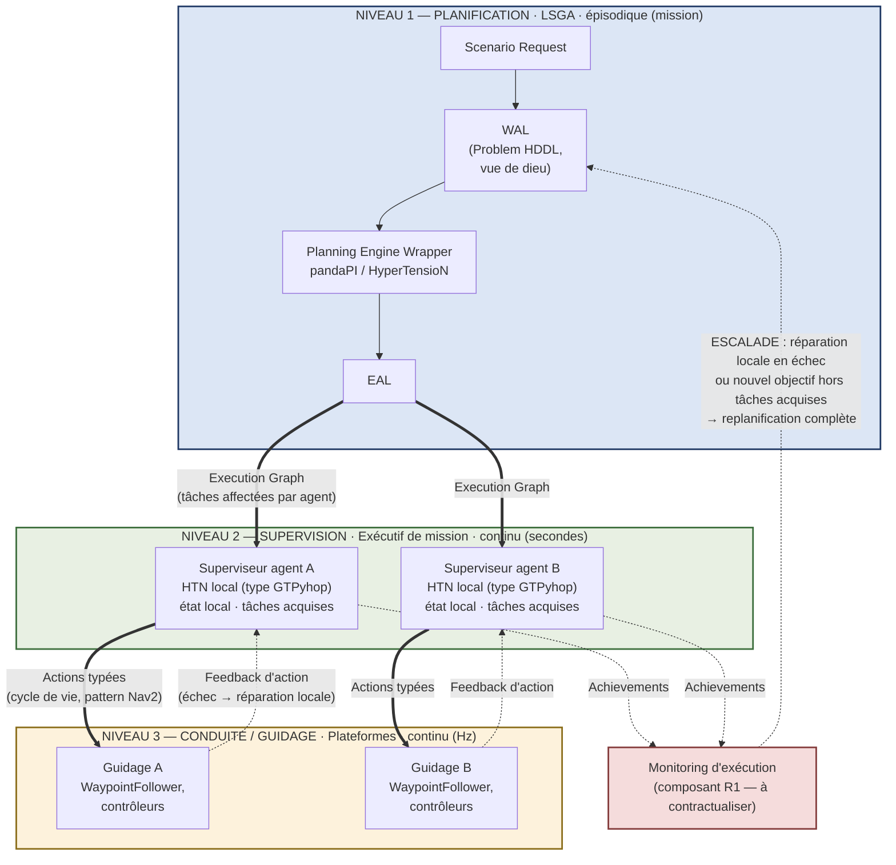

# Note d'architecture — LSGA
## Trois niveaux de décision : planification, supervision, guidage

| | |
|---|---|
| **De** | Estelle Chauveau (PO LOTUSim) |
| **À** | Cyril Moron (Architecte logiciel LOTUSim) |
| **Date** | 12 juillet 2026 |
| **Réf.** | Review LSGA v2 du 11/07/2026 — remarques R1 et R2 |

---

## 1. Objet

Cette note répond aux remarques **R1** (boucle de retour sous-spécifiée) et **R2** (frontière entre replanification LSGA et adaptation exécutive) de ta review. Elle propose un cadre commun à trois niveaux de décision, une discipline de vocabulaire associée, et les attendus pour le document *« Execution Environment — périmètre et contrat »* que tu as proposé de rédiger — proposition que j'accepte.

## 2. Le constat

LSGA v2 introduit un changement de paradigme : la planification initiale est **centralisée, en « vue de dieu », intégrant tous les agents**. La review objecte l'expérience tsm : une replanification toutes les ~2 s en poursuite.

Ces deux faits ne sont pas contradictoires — ils ne parlent pas du même niveau de décision. La confusion vient de ce que le mot « replanification » recouvre aujourd'hui trois activités de natures différentes, que tsm réalise dans une même boucle.

## 3. Les trois niveaux de décision

| Niveau | Analogie opérationnelle | Nature | Représentation du monde | Horizon | Responsable |
|---|---|---|---|---|---|
| **1. Planification** | Commandement de la force navale | HTN symbolique complet, « vue de dieu », tous agents | Domain HDDL + Problem HDDL (vue globale) | Mission — épisodique | LSGA |
| **2. Supervision** | Commandant de bord | HTN local par agent, réparation de plan | État local observé, tâches acquises | Secondes — continu | Exécutif de mission (Execution Environment) |
| **3. Conduite / guidage** | Officier de quart, homme de barre | Continu, non symbolique : consignes, asservissements | Trajectoires, poses, waypoints | Hertz | Plateforme (WaypointFollower, contrôleurs) |

Ce découpage correspond à l'architecture à trois couches classique en robotique (délibératif / exécutif / fonctionnel, formalisée notamment au LAAS) et à la réalité opérationnelle : le commandement de force donne la mission et les ordres globaux ; chaque commandant de bord les met en œuvre selon ses capacités et sa situation locale ; la conduite tient la consigne.

## 4. Schéma global

**Lecture** : les flèches pleines descendent (délégation), les flèches pointillées remontent (observation). Chaque niveau rattrape ce qu'il peut et remonte ce qu'il ne peut pas.

## 5. Pourquoi la planification initiale centralisée est légitime

La thèse d'Antoine Milot (contrôle d'une flotte d'AUV pour la chasse aux mines) décentralise la décision — y compris l'allocation initiale, par enchères — **en raison des contraintes de communication sous-marines à l'exécution**. Cet argument ne s'applique pas au niveau 1 de LSGA : le planificateur n'est pas embarqué, il tourne hors ligne au moment de la génération du scénario, où la contrainte de communication n'existe pas.

LSGA prend donc l'atout reconnu des approches centralisées (qualité de la solution globale) là où il est accessible, et conserve la robustesse décentralisée là où elle est nécessaire : à l'exécution.

La même thèse fournit en revanche le plan directeur du niveau 2 : supervision formulée comme un problème de planification HTN local (tâches acquises forcées, alternatives supprimées), intégration d'*achievements* (informations d'exécution horodatées), réparation locale d'abord, et gestion explicite des échecs de la réparation — c'est-à-dire le critère d'escalade.

## 6. Discipline de vocabulaire (décision proposée)

- **Replanification** : réservé aux niveaux 1 et 2 (production d'un nouveau plan symbolique).
- **Réparation locale** : replanification de niveau 2, par agent, sur représentation réduite.
- **Recalcul de consigne / guidage** : niveau 3, continu, sans planificateur. La poursuite de cible à ~2 s de tsm relève vraisemblablement de ce niveau — à confirmer (cf. §9).

## 7. Interfaces et critère d'escalade (réponse à R2)

- **1 ↔ 2** : l'Execution Graph descend les tâches affectées par agent ; les *achievements* remontent vers le monitoring.
- **2 ↔ 3** : le superviseur émet des actions typées avec cycle de vie (pattern Nav2 / actions ROS 2 typées par famille — l'incrément que tu as déjà cadré) ; le feedback d'action constitue le flux remontant.
- **Escalade** : chaque niveau rattrape ce qu'il peut et remonte ce qu'il ne peut pas. Guidage en échec (waypoint inatteignable) → réparation locale de l'agent. Réparation locale en échec, ou nouvel objectif dépassant les tâches acquises → replanification complète LSGA.

Ce critère d'escalade constitue la frontière demandée par R2.

**Conséquence sur les moteurs** : HDDL + pandaPI ou HyperTensioN au niveau 1 ; planificateur léger type GTPyhop au niveau 2 ; aucun planificateur au niveau 3. GTPyhop trouve ainsi sa juste place sans porter le pipeline HDDL, ce qui lève la tension entre R3 et R4.

## 8. Réponse à R1 et attendus sur ton document

J'accepte ta proposition de rédiger *« Execution Environment — périmètre et contrat »*, en y intégrant le composant de monitoring/déclenchement. Critères d'acceptation côté PO :

1. le document distingue explicitement, en interne, le niveau 2 (supervision) et le niveau 3 (guidage), avec leurs responsabilités respectives — sans reconduire leur fusion actuelle dans tsm ;
2. le contrat 2 ↔ 3 est spécifié en actions typées avec cycle de vie ;
3. le modèle de données du monitoring s'appuie sur (ou se positionne par rapport à) la structure des *achievements* de la thèse d'Antoine Milot ;
4. le critère d'escalade vers la replanification LSGA (§7) y figure comme élément du contrat.

## 9. Question ouverte

Dans tsm, la boucle à ~2 s replanifie-t-elle la **mission de l'agent** (niveau 2) ou recalcule-t-elle la **trajectoire de poursuite** (niveau 3) ? La réponse conditionne la répartition des responsabilités dans ton document — merci de la qualifier au regard du tableau du §3.
